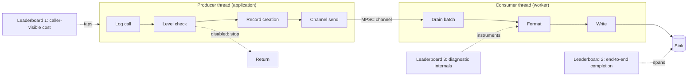
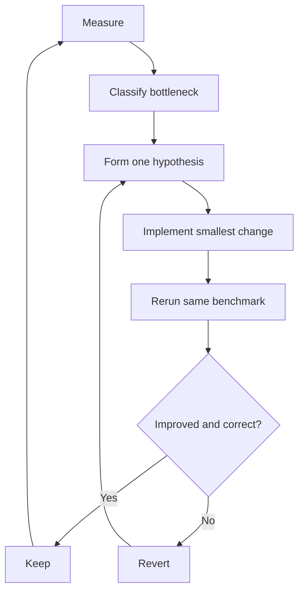

# Benchmarking and optimization design

## Status

Draft. Audience: contributors implementing the benchmark suite, reviewers
evaluating performance claims, and maintainers tuning consumer-thread behaviour.

## 1. Introduction

`femtologging` pushes formatting and input/output (I/O) onto dedicated consumer
threads. Producer threads create a `FemtoLogRecord` and enqueue it on a bounded
multi-producer, single-consumer (MPSC) channel; consumer threads own formatting
and output. The design document records this boundary: producers do minimal
record creation and channel submission, while consumer threads handle
formatting and the final write.[^1]

That architecture makes one rule non-negotiable for any benchmark that touches
`femtologging`: **never compare asynchronous caller latency against synchronous
end-to-end work without saying so loudly.** Caller-visible latency is a
first-class metric for a queue-based logger, not a shortcut that flatters it. A
table that places `femtologging`'s enqueue cost beside a synchronous library's
write cost, under a single "latency" heading, is not a comparison; it is a
category error.

This document specifies two related but distinct systems.

- A **public comparison suite** answers a user's question: how does
  `femtologging` compare with the standard library `logging` module,
  `picologging`, and `loguru` for equivalent, user-visible workloads?
- An **internal performance laboratory** answers a maintainer's question: which
  part of `femtologging` should be sharpened next?

These have different audiences, different fairness obligations, and different
output formats. They share infrastructure but never share leaderboards. Mixing
them produces numbers that mislead in both directions.

## 2. Goals and non-goals

### 2.1. Goals

- Measure caller-visible cost, end-to-end completion, and diagnostic internals
  as three separate leaderboards, each with an explicit measurement boundary.
- Compare against the standard library `logging` module, `picologging`, and
  `loguru` in both synchronous and queue-based modes, with every row labelled
  by architecture.
- Ground every published comparison in a correctness check: expected record
  count, expected byte count where applicable, and zero unexpected drops.
- Localize consumer-side cost (record construction, channel send, formatter,
  file worker drain, socket serialization) through Rust microbenchmarks so that
  optimization targets the dominant cost rather than folklore.
- Gate performance regressions in continuous integration (CI) against a rolling,
  per-machine baseline.

### 2.2. Non-goals

- This suite does not select the production channel crate afresh. ADR 004
  retains `crossbeam-channel` and rejects a `flume` swap; the lab measures
  channel behaviour to confirm or challenge that decision, not to relitigate it
  pre-emptively.[^2]
- It does not optimize for benchmarks that contradict the architecture. Eager
  f-string evaluation in disabled logs, terminal output, and per-record flushes
  are measured and labelled, not chased.
- It does not run the full matrix on shared CI runners. Only a cheap smoke
  subset runs per pull request; the full suite runs on a pinned, mostly idle
  host.
- It does not benchmark Python versions below 3.12, because the package declares
  `requires-python = ">=3.12"`.

## 3. Benchmark philosophy: three leaderboards

The suite publishes three leaderboards, never one.

The **caller-visible cost** leaderboard measures how long an application thread
spends inside the logging call. This is where `femtologging`'s queue-based
design should excel, and where the fair comparators are the standard library
`QueueHandler`/`QueueListener` pair, `loguru` with `enqueue=True`, and
`picologging`'s `QueueHandler`/`QueueListener`. The standard library documents
`QueueHandler` and `QueueListener` as the mechanism for moving handler work
onto a separate thread, which makes them the fairest architectural comparison
for the standard library.[^3] `loguru` exposes an `enqueue` option that sends
messages through a queue and makes logging calls non-blocking.[^4]
`picologging` ships its own `QueueHandler` and `QueueListener` in
`picologging.handlers`, so a queue-based comparison can use
`picologging`-native components rather than a mixed stack.[^5]

The **end-to-end completion** leaderboard measures wall-clock time from the
first log call until every record has reached the sink and the logger has
flushed or drained. This stops an asynchronous library from winning by hiding a
mountain of work on another thread. For `femtologging`, the protocol is:
enqueue all records, flush, drain, then verify every record arrived. For
`loguru` in enqueue mode, the protocol calls `logger.complete()`, which its
documentation defines as waiting for all messages added to `enqueue=True`
handlers to be processed.[^4] For the standard library and `picologging` queue
modes, the protocol stops the listener after the queue drains.

The **diagnostic internals** leaderboard measures record construction, channel
send, formatter cost, file worker drain, socket serialization, queue
saturation, and memory behaviour. These numbers are not directly comparable
with the other libraries. They exist to guide optimization, and they live in
the internal laboratory.

## 4. Comparison targets

Every comparator is labelled by architecture. The suite never collapses these
rows into a single "stdlib versus picologging versus loguru versus
femtologging" bar chart, because the architecture is the variable that matters.

| Family         | Mode                             | Why it exists                                                            |
| -------------- | -------------------------------- | ------------------------------------------------------------------------ |
| `logging`      | Synchronous direct handler       | User baseline; shows traditional caller blocking.                        |
| `logging`      | `QueueHandler` + `QueueListener` | Fair asynchronous comparison; a documented standard library pattern.[^3] |
| `picologging`  | Synchronous direct handler       | Drop-in, stdlib-compatible high-performance comparison.[^5]              |
| `picologging`  | `QueueHandler` + `QueueListener` | Fair queue-based comparison with picologging-native components.[^5]      |
| `loguru`       | `enqueue=False`                  | Idiomatic direct-sink comparison.                                        |
| `loguru`       | `enqueue=True`                   | Fair queue-based comparison; loguru queues before the sink.[^4]          |
| `femtologging` | Queue-based handler              | The real asynchronous product path; caller-visible rows stop at enqueue. |
| `femtologging` | Batched file worker              | Consumer-side batching path for drained throughput and syscall studies.  |
| `femtologging` | Direct sink laboratory adapter   | Internal diagnostic baseline; not published as the user-facing default.  |

_Table 1: Comparison targets, each labelled by architecture._

Two caveats constrain the comparison.

First, `picologging` is beta software with documented limitations, and its
latest release predates the most recent CPython versions.[^5] The adapter layer
must probe `picologging` availability per interpreter and skip it where wheels
are absent — and the runner must `log()` the skip rather than silently omit the
row, so a missing comparator never reads as "covered".

Second, the primary Python comparison matrix runs only on supported CPython
versions, starting at 3.12, consistent with the package's `requires-python`
declaration.

## 5. Architecture

### 5.1. Repository structure

The suite adds a `benchmarks/` package alongside the existing Rust benchmark
directory. The Python harness owns the public comparison suite; the Rust
benches own the internal laboratory.

```text
benchmarks/
  README.md
  pyproject.toml
  femtobench/
    __init__.py
    adapters/
      base.py
      stdlib_logging.py
      stdlib_queue.py
      picologging_sync.py
      picologging_queue.py
      loguru_sync.py
      loguru_enqueue.py
      femtologging.py
    cases/
      disabled.py
      enabled_null.py
      file.py
      rotating_file.py
      stream.py
      socket.py
      filters.py
      exceptions.py
      stack_info.py
      structured.py
      saturation.py
      config.py
    sinks/
      null.py
      counting.py
      slow.py
      socket_server.py
    runner.py
    schema.py
    compare.py
    report.py
  results/
    .gitkeep

rust_extension/benches/
  config.rs              # existing
  hot_path.rs
  formatter.rs
  channel.rs
  file_worker.rs
  socket_worker.rs
  batching.rs
```

Each new Rust bench file requires a `[[bench]]` entry in
`rust_extension/Cargo.toml` with `harness = false`, because the benches use
Criterion's harness rather than the default `libtest` harness. The existing
`config.rs` bench already establishes the Criterion dependency and the pattern
of driving Python entry points through PyO3 under the `python` feature.[^6]

### 5.2. Adapter layer and the fairness contract

The adapter layer is where fairness is enforced or lost. Each adapter exposes a
uniform interface — configure, warm up, log one record, flush, drain, verify,
tear down — so the runner drives every library through the same protocol. The
adapter, not the case, owns the library-specific incantations.

The contract requires equal semantics wherever the libraries permit it: the
same log levels, message counts, record content, sink destination, flush and
drain protocol, and propagation settings. The adapter disables colourized
output, rich trace diagnostics, terminal detection, and default stderr handlers
unless the case explicitly targets them. For `loguru`, the adapter removes the
preconfigured sink before adding benchmark sinks, because the imported `loguru`
logger arrives preconfigured to emit to stderr.[^4]

The suite runs in two modes.

- **Idiomatic mode** lets each library use its recommended style: `loguru` uses
  `{}` formatting, the standard library and `picologging` use `%` formatting,
  and `femtologging` uses its public Python API. This answers, "what should a
  user expect?"
- **Parity mode** normalizes everything controllable: the same sink, no colours,
  no exception prettification, no extra context, and no caller introspection
  beyond what the formatter needs. This answers, "how much does the engine
  cost?"

Disabled logs require special care. In Python, function arguments evaluate
before the logging call, so `logger.debug("x=%s", expensive())` pays for
`expensive()` even when the level disables the record. A logging framework can
defer formatting; it cannot un-evaluate a Python argument. The suite therefore
splits the disabled case into three: a literal, cheap deferred arguments, and
an eager expensive expression. The eager case is labelled "user expression
cost", not framework cost, so no reader mistakes a user's eagerness for a
framework weakness.

### 5.3. Measurement boundaries

The following flowchart shows where each leaderboard takes its measurement
across the producer-consumer boundary. The producer thread runs the application
code path; the consumer thread runs formatting and I/O. The caller-visible
leaderboard taps the producer side only; the end-to-end leaderboard spans the
whole path through drain; the diagnostic leaderboard instruments individual
stages on both sides.

For screen readers: the diagram traces a log call from the application thread
through the level check, record creation, and channel send on the producer
side, then across the MPSC channel to the consumer thread's drain, format, and
write stages, and finally to the sink. Three measurement brackets are overlaid:
caller-visible cost covers the producer stages, end-to-end completion covers
everything up to and including the sink write plus flush, and diagnostic
internals tap each stage individually.



_Figure 1: Measurement boundaries for the three leaderboards across the
producer-consumer pipeline._

### 5.4. Python harness

The Python harness drives the public comparison suite through `pyperf`, which
provides calibration, multiple worker processes, instability checks, JSON
output, metadata collection, distribution statistics, comparison tooling, and
memory-tracking hooks.[^7] The harness does not roll its own timing loop;
`pyperf` handles warm-up and worker spawning so that interpreter start-up and
garbage-collection noise do not contaminate the per-call figures.

The `compare.py` module wraps `pyperf compare_to`, which tests whether a
difference is statistically significant using a Student's two-sample,
two-tailed t-test at alpha 0.95.[^8] The regression gate consumes this
significance verdict rather than comparing raw means, so a regression fails the
build only when the difference is both large enough and statistically real.

### 5.5. Rust internal laboratory

The internal laboratory uses Criterion for Rust-only microbenchmarks, extending
the existing `config.rs` group. The benches run against release builds and
across the project's feature matrix: `--no-default-features`,
`--features python`, `--features log-compat`, and `--features tracing-compat`,
mirroring the lint and test matrix already encoded in the `Makefile`.[^9]
Representative cases — not every matrix point — are profiled with Linux
`perf stat` and flamegraphs.

The laboratory's inputs stay realistic: tiny messages, medium messages,
structured records, exceptions, and bursts. The current dependency shape
already includes `crossbeam-channel` and Criterion, so the initial laboratory
fits the repository without new dependencies.

## 6. Benchmark dimensions

The core matrix varies framework, handler, workload, concurrency, and
queue/batch settings.

Handlers progress from a no-output sink to realistic destinations: a
`NullHandler` or equivalent, a stream to a non-terminal sink, a file on a
temporary filesystem (`tmpfs`) and on a normal disk, a rotating file without
rollover, a rotating file with rollover, a loopback socket, and a slow-sink
simulation. The standard library's `NullHandler` performs no formatting and no
output, so it isolates framework overhead cleanly.[^3] No case writes to a
terminal, because terminal I/O dominates every other cost and turns the
measurement into noise.

Workloads cover the cases below.

| Workload                | Example                                                  | Purpose                                                    |
| ----------------------- | -------------------------------------------------------- | ---------------------------------------------------------- |
| Disabled literal        | `debug("constant")` at level `INFO`                      | Fast level check, no record creation.                      |
| Disabled args           | `debug("x=%s", x)`                                       | Lazy formatting and argument retention.                    |
| Disabled eager f-string | `debug(f"x={expensive()}")`                              | User-side eagerness, not framework cost. Labelled as such. |
| Enabled literal         | `info("constant")`                                       | Record-creation baseline.                                  |
| Enabled args            | `info("x=%s y=%s", x, y)` or loguru `{}` equivalent      | Formatter and argument handling.                           |
| Structured fields       | Request id, user id, path, status                        | Key-value metadata.                                        |
| Context stack           | Scoped context plus inline override                      | Producer-side context merge.                               |
| Filtered                | Accepted and rejected by logger/root filter              | Filter hot-path cost.                                      |
| Exception logging       | `exc_info=True`, chained exceptions                      | Expensive but operationally vital.                         |
| Stack info              | `stack_info=True` equivalent                             | Frame capture and serialization.                           |
| Socket serialization    | Local Transmission Control Protocol (TCP) or Unix socket | MessagePack framing versus pickle.                         |
| Burst logging           | Short burst, then idle                                   | Queue wake-up, batch shrinkage, tail latency.              |
| Sustained logging       | Millions of records                                      | Throughput, batching, memory, drops.                       |
| Slow consumer           | Artificial sink delay                                    | Backpressure, drops, caller blocking, shutdown drain.      |

_Table 2: Canonical workloads and what each one exercises._

Concurrency runs at 1, 2, 4, 8, 16, 32, and twice the logical CPU count of
producer threads. Each concurrency level runs twice: with a fixed total message
count, which exposes overhead scaling, and with a fixed count per producer,
which exposes saturation.

The `femtologging`-specific sweep varies the settings below.

| Setting         | Values                                                          |
| --------------- | --------------------------------------------------------------- |
| Queue capacity  | 1,024; 8,192; 65,536; and the default                           |
| Batch capacity  | 1; 4; 16; 64; 256; and the default                              |
| Flush policy    | Per record, periodic, explicit only                             |
| Formatter       | Minimal message, default formatter, structured, exception-heavy |
| Timestamp mode  | Disabled, wall clock, high-resolution                           |
| Overflow policy | Drop, block, timeout 1 ms, timeout 10 ms, and timeout 100 ms    |

_Table 3: `femtologging`-specific configuration sweep._

The design document separates the producer hot path (level check, lazy argument
evaluation, record creation, channel send) from consumer-side concerns
(formatter and serialization efficiency).[^1] The matrix keeps those concerns
in separate cases so a result points at one stage, not a blur of several.

## 7. Metrics and result schema

Every benchmark emits structured JSON carrying role and architecture metadata
before numeric measurements, so caller-visible, end-to-end, and diagnostic rows
cannot be merged accidentally.

The `architecture` field is one of `sync-direct`, `queue-listener`,
`async-queue`, `batched-worker`, or `lab-direct`.

| Field              | Meaning                                                              |
| ------------------ | -------------------------------------------------------------------- |
| `leaderboard_role` | `caller-visible`, `end-to-end`, or `diagnostic-internal`.            |
| `architecture`     | Concrete concurrency and handler architecture.                       |
| `framework`        | Package under test, such as `logging`, `picologging`, or `loguru`.   |
| `mode`             | Concrete adapter mode, such as `enqueue=True` or `QueueHandler`.     |
| `workload`         | Stable case identifier, such as `file_tmpfs_queue`.                  |

_Table 4: Result schema identity fields._

Every benchmark also carries at least the metrics below.

| Metric                           | Meaning                                             |
| -------------------------------- | --------------------------------------------------- |
| `caller_ns_per_call`             | Time spent in the logging call on producer threads. |
| `records_enqueued_per_second`    | Producer-side throughput.                           |
| `records_drained_per_second`     | Consumer-side throughput after flush and drain.     |
| `end_to_end_ns_p50/p90/p99/p999` | Per-record latency where instrumentation exists.    |
| `flush_ns`                       | Time to flush or complete after producers finish.   |
| `shutdown_drain_ns`              | Time to stop listeners or workers cleanly.          |
| `bytes_written_per_second`       | Throughput for file and socket sinks.               |
| `drops`                          | Must be zero outside explicit saturation tests.     |
| `max_queue_depth`                | Where exposed.                                      |
| `rss_peak_bytes`                 | Peak process memory.                                |
| `allocations_per_record`         | Where allocator instrumentation is available.       |
| `cpu_cycles_per_record`          | From Linux `perf stat` on dedicated runs.           |
| `context_switches`               | Useful for queue and batching tuning.               |
| `syscalls_per_record`            | Critical for file and stream batching experiments.  |

_Table 5: Result schema metrics. Memory peak draws on `pyperf`'s
`tracemalloc_peak` metadata where the Python harness records it.[^7]_

Correctness is part of the schema, not an afterthought. After every run the
harness verifies the expected record count, the expected byte count where
applicable, the absence of unexpected drops, the absence of malformed socket
frames, and a completed flush. A run that fails any correctness check is
reported as a failure, never as a fast result.

## 8. Measurement protocols

For each Python case, the harness builds and installs `femtologging` from the
current commit, pins competitor versions in a lockfile, and records metadata:
commit SHA, Python version, package versions, operating system, kernel, CPU
model, frequency governor, Rust profile, feature flags, `RUSTFLAGS`, and
whether the filesystem target is `tmpfs`, a solid-state disk, or networked. It
then warms up the framework and sink, runs through `pyperf`, verifies
correctness, exports JSON and a compact Markdown table, and compares against
the checked-in or dashboard baseline.

For Rust internals, the laboratory uses Criterion on release builds only, adds
feature-specific benches across the matrix in §5.5, and applies `perf stat` and
flamegraphs to selected representative cases rather than every matrix point.

## 9. Concrete benchmark groups

### 9.1. Group A: disabled hot path

Group A proves that disabled logging costs almost nothing. Its cases are
`disabled_literal`, `disabled_args`, `disabled_guarded_expensive_args`, and
`disabled_eager_fstring`. It measures caller nanoseconds per call and
allocations. The optimization target is a level check first, with no record, no
timestamp, no thread name, no metadata map, and no formatter. The design
document already requires the level check to stop processing immediately when
the level is insufficient.[^1]

### 9.2. Group B: enabled no-output path

Group B isolates record creation without I/O, using a `NullHandler` or
equivalent.[^3] Its cases are `enabled_literal_null`, `enabled_args_null`,
`enabled_structured_null`, `enabled_context_null`,
`enabled_filter_accept_null`, and `enabled_filter_reject_null`. For
`femtologging`, this group reveals whether PyO3 conversion, metadata
allocation, timestamp acquisition, thread-id capture, or channel send dominates.

### 9.3. Group C: direct versus queued I/O

Group C compares architecture honestly with `stream_to_devnull_sync`,
`stream_to_devnull_queue`, `file_tmpfs_sync`, `file_tmpfs_queue`,
`file_real_disk_sync`, and `file_real_disk_queue`. It reports two tables:
caller latency and fully drained throughput. The synchronous table answers,
"what happens if I write on the caller thread?" The queue table answers, "what
happens if I offload I/O the way `femtologging` does?"

### 9.4. Group D: file batching

Group D tunes `femtologging`'s consumer workers. ADR 004 selects drain-loop
batching with `try_recv()` as the primary strategy, because it adds no
light-load latency and forms larger batches naturally under sustained load; it
also records that the shipped phase has batched-receive plumbing while true
batch writes remain follow-on work.[^2] The `batching.rs` bench sweeps
`batch_capacity` over 1, 4, 16, 64, and 256; producer threads over 1, 4, 16,
and 64; message sizes of 32 bytes, 128 bytes, and 1 KiB; and sinks of a `tmpfs`
file and a real solid-state disk file. It measures records per second, syscalls
per record, flush latency, shutdown drain latency, and p99 caller latency. Its
purpose is to decide whether to implement contiguous buffer writes before
`write_vectored`, because ADR 004 treats vectored I/O as conditional future
work pending `write_all_vectored` stabilization.[^2]

### 9.5. Group E: socket handler

Group E tests serialization and reconnection without letting network randomness
eat the experiment. It uses a loopback TCP server and, separately, a
Unix-domain socket on Unix-like platforms, and it verifies frames. It sweeps
payload sizes and batch capacities. It includes the standard library
`SocketHandler` as a functional baseline but marks its wire format separately,
because that handler pickles records and length-prefixes them; `picologging`'s
`SocketHandler` behaves the same way.[^3][^5] `femtologging` serializes records
to MessagePack and frames them with a four-byte big-endian prefix, so the bench
validates both throughput and frame correctness.[^1]

### 9.6. Group F: saturation and backpressure

Group F avoids pleasant averages that hide catastrophe. Its cases are
`bounded_queue_fast_consumer`, `bounded_queue_slow_consumer`,
`bounded_queue_stalled_consumer`, `burst_then_flush`,
`producer_spike_while_rotating`, and `socket_disconnected_then_reconnect`. It
records caller p99 and p999, drops, blocked time, drain time, memory growth,
and recovery behaviour. `femtologging` tracks dropped records when queues fill,
so the result schema wires that count through. This group also exposes a known
failure mode in a comparator: `loguru` with `enqueue=True` can grow memory
without bound when a sink cannot keep up, because its queue is unbounded.[^10]
The suite reports that behaviour rather than tuning it away, since it is a
genuine architectural difference.

### 9.7. Group G: configuration

Group G keeps and extends the existing Criterion configuration group, which
benchmarks the direct builder `build_and_init`, Python `basicConfig`, and the
`dictConfig` round trip.[^6] It adds Python-facing `pyperf` cases:
`femtologging_basicConfig`, `femtologging_dictConfig`, `femtologging_builder`,
`stdlib_basicConfig`, `stdlib_dictConfig`, `picologging_basicConfig`,
`picologging_dictConfig`, and `loguru_configure`. Configuration is not the hot
path, but services configure logging during start-up, command-line invocation,
tests, and subprocess creation, so start-up cost affects adoption.

## 10. Benchmark-guided optimization

### 10.1. The loop

Optimization follows a strict loop, shown below. Each pass starts from a
measurement, forms exactly one hypothesis, makes the smallest change that tests
it, and keeps the change only if the same benchmark improves and correctness
holds.

For screen readers: the diagram is a cycle. It begins at measure, proceeds to
classify the bottleneck, then to form one hypothesis, then to implement the
smallest change, then to rerun the same benchmark. After the rerun it branches
on whether the result improved and stayed correct: if yes, the change is kept
and the cycle returns to measure; if no, the change is reverted and the cycle
returns to form one hypothesis.



_Figure 2: The benchmark-guided optimization loop._

Every optimization pull request records the benchmark case, before and after
figures, the relative change, the `pyperf` significance verdict, the
correctness checks, the memory impact, the complexity cost, and why the
benchmark represents a real workload. A pull request that asserts "this should
be faster" without that evidence does not land.

### 10.2. Playbook by failing benchmark

The laboratory exists so that each failing benchmark points at a specific knob.
The mapping below records the design decision that connects a symptom to its
optimization target; it is not a wishlist of features.

- **Disabled logs too slow.** Optimize the level lookup first: cache effective
  levels and use integer comparisons. Defer frame inspection, timestamp
  capture, thread metadata, filter evaluation, context merge, and record
  allocation until after the level check.[^1] Compile-time level filtering via
  Cargo features remains the larger hammer for the Rust macro path and is
  tracked separately as roadmap item 3.2.3.
- **Enabled `NullHandler` too slow.** Profile allocations. Likely targets are
  `RecordMetadata` allocation, map creation for absent structured fields,
  timestamp formatting rather than capture, thread-name lookup, logger-name
  normalization, PyO3 extraction, and temporary `String` creation. The design
  response is lazy metadata and an inline small map for the common
  zero-to-four-field case rather than an ordered map whose ordering is not
  needed on the output path.
- **Multi-threaded enqueue slows down.** Benchmark `crossbeam-channel` capacity
  and contention. Try, in order: a larger bounded capacity, batch-drain
  capacity tuning, non-blocking send with explicit drop accounting, per-handler
  queue sharding, and thread-local staging buffers. A channel-crate swap stays
  off the table absent a clear, measured loss, consistent with ADR 004.[^2]
- **Formatting dominates.** Preparse format strings, cache formatter plans, and
  reuse consumer-thread buffers. Avoid `format!` in loops; write into an
  existing buffer. The `formatter.rs` bench isolates `format_literal`,
  `format_args_2`, `format_structured_4_fields`, `format_exception_short`,
  `format_exception_chained`, and `format_stack_info`.[^1]
- **File throughput lags.** Eliminate accidental per-record flushes, then
  implement contiguous batch-buffer writes for file and stream handlers, then
  revisit vectored I/O where the platform supports it.[^2] Track write syscalls
  per record, flush syscalls per record, bytes per syscall, records per batch,
  p99 flush latency, and shutdown drain latency. If batching improves
  throughput but worsens p999 caller latency under saturation, tune capacity or
  overflow policy rather than enlarging the batch blindly.
- **Socket throughput lags.** Separate serialization from the socket write:
  benchmark MessagePack serialization into a reusable buffer without I/O, then
  loopback write with prebuilt frames, then the combination. Reuse
  serialization buffers, batch frames per write, and avoid per-record
  allocation of the frame prefix and payload.
- **Filters are expensive.** Keep the fast path to a level check, then filters.
  Store filter collections in copy-on-write `Arc` snapshots so reads do not
  lock. Benchmark Rust-native filters separately from Python callback filters,
  because the latter cross the PyO3 boundary and may need the global
  interpreter lock (GIL); Python callback filters are a compatibility feature
  with an explicit cost.
- **Memory grows under bursts.** Run a soak test: ten minutes, a fixed rate
  below
  drain capacity with periodic bursts above it, recording resident set size
  every second and forcing a flush every few seconds, verifying no monotonic
  unbounded growth. Record pooling stays a later, advanced move, consistent
  with the design document's caution about its complexity.[^1]

## 11. Regression policy and reporting

### 11.1. Regression gates

The suite sets separate gates by benchmark class. Each gate fires only when the
difference is statistically significant under the `pyperf` t-test (§5.4).

| Benchmark class                    | Gate                                    |
| ---------------------------------- | --------------------------------------- |
| Disabled hot path                  | Fail on >3% regression if significant.  |
| Enabled null                       | Fail on >5% regression.                 |
| Caller latency, queued file/socket | Fail on >5% p50 or >10% p99 regression. |
| End-to-end throughput              | Fail on >5% regression.                 |
| Memory peak                        | Fail on >10% growth unless justified.   |
| Drops in non-saturation tests      | Always fail.                            |
| Correctness mismatch               | Always fail.                            |
| Configuration benchmarks           | Warn at >10%, fail at >20%.             |

_Table 6: Regression gates by benchmark class._

Baselines are per-machine class and rolling. The suite never compares laptop
numbers with CI numbers, keeps raw JSON artefacts, and displays trend lines by
commit so that a slow creep is caught before it becomes a swamp.

### 11.2. Reporting

Each run produces three artefacts: `results/<date>/<commit>/raw.pyperf.json`,
`results/<date>/<commit>/criterion/`, and `results/<date>/<commit>/summary.md`.
The summary carries compact tables, with a "benchmark meaning" note beside each
one — for example, "caller latency excludes consumer drain; see the end-to-end
table for total work" — so no reader compares across leaderboards by accident.

| Role           | Architecture   | Case         | Framework      | Mode    | caller ns/call | drained records/s | p99 E2E µs | RSS MiB | drops |
| -------------- | -------------- | ------------ | -------------- | ------- | -------------- | ----------------- | ---------- | ------- | ----- |
| caller-visible | sync-direct    | enabled file | `logging`      | sync    | …              | …                 | …          | …       | 0     |
| caller-visible | queue-listener | enabled file | `logging`      | queue   | …              | …                 | …          | …       | 0     |
| caller-visible | async-queue    | enabled file | `loguru`       | enqueue | …              | …                 | …          | …       | 0     |
| caller-visible | sync-direct    | enabled file | `picologging`  | sync    | …              | …                 | …          | …       | 0     |
| caller-visible | async-queue    | enabled file | `femtologging` | async   | …              | …                 | …          | …       | 0     |

_Table 7: Example summary layout for one workload across comparators._

## 12. Verification

The benchmark suite is itself a measurement instrument, so its correctness
matters as much as the figures it reports. Three invariants define a correct
run.

- **Fairness invariant.** In parity mode, every comparator writes the same
  record
  content to the same class of sink with colours, prettification, and extra
  context disabled. A run violates fairness if any adapter emits to its default
  stderr sink, applies colourization, or performs caller introspection the case
  did not request. The adapter base class enforces this by constructing sinks
  explicitly and asserting that no default handler remains attached before the
  measured loop begins.
- **Completeness invariant.** Every published row carries a correctness verdict:
  expected record count met, expected byte count met where applicable, zero
  unexpected drops, zero malformed socket frames, and a completed flush. The
  runner refuses to publish a row whose verdict is absent. Where the suite
  bounds coverage — skipping an unavailable `picologging`, sampling a subset,
  or capping a sweep — it logs the bound, so truncation never reads as full
  coverage.
- **Significance invariant.** A regression gate fires only on a difference that
  is both larger than its class threshold and statistically significant under
  the `pyperf` two-tailed t-test at alpha 0.95.[^8] This guards against CI
  noise failing builds and against real regressions passing on a lucky sample.

These invariants are checks the suite runs, not aspirations. The combinatorial
surface — framework times handler times workload times concurrency times the
`femtologging` configuration sweep — is large, and the suite does not claim to
verify every point on every commit. The smoke subset runs per pull request; the
full matrix runs on the pinned host; and the regression dashboard records which
points last ran, so the coverage gap is visible rather than hidden.

## References

[^1]: `femtologging` design document, "Optimizing for performance" and "Key
    recommendations and future directions".
    [`rust-multithreaded-logging-framework-for-python-design.md`](./rust-multithreaded-logging-framework-for-python-design.md).

[^2]: ADR 004, "Batching optimizations in consumer threads".
    [`adr-004-batching-optimizations-in-consumer-threads.md`](./adr-004-batching-optimizations-in-consumer-threads.md).

[^3]: Python documentation, "logging.handlers — Logging handlers".
    <https://docs.python.org/3/library/logging.handlers.html>.

[^4]: `loguru` documentation, "loguru.logger" — `add(..., enqueue=...)` and
    `complete()`. <https://loguru.readthedocs.io/en/stable/api/logger.html>.

[^5]: `picologging` documentation and repository: drop-in replacement, 4-17x
    faster than the standard library, beta status with documented limitations,
    and `picologging.handlers` `QueueHandler`/`QueueListener` and
    `SocketHandler`. <https://microsoft.github.io/picologging/handlers.html> and
    <https://github.com/microsoft/picologging>.

[^6]: `rust_extension/benches/config.rs` — the existing Criterion configuration
    benchmark group.

[^7]: `pyperf` documentation — calibration, worker processes, JSON output,
    metadata, and `tracemalloc_peak`. <https://pyperf.readthedocs.io/>.

[^8]: `pyperf` commands — `compare_to` significance via a Student's two-sample,
    two-tailed t-test at alpha 0.95.
    <https://pyperf.readthedocs.io/en/latest/cli.html>.

[^9]: `Makefile` — the lint and test feature matrix
    (`--no-default-features`, `--features python`, `--features log-compat`,
    `--features tracing-compat`).

[^10]: `loguru` issue 1419, "`enqueue=True` causes unbounded memory growth with
    slow sinks". <https://github.com/Delgan/loguru/issues/1419>.
