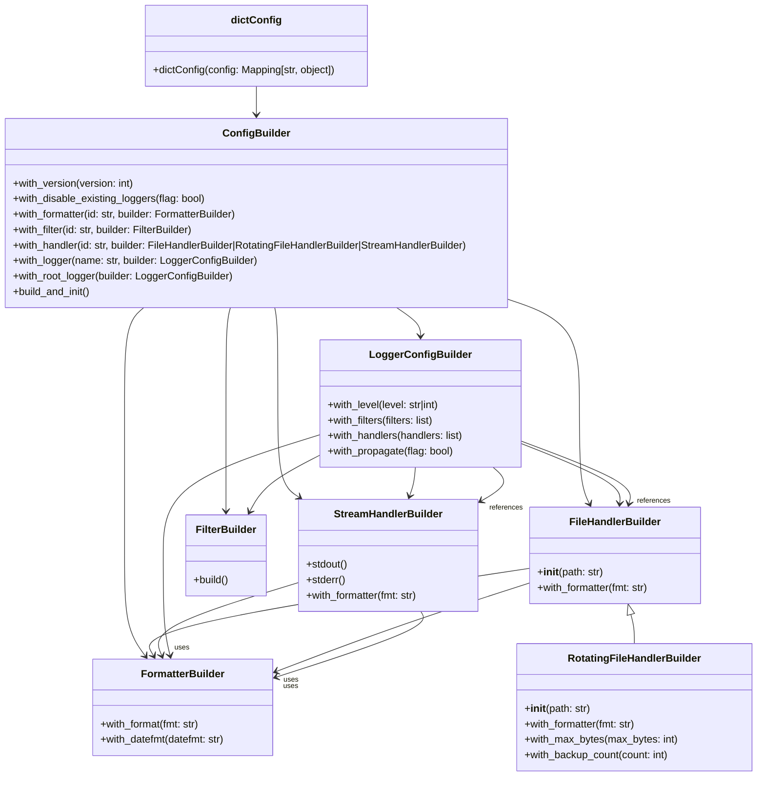
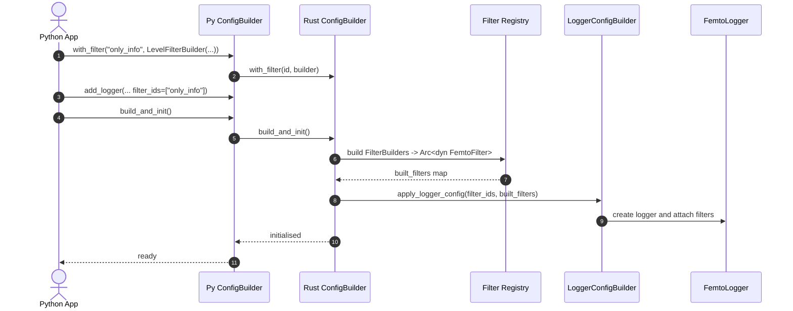
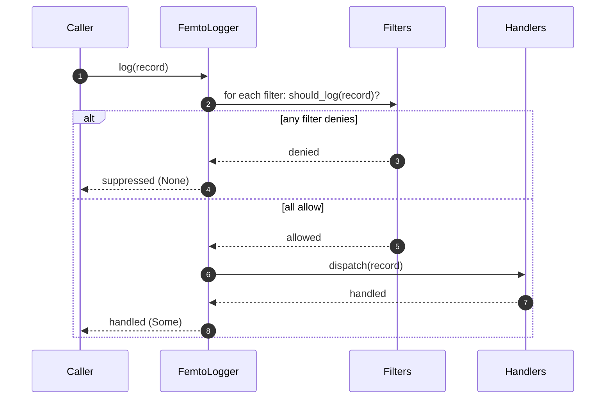
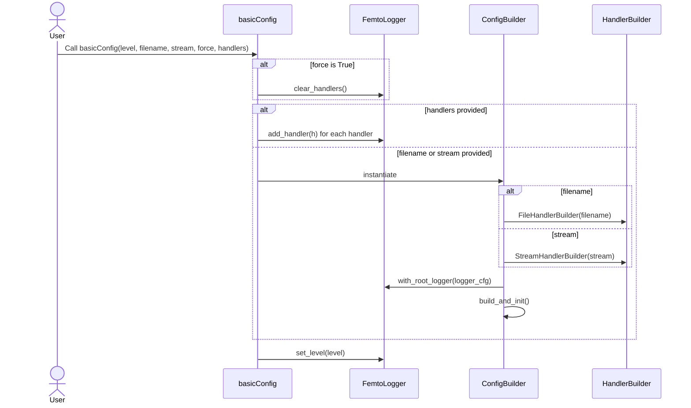
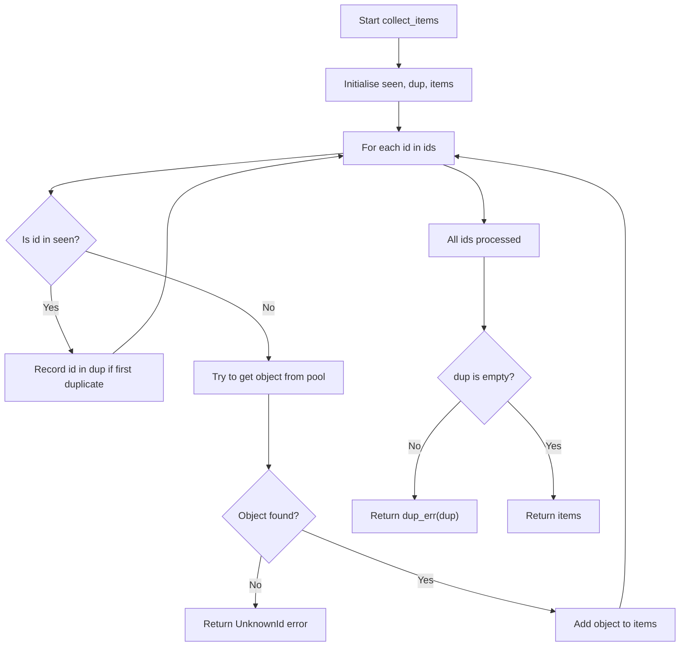

# Femtologging Configuration Design Document

## 1. Core Configuration Model: The Builder Pattern

The primary and recommended method for configuring `femtologging` in new
applications will be a fluent builder API. This pattern promotes clarity, type
safety (especially in Rust), and discoverability.

### 1.1. Rust Builder API Design

The Rust configuration will expose a `ConfigBuilder` struct, allowing for a
programmatic and type-safe setup of the logging system.

```rust
// In femtologging::config::ConfigBuilder
pub enum HandlerBuilder {
    Stream(StreamHandlerBuilder),
    File(FileHandlerBuilder),
}

struct FormatterId(String); // Newtype for formatter identifiers

pub struct ConfigBuilder {
    // Internal state to hold configuration parts
    version: u8,
    disable_existing_loggers: bool,
    default_level: Option<FemtoLevel>,
    formatters: BTreeMap<String, FormatterBuilder>,
    filters: BTreeMap<String, FilterBuilder>, // see §1.1.1 "Filters" (<#111-filters>)
    handlers: BTreeMap<String, HandlerBuilder>,
    // `HandlerBuilder` is a concrete enum; later insertions with the same ID
    // overwrite earlier ones.
    loggers: BTreeMap<String, LoggerConfigBuilder>,
    root_logger: Option<LoggerConfigBuilder>,
}

impl ConfigBuilder {
    /// Creates a new, empty `ConfigBuilder`.
    pub fn new() -> Self { /* ... */ }

    /// Sets the configuration schema version. Currently, only 1 is supported.
    pub fn with_version(mut self, version: u8) -> Self { /* ... */ }

    /// Sets whether existing loggers should be disabled upon configuration.
    pub fn with_disable_existing_loggers(mut self, disable: bool) -> Self { /* ... */ }

    /// Sets the default log level for loggers that do not have an explicit level configured.
    pub fn with_default_level(mut self, level: FemtoLevel) -> Self { /* ... */ }

    /// Adds a formatter configuration by its unique ID, replacing any existing entry.
    pub fn with_formatter(mut self, id: impl Into<String>, builder: FormatterBuilder) -> Self {
        /* ... */
    }

    /// Adds a filter configuration by its unique ID, replacing any existing entry.
    pub fn with_filter(mut self, id: impl Into<String>, builder: FilterBuilder) -> Self {
        /* ... */
    }

    /// Adds a handler configuration by its unique ID.
    pub fn with_handler<B>(mut self, id: impl Into<String>, builder: B) -> Self
    where
        B: Into<HandlerBuilder>,
    {
        self.handlers.insert(id.into(), builder.into());
        self
    }

    /// Adds a logger configuration by its name, replacing any existing entry.
    pub fn with_logger(
        mut self,
        name: impl Into<String>,
        builder: LoggerConfigBuilder,
    ) -> Self {
        /* ... */
    }

    /// Sets the configuration for the root logger. Calling this multiple times
    /// replaces the previous root logger.
    pub fn with_root_logger(
        mut self,
        builder: LoggerConfigBuilder,
    ) -> Self {
        /* ... */
    }

    /// Finalizes the configuration and initializes the global logging system.
    pub fn build_and_init(self) -> Result<(), ConfigError> { /* ... */ }
}

// In femtologging::config::LoggerConfigBuilder
pub struct LoggerConfigBuilder {
    level: Option<FemtoLevel>,
    propagate: Option<bool>,
    filters: Vec<String>,
    handlers: Vec<String>,
}

impl LoggerConfigBuilder {
    /// Creates a new `LoggerConfigBuilder`.
    pub fn new() -> Self { /* ... */ }

    /// Sets the log level for this logger.
    pub fn with_level(mut self, level: FemtoLevel) -> Self { /* ... */ }

    /// Sets whether messages should propagate to parent loggers.
    pub fn with_propagate(mut self, propagate: bool) -> Self { /* ... */ }

    /// Sets the filter identifiers, replacing any previously configured filters.
    pub fn with_filters<I, S>(mut self, filter_ids: I) -> Self
    where
        I: IntoIterator<Item = S>,
        S: Into<String>,
    {
        /* ... */
    }

    /// Sets the handler identifiers, replacing any previously configured handlers.
    pub fn with_handlers<I, S>(mut self, handler_ids: I) -> Self
    where
        I: IntoIterator<Item = S>,
        S: Into<String>,
    {
        /* ... */
    }
}

// In femtologging::config::FormatterBuilder
pub struct FormatterBuilder {
    format: Option<String>,
    datefmt: Option<String>,
    // style: Option<FormatterStyle>, // Future: For %, {, $ styles
}

impl FormatterBuilder {
    /// Creates a new `FormatterBuilder`.
    pub fn new() -> Self { /* ... */ }

    /// Sets the format string for the formatter.
    pub fn with_format(mut self, format_str: impl Into<String>) -> Self { /* ... */ }

    /// Sets the date format string for the formatter.
    pub fn with_datefmt(mut self, date_format_str: impl Into<String>) -> Self { /* ... */ }
}

// In femtologging::handlers::HandlerBuilderTrait (and specific builders)
pub trait HandlerBuilderTrait: Send + Sync {
    type Handler: FemtoHandlerTrait;

    fn build_inner(&self) -> Result<Self::Handler, HandlerBuildError>;

    fn build(&self) -> Result<Box<dyn FemtoHandlerTrait>, HandlerBuildError> {
        let handler = self.build_inner()?;
        Ok(Box::new(handler))
    }
}

// Builders capture any required context directly. The earlier
// `build_handler(&ConfigContext)` design has been dropped; shared state is
// injected through builder fields instead of a dedicated context object.
//
// Built handlers are wrapped in `Arc<dyn FemtoHandlerTrait>` during realisation.
// The same `Arc` is attached to multiple loggers, enabling safe cross-thread
// sharing of a single handler instance.

// Example: In femtologging::handlers::FileHandlerBuilder
pub struct FileHandlerBuilder {
    path: String,
    mode: Option<String>,
    encoding: Option<String>,
    level: Option<FemtoLevel>,
    formatter_id: Option<FormatterId>,
    filters: Vec<String>,
    capacity: Option<usize>,
    flush_record_interval: Option<usize>, // records
}

impl FileHandlerBuilder {
    /// Creates a new `FileHandlerBuilder` for a given path.
    pub fn new(path: impl Into<String>) -> Self { /* ... */ }

    /// Sets the file opening mode (e.g., "a", "w").
    pub fn mode(mut self, mode: impl Into<String>) -> Self { /* ... */ }

    /// Sets the encoding for the file.
    pub fn encoding(mut self, encoding: impl Into<String>) -> Self { /* ... */ }

    /// Sets the log level for this handler.
    pub fn with_level(mut self, level: FemtoLevel) -> Self { /* ... */ }

    /// Sets the ID of the formatter to be used by this handler.
    pub fn with_formatter(mut self, formatter_id: impl Into<FormatterId>) -> Self { /* ... */ }

    /// Sets the filter identifiers, replacing any previously configured filters.
    pub fn with_filters<I, S>(mut self, filter_ids: I) -> Self
    where
        I: IntoIterator<Item = S>,
        S: Into<String>,
    {
        /* ... */
    }

    /// Sets the internal channel capacity for the handler.
    pub fn with_capacity(mut self, capacity: usize) -> Self { /* ... */ }

    /// Sets how often the worker thread flushes the file. Measured in
    /// records and must be greater than zero so periodic flushing always
    /// occurs.
    pub fn flush_record_interval(mut self, interval: usize) -> Self { /* ... */ }
}

impl HandlerBuilderTrait for FileHandlerBuilder { /* ... */ }


// Example: In femtologging::handlers::StreamHandlerBuilder
pub struct StreamHandlerBuilder {
    stream_target: String, // "stdout", "stderr", or "ext://sys.stdout", "ext://sys.stderr"
    level: Option<FemtoLevel>,
    formatter_id: Option<FormatterId>,
    filters: Vec<String>,
    capacity: Option<usize>,
    flush_timeout_ms: Option<NonZeroU64>, // milliseconds
}

impl StreamHandlerBuilder {
    /// Creates a new `StreamHandlerBuilder` writing to stdout.
    pub fn stdout() -> Self { /* ... */ }

    /// Creates a new `StreamHandlerBuilder` writing to stderr.
    pub fn stderr() -> Self { /* ... */ }

    /// Sets the target stream (e.g., "stdout", "stderr").
    pub fn stream_target(mut self, target: impl Into<String>) -> Self { /* ... */ }

    /// Sets the log level for this handler.
    pub fn with_level(mut self, level: FemtoLevel) -> Self { /* ... */ }

    /// Sets the ID of the formatter to be used by this handler.
    pub fn with_formatter(mut self, formatter_id: impl Into<FormatterId>) -> Self { /* ... */ }

    /// Sets the filter identifiers, replacing any previously configured filters.
    pub fn with_filters<I, S>(mut self, filter_ids: I) -> Self
    where
        I: IntoIterator<Item = S>,
        S: Into<String>,
    {
        /* ... */
    }

    /// Sets the internal channel capacity for the handler.
    pub fn with_capacity(mut self, capacity: usize) -> Self { /* ... */ }

    /// Sets the flush timeout in milliseconds. Must be greater than zero.
    pub fn with_flush_timeout_ms(mut self, timeout_ms: NonZeroU64) -> Self { /* ... */ }
}

impl HandlerBuilderTrait for StreamHandlerBuilder { /* ... */ }

```

The file builder uses a `flush_record_interval` measured in records, while the
stream builder's `flush_timeout_ms` is a duration in milliseconds. These
semantics intentionally differ: file handlers flush after a set number of
records, whereas stream handlers flush after a period of inactivity. Their
dictionary representations mirror these names to avoid ambiguity.

Both bindings expose the timeout as a `NonZeroU64`, so Rust callers must
construct a non-zero duration and Python callers receive a ``ValueError`` if
zero is provided. Values must also fit within an unsigned 64-bit millisecond
range; excessively large durations overflow the shared representation and are
rejected, matching the Python dictionary emission.

#### 1.1.1 Filters

Filters implement the `FemtoFilter` trait and decide whether a `FemtoLogRecord`
is processed. The builder currently recognises two concrete filter builders
with these semantics:

- `LevelFilterBuilder` admits records whose level is less than or equal to
  `max_level` (inclusive). This acts after any per-logger level gating.
- `NameFilterBuilder` admits records whose logger name starts with a given
  prefix. Filters are registered via `ConfigBuilder.with_filter()` and
  referenced by loggers through `LoggerConfigBuilder.with_filters()`.

`ConfigBuilder` attempts to extract known builders in order, so adding a new
filter requires updating this extraction logic.

Filters run only after the logger has accepted the record based on its level.
Records failing the logger's level check are dropped before any filter runs, so
filters merely further narrow which records proceed to handlers. Reconfiguring
a logger replaces its filter set: `apply_logger_config` clears any existing
filters only after all filter IDs validate, replacing them with the newly
specified set.

### 1.2. Python Builder API Design (Congruent with Rust and Python Schemas)

The Python API will mirror the Rust builder's semantics, providing a familiar
and idiomatic Python interface. This will involve exposing builder classes and
methods via `PyO3` bindings. Type hints will be used for clarity.

`FilterBuilder` refers to the filter types described in §1.1.1
[Filters](#111-filters). The module exposes two constructors:

- `LevelFilterBuilder(max_level: Union[str, FemtoLevel])`.
- `NameFilterBuilder(prefix: str)`.

String level parameters accept case-insensitive names: `TRACE`, `DEBUG`,
`INFO`, `WARN`, `WARNING`, `ERROR`, and `CRITICAL`. `WARN` and `WARNING` are
equivalent. `NOTSET` is not supported.

```python
# In femtologging.config
from typing import List, Optional, Union
from .levels import FemtoLevel  # Enum of logging levels

class ConfigBuilder:
    def __init__(self) -> None: ...
    def with_version(self, version: int) -> "ConfigBuilder": ...
    def with_disable_existing_loggers(self, disable: bool) -> "ConfigBuilder": ...
    def with_default_level(self, level: Union[str, FemtoLevel]) -> "ConfigBuilder": ...
        # accepts "TRACE", "DEBUG", "INFO", "WARN", "WARNING", "ERROR", "CRITICAL"
    def with_formatter(self, id: str, builder: "FormatterBuilder") -> "ConfigBuilder": ...  # replaces existing formatter
    def with_filter(self, id: str, builder: "FilterBuilder") -> "ConfigBuilder": ...  # replaces existing filter
    def with_handler(
        self,
        id: str,
        builder: Union[
            "FileHandlerBuilder",
            "RotatingFileHandlerBuilder",
            "StreamHandlerBuilder",
        ],
    ) -> "ConfigBuilder": ...
    def with_logger(self, name: str, builder: "LoggerConfigBuilder") -> "ConfigBuilder": ...  # replaces existing logger
    def with_root_logger(self, builder: "LoggerConfigBuilder") -> "ConfigBuilder": ...  # replaces previous root logger
    def build_and_init(self) -> None: ...

class LoggerConfigBuilder:
    def __init__(self) -> None: ...
    def with_level(self, level: Union[str, FemtoLevel]) -> "LoggerConfigBuilder": ...
        # accepts "TRACE", "DEBUG", "INFO", "WARN", "WARNING", "ERROR", "CRITICAL"
    def with_propagate(self, propagate: bool) -> "LoggerConfigBuilder": ...
    def with_filters(self, filter_ids: List[str]) -> "LoggerConfigBuilder": ...  # replaces existing filters
    def with_handlers(self, handler_ids: List[str]) -> "LoggerConfigBuilder": ...  # replaces existing handlers

class FormatterBuilder:
    def __init__(self) -> None: ...
    def with_format(self, format_str: str) -> "FormatterBuilder": ...
    def with_datefmt(self, date_format_str: str) -> "FormatterBuilder": ...
    # def style(self, style: str) -> "FormatterBuilder": ... # Future

# In femtologging.handlers
class HandlerBuilder: # Abstract base class or conceptual union
    # Common methods
    def with_level(self, level: Union[str, FemtoLevel]) -> "HandlerBuilder": ...
        # accepts "TRACE", "DEBUG", "INFO", "WARN", "WARNING", "ERROR", "CRITICAL"
    def with_formatter(self, formatter_id: str) -> "HandlerBuilder": ...
    def with_filters(self, filter_ids: List[str]) -> "HandlerBuilder": ...  # replaces existing filters
    def with_capacity(self, capacity: int) -> "HandlerBuilder": ... # Common for queue-based handlers

class FileHandlerBuilder(HandlerBuilder):
    def __init__(self, path: str) -> None: ...
    def mode(self, mode: str) -> "FileHandlerBuilder": ...
    def encoding(self, encoding: str) -> "FileHandlerBuilder": ...
    def flush_record_interval(self, interval: int) -> "FileHandlerBuilder": ...

class StreamHandlerBuilder(HandlerBuilder):
    @classmethod
    def stdout(cls) -> "StreamHandlerBuilder": ...
    @classmethod
    def stderr(cls) -> "StreamHandlerBuilder": ...
    def stream_target(self, target: str) -> "StreamHandlerBuilder": ... # "stdout", "stderr", "ext://sys.stdout", "ext://sys.stderr"

# ... Other handler builders (RotatingFileHandlerBuilder, SocketHandlerBuilder etc.)
```

### 1.3. Implemented handler builders

The initial implementation provides `FileHandlerBuilder`,
`RotatingFileHandlerBuilder`, and `StreamHandlerBuilder` as thin wrappers over
the existing handler types. `FileHandlerBuilder` supports capacity and flush
interval, while `RotatingFileHandlerBuilder` layers on `max_bytes` and
`backup_count` rotation thresholds. Rotation is opt-in: both limits must be
provided with positive values, otherwise the builder raises a configuration
error so invalid rollover settings fail fast. When thresholds are omitted the
handler stores `(0, 0)`, disabling rotation entirely. Explicit zero values are
rejected so misconfigured rollovers fail loudly rather than silently logging
without retention. `StreamHandlerBuilder` configures the stream target and
capacity. All builders expose `build()` methods returning ready‑to‑use
handlers. Advanced options such as file encoding or custom writers are deferred
until the corresponding handler features are ported from picologging. The Rust
implementation stores the configured thresholds on `FemtoRotatingFileHandler`
so later work can wire in the rotation algorithm without changing the builder
API. Internally, a shared `FileLikeBuilderState` keeps the queue configuration
logic in one place for both file-based builders, reducing duplication and
ensuring validation stays consistent.

#### Overflow policy options

Both file-derived builders expose a `with_overflow_policy` fluent that applies
back-pressure rules to the worker queue. Passing `"drop"` or `"block"` requires
no additional arguments and configures the corresponding `OverflowPolicy`.
Supplying `"timeout"` demands a `timeout_ms` keyword argument; the builder
ensures the supplied integer is positive before enabling the bounded wait. The
fluent stores the resolved `OverflowPolicy`, keeping subsequent calls and the
Rust build pipeline aligned. Direct construction uses `HandlerOptions.policy`,
which accepts the string forms parsed by `file::parse_overflow_policy`:
`"drop"`, `"block"`, or `"timeout:N"` with a positive integer suffix. A bare
`"timeout"` still raises the targeted guidance error emitted by the parser.

To keep the Python surface ergonomic, `FemtoRotatingFileHandler` accepts an
optional `HandlerOptions` instance bundling queue capacity, flush interval,
overflow policy, and rotation thresholds. The constructor mirrors the builder
fluents so direct construction honours the same validation rules:

- `capacity` defaults to `DEFAULT_CHANNEL_CAPACITY` and must be greater than
  zero. It feeds `with_capacity` on the file builders and the underlying queue
  limits on the Rust side.
- `flush_interval` defaults to `1`. Positive values are validated by
  `file::validate_params`, while passing `-1` normalises to the default
  interval to preserve the "flush on every record" behaviour without repeating
  the constant.
- `policy` defaults to `"drop"`. The field accepts exactly `"drop"`,
  `"block"`, or `"timeout:N"` (with positive integer `N`). The string feeds
  `file::parse_overflow_policy`, so providing `"timeout"` without a suffix
  still surfaces the explicit guidance about the required numeric value.
- `rotation` is an optional `(max_bytes, backup_count)` tuple. When provided,
  both values must be positive or construction fails with
  `ROTATION_VALIDATION_MSG`. Omitting it or passing `(0, 0)` disables rotation,
  matching the builder defaults.
- `max_bytes` and `backup_count` are writable attributes storing the validated
  thresholds. They default to zero so rotation stays disabled until explicitly
  configured and track any updates performed after instantiation.

The options object therefore aligns the handler constructor with the builder
surface whilst still allowing rotation to be configured in a single argument or
adjusted after creation when tests need to manipulate individual thresholds.

### 1.4. Class diagram

The relationships among the builder types and the `dictConfig` helper are
summarised below:



### 1.5. Interaction sequences

The configuration flow and runtime log path are illustrated below to show how
Python builders cooperate with the Rust filter map and how filters gate records
before handlers run.





## 2. Backwards Compatibility APIs

`femtologging` will provide functions in the Python package to ensure backwards
compatibility with existing codebases that use standard `logging` configuration
methods. These functions will internally leverage the new builder API.

### 2.1. `basicConfig`

The `femtologging.basicConfig(**kwargs)` function offers a subset of the
standard `logging.basicConfig` interface.

- **Functionality:** It configures the root logger with a single handler and
  optional level.

- **Internal Translation:**

  - Only `level`, `filename`, `stream`, `handlers`, and `force` are currently
    supported. Formatter customization and additional file options are deferred
    until the formatter system matures.

  - The function instantiates a `ConfigBuilder` when no pre-constructed
    `handlers` are supplied.

  - If `filename` is provided, a `FileHandlerBuilder` targets the given path.
    Otherwise, a `StreamHandlerBuilder` writes to `stderr` by default or to
    `stdout` when ``stream`` is ``sys.stdout``.

  - The handler is registered under a default identifier and attached to the
    root logger. The root's level is set if ``level`` is provided.

  - Passing ``force=True`` uses the `FemtoLogger.clear_handlers` method to
    remove any existing root handlers before applying the new configuration.

  - `ConfigBuilder.build_and_init()` finalizes the setup.

The interaction sequence is illustrated below:



### 2.2. `dictConfig`

`femtologging.dictConfig(config: dict)` translates the standard
`logging.config.dictConfig` schema into builder calls. The function processes
components in a fixed order to honour dependencies:

1. The `version` key must be `1`; any other value raises ``ValueError``.
2. `disable_existing_loggers` is mapped directly to
   ``ConfigBuilder.with_disable_existing_loggers``.
3. **Formatters** are created first. Each entry yields a ``FormatterBuilder``
   populated via ``with_format`` and ``with_datefmt``.
4. **Handlers** follow. Supported string class names are resolved via an
   internal registry of builder classes:
   - ``"logging.StreamHandler"`` and ``"femtologging.StreamHandler"``
     → ``StreamHandlerBuilder``
   - ``"logging.FileHandler"`` and ``"femtologging.FileHandler"``
     → ``FileHandlerBuilder``
   - ``"logging.handlers.RotatingFileHandler"``,
     ``"logging.RotatingFileHandler"``, ``"femtologging.RotatingFileHandler"``,
     and ``"femtologging.FemtoRotatingFileHandler"`` →
     ``RotatingFileHandlerBuilder`` Unsupported handler classes raise
     ``ValueError``. ``args`` and ``kwargs`` may be provided either as native
     structures or as strings, which are safely evaluated with
     ``ast.literal_eval``. For stream handlers, ``ext://sys.stdout`` and
     ``ext://sys.stderr`` are accepted targets. Handler ``level`` and
     ``filters`` settings are currently unsupported and produce ``ValueError``.
5. **Loggers** are processed next. Each definition yields a
   ``LoggerConfigBuilder`` with optional ``level``, ``handlers`` and
   ``propagate`` settings. Logger ``filters`` are not yet supported and trigger
   ``ValueError``.
6. Finally, the **root** logger configuration is applied.

`incremental=True` is explicitly rejected. The implementation favours explicit
errors for malformed structures, unknown handler classes, or other unsupported
features to aid debugging.

### 2.3. `fileConfig`

`femtologging.fileConfig(fname: str, **kwargs)` will support INI-style
configuration files, as per `logging.config.fileConfig`.

- **Functionality:** This method reads configuration from a file in a format
  compatible with Python's `ConfigParser`.

- **Internal Translation:**

  - **Rust-backed INI Parsing:** The `fileConfig` function (in Python) will
    delegate the actual INI file parsing to a new Rust function exposed via
    PyO3. This Rust function will use an existing, robust Rust INI parsing
    crate (e.g., `ini` or `configparser`) to read the INI file into a
    structured representation (e.g., `HashMap<String, HashMap<String, String>>`
    representing sections and key-value pairs).

  - **Python-side Conversion to** `dictConfig` **Schema:** The Rust-parsed data
    will be returned to Python. The Python `fileConfig` function will then
    convert this INI-style data into a dictionary structure that strictly
    adheres to the `dictConfig` schema. This conversion involves:

    - Identifying `[loggers]`, `[handlers]`, `[formatters]` sections and their
      `keys` attributes.

    - For each component (logger, handler, formatter), extracting its specific
      configuration from sections like `[logger_<name>]`, `[handler_<name>]`,
      `[formatter_<name>]`.

    - **Parameter Evaluation:** Crucially, string values from INI (especially
      for `args` and `kwargs` entries in handler sections) will be treated as
      Python literal expressions. These strings will be safely evaluated using
      `ast.literal_eval` (or a similar secure method) to convert them into
      actual Python tuples, lists, numbers, or dictionaries, suitable for the
      `dictConfig` structure. This ensures compatibility with complex handler
      constructors that expect specific Python types.

    - The `defaults` dictionary passed to `fileConfig()` will be used to
      substitute `%(key)s` placeholders in the INI file.

  - **Delegation to** `dictConfig`**:** Finally, the fully formed
    `dictConfig`-compatible dictionary will be passed to
    `femtologging.dictConfig()`. This makes `fileConfig` a two-stage process:
    INI parsing (Rust) -> `dictConfig` dictionary conversion (Python) ->
    `dictConfig` processing (Python, calling Rust builders). This simplifies
    the overall implementation by centralizing the core configuration logic in
    `dictConfig` and its builder translation.

## 3. Runtime Reconfiguration

- **Dynamic Log Level Updates:** As outlined in the design document \[cite:
  uploaded:leynos/femtologging/femtologging-1f5b6d137cfb01ba5e55f41c583992a64985340c/docs/[rust-multithreaded-logging-framework-for-python-design.md](http://rust-multithreaded-logging-framework-for-python-design.md)\],
  Dynamic log-level changes for loggers will be a core feature, utilizing
  atomic operations in Rust for thread-safe updates. This will be exposed via
  methods on `FemtoLogger` instances (e.g., `logger.set_level()`).

- **Future Enhancements:** Dynamic changes to handlers, formatters, and filters
  (e.g., swapping out a file handler for a new one with a different path, or
  changing a formatter's string) will be considered for future versions (V1.1
  or V2) due to their complexity. This would require careful management of
  consumer threads and resource lifecycles in Rust, likely involving a
  `reload()` method on the `ConfigBuilder` or dedicated control plane for the
  logging system.

## 4. Integration with Rust Ecosystem

`femtologging` will integrate with the broader Rust logging ecosystem by
implementing the `log::Log` trait and providing a `tracing_subscriber::Layer`
\[cite:
uploaded:leynos/femtologging/femtologging-1f5b6d137cfb01ba5e55f41c583992a64985340c/docs/[rust-multithreaded-logging-framework-for-python-design.md](http://rust-multithreaded-logging-framework-for-python-design.md)\].
 This ensures that `femtologging` can serve as a high-performance backend for
applications already using these established facades, without requiring them to
switch their logging calls.

## 5. Implementation Notes

The initial implementation introduces `ConfigBuilder`, `LoggerConfigBuilder`,
`FormatterBuilder`, `FileHandlerBuilder`, and `StreamHandlerBuilder` with
fluent, chainable methods exposed to Python via `PyO3`. `build_and_init`
constructs each configured handler once, wraps it in an `Arc`, and attaches it
to the appropriate loggers.

Threaded components, such as `FemtoLogger` and `FemtoStreamHandler`, wrap their
internal `JoinHandle` and channel receivers in `parking_lot::Mutex` guards.
This design makes each struct implement `Send` and `Sync`, so loggers and
handlers can be shared safely across threads without resorting to `unsafe`
code. Compile‑time assertions in `rust_extension/tests/send_sync.rs` enforce
these guarantees.

### `collect_items` helper flow

The `ConfigBuilder` uses a `collect_items` helper to deduplicate identifiers,
report unknown IDs, and return the matched objects. Duplicate identifiers are
reported once. Callers clear any existing entries on the logger and attach the
returned items. The flow is outlined below:


