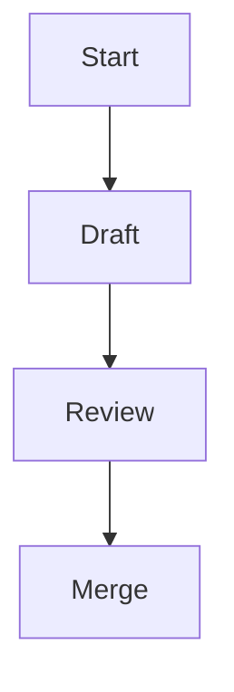

# Documentation style guide

This guide outlines conventions for authoring documentation for Lille.
These rules help keep the documentation clear and consistent for
developers.

## Spelling

- Use British English based on the
  [Oxford English Dictionary](https://public.oed.com/) (en-oxendict).
- The word **"outwith"** is acceptable.
- Keep US spelling when used in an API, for example, `color`.
- The project licence file is spelled `LICENSE` for community consistency.

## Punctuation and grammar

- Use the Oxford comma: "ships, planes, and hovercraft".
- Company names are treated as collective nouns: "Lille Industries are expanding".

## Headings

- Write headings in sentence case.
- Use Markdown headings (`#`, `##`, `###`, and so on) in order without skipping levels.

## Markdown rules

- Follow [markdownlint](https://github.com/DavidAnson/markdownlint)
  recommendations[^markdownlint].
- Provide code blocks and lists using standard Markdown syntax.
- Always provide a language identifier for fenced code blocks; use
  `plaintext` for non-code text.
- Use `-` as the first level bullet and renumber lists when items change.
- Prefer inline links using `[text](url)` or angle brackets around the URL.
- Ensure blank lines before and after bulleted lists and fenced blocks.
- Ensure tables have a delimiter line below the header row.

## Expanding acronyms

- Expand any uncommon acronym on first use, for example, Continuous Integration (CI).

## Formatting

- Wrap paragraphs at 80 columns.
- Wrap code at 120 columns.
- Do not wrap tables.
- Use footnotes referenced with `[^label]`.

## Example snippet

```rust
/// A simple function demonstrating documentation style.
fn add(a: i32, b: i32) -> i32 {
    a + b
}
```

## API doc comments (Rust)

Doc comments document public APIs and must remain consistent with the
contents of the manual.

- Begin each block with `///`.
- Keep the summary line short, followed by further detail.
- Explicitly document all parameters with `# Parameters`, describing each argument.
- Document the return value with `# Returns`.
- Document any panics or errors with `# Panics` or `# Errors` as appropriate.
- Place examples under `# Examples` and mark the code block with `no_run`
  so they compile but do not execute during documentation tests. Use
  `ignore` instead of `no_run` when the example does not compile or relies on
  external tools.
- Put function attributes after the doc comment.

````rust
/// Returns the sum of `a` and `b`.
///
/// # Parameters
/// - `a`: The first integer to add.
/// - `b`: The second integer to add.
///
/// # Returns
/// The sum of `a` and `b`.
///
/// # Examples
///
/// ```rust,no_run
/// assert_eq!(add(2, 3), 5);
/// ```
#[inline]
pub fn add(a: i32, b: i32) -> i32 {
    a + b
}
````

## Diagrams and images

Where it adds clarity, include [Mermaid](https://mermaid.js.org/) diagrams.
When embedding figures, use `` and provide concise
alt text describing the content. Add a short description before each Mermaid
diagram, so screen readers can understand it.



## Python docstrings

Docstrings document public modules, classes, and functions. Use the NumPy
style and keep descriptions short. See the
[NumPy docstring standard][numpydoc]
for the full specification.

- Begin with a one-line summary followed by a blank line and extended description.
- List parameters and return values under `Parameters` and `Returns` headings.
- Document exceptions under `Raises` and include examples in fenced `python` blocks.
- Keep lines within 80 columns and prefer present tense.

```python
def scale(values: list[float], factor: float) -> list[float]:
    """Scale numeric values by a factor.

    Parameters
    ----------
    values : list of float
        The numeric values to scale.
    factor : float
        The multiplier applied to each value.

    Returns
    -------
    list of float
        The scaled values.
    """
    return [v * factor for v in values]
```

[numpydoc]: https://numpydoc.readthedocs.io/en/stable/format.html

[^markdownlint]: A linter that enforces consistent Markdown formatting.
