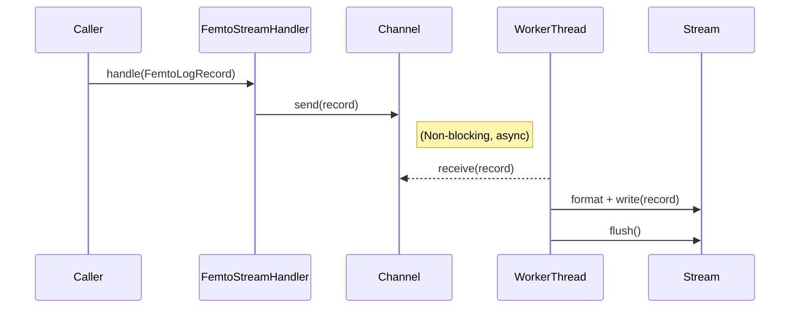

# Porting Formatters and Handlers to Rust

This document outlines a safe and thread‑aware design for moving
formatting and handler components from Python to Rust. It complements the
[roadmap](./roadmap.md) and expands on the design ideas described in
[`rust-multithreaded-logging-framework-for-python-design.md`](./rust-multithreaded-logging-framework-for-python-design.md).

## Goals

- Provide Rust implementations of formatting and handler logic
  equivalent to CPython's `logging` module, keeping API familiarity.
- Ensure all components satisfy `Send`/`Sync`, so they can operate across
  threads without unsafe code.
- Maintain a producer–consumer model for handlers, so application threads
  are never blocked by I/O.
- Use `crossbeam-channel` as the initial MPSC queue, consistent with
  [`dependency-analysis.md`](./dependency-analysis.md).

## FemtoFormatter Trait

`FemtoFormatter` defines how a `FemtoLogRecord` becomes a string. A
simple default formatter mirrors the current Python behaviour by
combining the logger name, level, and message:

```rust
pub trait FemtoFormatter: Send + Sync {
    fn format(&self, record: &FemtoLogRecord) -> String;
}

pub struct DefaultFormatter;

impl FemtoFormatter for DefaultFormatter {
    fn format(&self, record: &FemtoLogRecord) -> String {
        format!("{}: {} - {}", record.logger, record.level, record.message)
    }
}
```

Formatters are `Send + Sync` so a handler thread can hold them without
synchronisation. Custom formatters may store additional configuration,
such as timestamp layouts. Future extensions can include structured
output with `serde` when network handlers are introduced.

## FemtoHandler Trait and Implementations

Each handler owns an MPSC receiver and runs in a dedicated consumer
thread. Application code holds the sender cloned from the channel.
Handlers implement a common trait:

```rust
pub trait FemtoHandler: Send + Sync {
    fn handle(&self, record: FemtoLogRecord);
}
```

Implementations should forward the record to an internal queue with
`try_send` so the caller never blocks. If the queue is full the record is
silently dropped and a warning is written to `stderr`.

### StreamHandler

`FemtoStreamHandler` writes formatted records to `stdout` or `stderr`.
The consumer thread receives `FemtoLogRecord` values, formats them using
its `FemtoFormatter`, and writes via a mutex‑protected `Write` object to
avoid interleaving. This mirrors the locking described in
[`concurrency-models-in-high-performance-logging.md`](./concurrency-models-in-high-performance-logging.md#1-the-picologging-concurrency-model-a-hybrid-approach).
The default bounded queue size is 1024 records, but
`FemtoStreamHandler::with_capacity` lets callers configure a custom
capacity when needed.

#### Sequence Diagram



### FileHandler

`FemtoFileHandler` behaves similarly but manages an owned file handle.
Rotation variants (`FemtoRotatingFileHandler`,
`FemtoTimedRotatingFileHandler`) build on this by performing rotation
logic inside their consumer threads.

All handlers spawn their consumer threads on creation and expose a
`snd: Sender<FemtoLogRecord>` to the logger. The logger clones this
sender when created, ensuring log messages are dispatched without
blocking. Dropping the sender signals the consumer to finish once the
queue is drained.

## Thread Safety Considerations

- `FemtoLogRecord` and any user data it carries must implement `Send` so
  records can cross threads. Non‑`Send` values should be formatted into
  strings on the producer side.
- Handler state (stream, file, formatter) is encapsulated inside the
  consumer thread. Only the `Sender` is shared with producer threads,
  eliminating the need for additional locks.
- The default bounded capacity of 1024 records from
  [`dependency-analysis.md`](./dependency-analysis.md) prevents unbounded
  memory usage if a consumer stalls.
- No `unsafe` blocks are necessary; all concurrency primitives come from
  `std` or `crossbeam-channel`.

## Testing

Rust unit tests use the `rstest` crate, as shown in
[`rust-testing-with-rstest-fixtures.md`](./rust-testing-with-rstest-fixtures.md).
Handlers should expose minimal hooks (e.g. returning formatted strings in
test mode) so tests can verify output without relying on external I/O.
Integration tests will instantiate loggers and handlers together to
ensure proper channel operation and thread termination.

## Next Steps

1. Implement the `FemtoFormatter` trait and `DefaultFormatter` in Rust.
2. Port `StreamHandler` and `FileHandler` following the producer–consumer
   model.
3. Update the roadmap once these components have stable tests.
4. Expand with rotating and network handlers as described in the
   roadmap's later phases.
