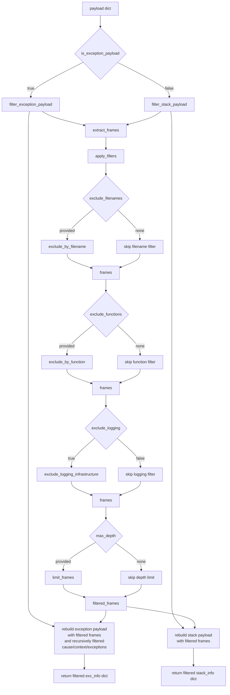

# Frame filtering API design

This document describes the frame filtering API for `exc_info` and `stack_info`
payloads in femtologging.

## Overview

The frame filtering API allows callers and formatters to exclude unwanted stack
frames from exception and stack trace payloads. Common use cases include:

- Removing logging infrastructure frames that add noise to stack traces
- Limiting stack depth for readability
- Excluding specific modules or functions from output

## Filter flow

The following diagram shows the flow of the Python `filter_frames()` function,
which applies each configured filter in sequence to produce a filtered payload:



*Figure 1: Filter flow for the `filter_frames()` function. The payload is first
classified as exception or stack type, then filters are applied conditionally
in sequence (exclusion filters before depth limiting). Exception payloads are
rebuilt with recursively filtered cause/context/exceptions chains, while stack
payloads are rebuilt with the filtered frames directly.*

## Design decisions

### Payload-level filtering

The filtering operates on payload dictionaries rather than modifying records
in-place. This approach:

- Aligns with the current design where `capture_*` functions return full frames
- Allows different formatters and handlers to filter differently
- Maintains testability and composability
- Keeps worker threads Global Interpreter Lock (GIL)-free (filtering operates on Rust-owned data)

### Filter order

Exclusion filters are applied before depth limiting. This ensures that:

1. Unwanted frames are removed first
2. The depth limit applies to the remaining useful frames
3. Users get the expected number of relevant frames

## Logging infrastructure patterns

Default patterns for `exclude_logging=True`:

- `"femtologging"` - this library
- `"_femtologging_rs"` - Rust extension
- `"logging/__init__"` - standard library logging
- `"logging/config"` - logging configuration
- `"<frozen importlib"` - import machinery

## API summary

### Rust API

Methods on `StackTracePayload`:

- `filter()` - filter frames using a predicate
- `limit()` - keep at most N frames
- `exclude_filenames()` - exclude by filename patterns
- `exclude_functions()` - exclude by function patterns
- `exclude_logging_infrastructure()` - exclude common logging frames

Methods on `ExceptionPayload`:

- `filter_frames()` - recursive filtering (handles cause, context, groups)
- `limit_frames()` - recursive depth limiting
- `exclude_filenames()` - recursive filename exclusion
- `exclude_functions()` - recursive function exclusion
- `exclude_logging_infrastructure()` - recursive infrastructure exclusion

Helper functions in `frame_filter` module:

- `filter_frames()` - predicate-based filtering
- `limit_frames()` - depth limiting
- `exclude_by_filename()` - filename pattern matching
- `exclude_by_function()` - function name pattern matching
- `exclude_logging_infrastructure()` - infrastructure frame removal

### Python API

```python
filter_frames(
    payload: dict,
    *,
    exclude_filenames: list[str] | None = None,
    exclude_functions: list[str] | None = None,
    max_depth: int | None = None,
    exclude_logging: bool = False,
) -> dict
```

Returns a new payload dictionary with frames filtered according to the
specified parameters.

```python
get_logging_infrastructure_patterns() -> list[str]
```

Returns the default patterns used to identify logging infrastructure frames.

## Usage example

```python
from femtologging import filter_frames

class MyHandler:
    def handle_record(self, record: dict) -> None:
        if exc := record.get("exc_info"):
            filtered = filter_frames(
                exc,
                exclude_logging=True,
                max_depth=10,
            )
            # Use filtered payload for output
```
