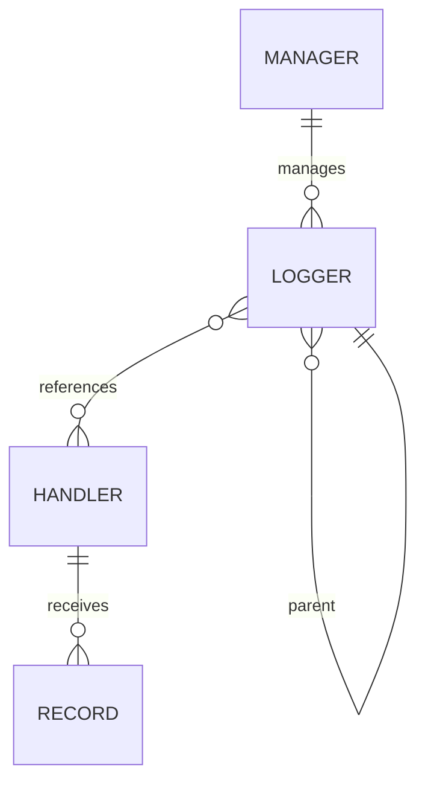
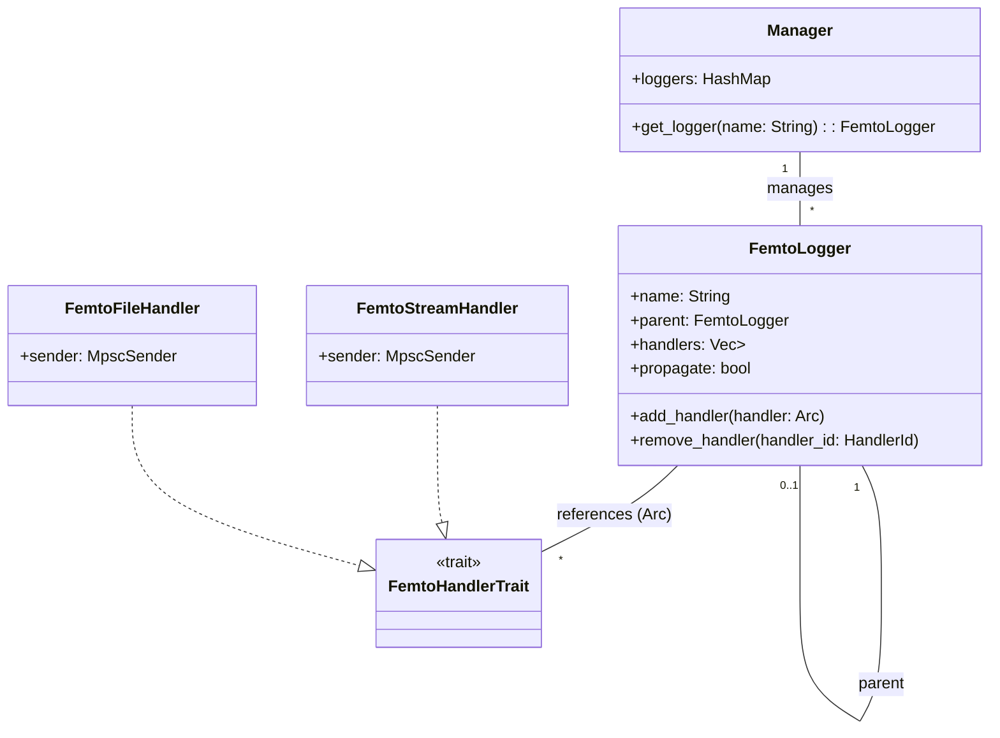
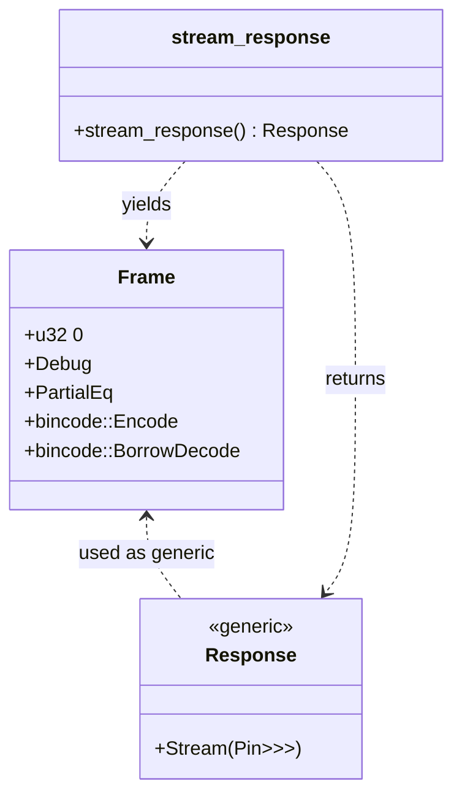

# Logger Hierarchy and Handler Relationships

This note outlines the remaining work to add flexible logger/handler wiring to
`femtologging`. The prototype originally assumed each logger owned a single
handler and that handlers were not shared. The codebase now supports multiple
handlers per logger and safely sharing a handler between loggers. The next step
is implementing hierarchical configuration using dotted names with propagation.

- [x] multiple handlers per logger
- [x] multiple loggers targeting the same handler safely
- hierarchical logger configuration using dotted names with propagation
- add_handler is currently only exposed in Rust; Python APIs will follow

## Steps to Implement

1. **Introduce a Manager registry**

   - Maintain a global `Manager` struct storing all loggers by name.
   - Protect the registry with a `parking_lot::RwLock` wrapped in a
     `once_cell::sync::Lazy` so multiple threads can read the HashMap
     concurrently while writes are serialized.
   - Each logger records its parent based on dotted name segments.
   - The root logger is created on first use and acts as the top of the tree.

2. **Allow multiple handlers per logger**

   - Change `FemtoLogger` to hold a `Vec<Arc<dyn FemtoHandlerTrait>>`.
   - Expose `add_handler()` and `remove_handler()` APIs.
   - Update logging macros to dispatch each record to every configured handler.

3. **Support handler sharing**

   - Wrap handlers in `Arc` so they can be referenced by multiple loggers.
   - Ensure the internal MPSC sender is cloned for each logger.
   - Document that handlers must be `Send + Sync + 'static` and stored as
     `Arc<dyn FemtoHandlerTrait + Send + Sync + 'static>`.

4. **Implement propagation across the hierarchy**

   - Each logger gains a `propagate` flag (default `true`).
   - When a logger handles a record, it first passes it to its own handlers,
     then forwards it to the parent logger if `propagate` is enabled.
   - Effective log level is computed by walking up the hierarchy.

5. **Provide configuration helpers**

   - Extend the builder API to attach multiple handler IDs per logger.
   - Allow handlers defined once to be referenced from several loggers.
   - Implement a `get_logger(name)` helper exposed through the Python bindings.
     It mirrors CPython's semantics and returns existing instances from the
     registry. Provide a camelCase alias `getLogger()` for backwards
     compatibility, though new code should prefer the snake_case form.

## Testing Considerations

- Unit tests should verify that records are emitted once per handler even when
  shared between loggers.
- Behavioural tests must cover propagation rules to ensure child loggers inherit
  levels and handlers from their parents unless explicitly overridden.
- Concurrency tests should create several loggers writing to the same file
  handler from multiple threads. They must assert that each log record is
  written exactly once with no data loss. Ordering between threads is not
  guaranteed, but records emitted by a single logger should appear in the order
  they were produced. Tests must also check for duplicate records when a handler
  is shared across threads.

## Architecture Diagrams

<!-- markdownlint-disable MD013 -->

<!-- markdownlint-enable MD013 -->
