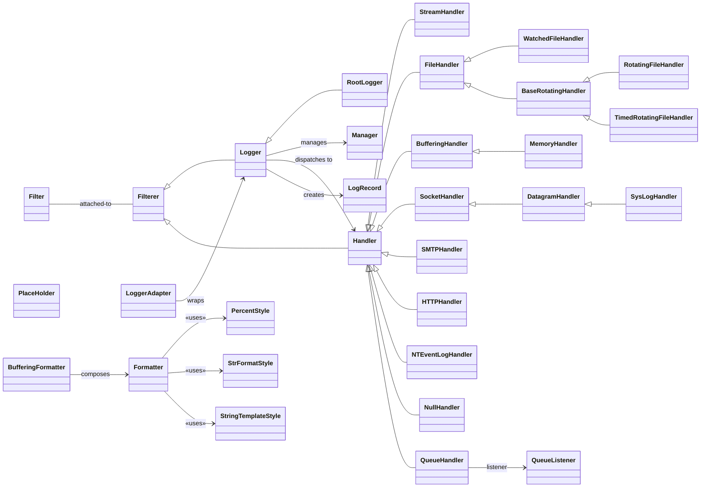

# Logging Class Overview

Below is a condensed inheritance / composition view of the `logging` package’s
class hierarchy in CPython (main branch, June 2025).\
It focuses on the public classes defined in `logging/__init__.py` and
`logging/handlers.py` and shows how the principal handler families relate to
`Logger`, `Filterer`, and `Formatter`.

## Notes & coverage

- `Filterer` is a mix-in providing support for `Filter` objects; both `Logger`
  and every `Handler` subclass inherit from it to gain
  `addFilter`/`removeFilter`, as seen in the core module definition
  ([github.com](https://github.com/python/cpython/raw/main/Lib/logging/__init__.py?plain=1)).

- Core logging classes (`Logger`, `Manager`, `PlaceHolder`, `LogRecord`,
  `Formatter`, …) live in `logging/__init__.py`.

- Most specialised handlers live in `logging/handlers.py`. The file defines the
  rotating‐file family, network-oriented handlers, queue helpers, etc.; for
  instance `BaseRotatingHandler` and its subclasses
  ([github.com](https://github.com/python/cpython/raw/main/Lib/logging/handlers.py?plain=1)),
  and buffering-based handlers
  ([github.com](https://github.com/python/cpython/raw/main/Lib/logging/handlers.py?plain=1)).

- Only inheritance and the most important *has-a* relations are shown; run-time
  wiring (e.g. a `Logger` holding multiple `Handler` instances) is depicted at a
  high level.

- Platform-specific handlers (such as `NTEventLogHandler`) are included even
  though they are only available on Windows builds.

- `logging.config` is outside the scope of the request, so configurator classes
  (`DictConfigurator`, `BaseConfigurator`, …) are omitted.

Drop the diagram straight into any Markdown viewer with Mermaid support (or
GitHub/GitLab’s preview) to render it.
