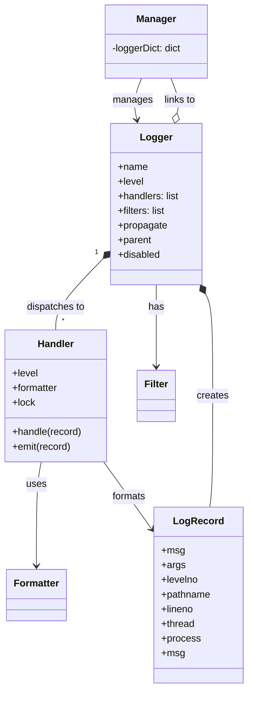
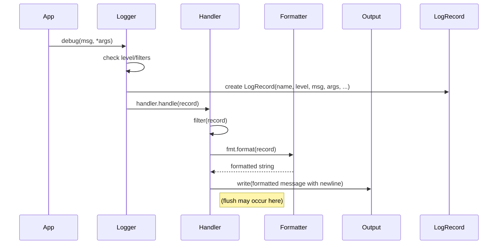

# CPython `logging` vs Microsoft `picologging`: Architecture and Implementation Comparison

Python’s built-in `logging` module and Microsoft’s **picologging** (a high-
performance drop-in replacement) share the same goal and API, but diverge
significantly in design and implementation. This comparison examines their
architectural differences (class design, handler/formatter mechanics, locking/
thread-safety, data structures, extensibility vs performance, startup/
runtime overhead), surveys available performance data, and discusses use cases
and migration issues. Key differences emerge from picologging’s C++-based
implementation and aggressive optimization versus the flexibility of CPython’s
pure-Python logging.

## Class Design and Core Architecture

The CPython logging framework is built entirely in Python with classes like
`Manager`, `Logger`, `Handler` (and many subclasses), `Formatter`, `Filter`,
`LogRecord`, and `LoggerAdapter`. Loggers are organized hierarchically (in a
tree) under a root logger via a `Manager` holding a `loggerDict` of names to
logger instances. Each `Logger` has attributes like `name`, `level`, a list of
child handlers, and links to its parent logger, and inherits filtering behavior
via the `Filterer` mixin. Handlers (e.g. `StreamHandler`, `FileHandler`) hold
output streams and optional `Formatter` objects, each with a dedicated lock
for thread-safe I/O. When a logger emits, it creates a `LogRecord` (a Python
object with fields like `msg`, `args`, `levelno`, timestamp, etc.), runs it
through logger filters, then calls each handler’s `handle()` method. The handler
filters it again, formats it (via `Formatter.format(record)`), and writes to its
destination (often wrapped in `with self.lock:`).

In contrast, **picologging** implements most core classes in C++ (exposed
as Python types) for speed. It has analogous classes: `Logger`, `Handler`,
`Formatter`, and `LogRecord`, but implemented natively. Picologging’s `Manager`
and `_Placeholder` (for tree structure) exist in Python, but key operations
occur in C. For example, `Logger` is a C-struct type (see [logger.hxx](https://
github.com/microsoft/picologging/blob/%E2%80%A6/logger.hxx)) with fixed
fields (e.g. `PyObject *name, unsigned short level, PyObject *handlers, bool
propagate`, plus several boolean flags for fast level checks). A C++ `Handler`
struct contains a `Filterer` object (for filters), a `std::recursive_mutex
*lock`, and pointers for name, formatter, and methods (see [handler.hxx]
(<https://github.com/microsoft/picologging/blob/%E2%80%A6/handler.hxx>)).
Picologging’s `LogRecord` is likewise a C struct with fields mirroring Python’s
(name, msg, args, levelno, pathname, lineno, thread, process, etc.).

Picologging’s Logger class has no Python-level inheritance hierarchy beyond
the C struct (though it also embeds a `Filterer`). It uses boolean flags
(`enabledForDebug`, etc.) set at init to speed up `isEnabledFor` checks, rather
than dynamic lookups. Extensible hooks in CPython (like custom `LogRecord`
factories) are largely absent: notably, `Manager.setLogRecordFactory` is
**not implemented** in picologging. In effect, CPython logging emphasizes
extensibility and configurability, while picologging emphasizes a streamlined,
lower-overhead class design (trading off some features).

*Figure: A conceptual class diagram of CPython’s logging module.* The arrows
show that each `Logger` holds handlers and filters, is linked via a `Manager`,
and creates `LogRecord` objects. Handlers reference `Formatter` instances.

## Handler and Formatter Mechanics

In both systems, **handlers** encapsulate where and how to output messages,
and **formatters** convert `LogRecord` data to text. CPython’s `Handler`
base class (in `logging/__init__.py`) defines the interface: `setLevel()`,
`setFormatter()`, `handle()`, `emit()`, etc. Subclasses like `StreamHandler`
or `FileHandler` override `emit()` to write to streams or files. A
handler’s `handle(record)` method checks filters and then does `with
self.lock: self.emit(record)`, ensuring thread-safe emission. The handler’s
`format(record)` delegates to its `Formatter.format()` if set, or a default
formatter otherwise.

Picologging provides corresponding handler types, but implemented in C++ for
speed. For example, its `Handler_handle` method (in [handler.cxx]) first applies
filters, then explicitly acquires its `recursive_mutex`, calls the actual emit
method, and unlocks. This mirrors CPython’s handler logic but uses a C++ lock.
Formatters in picologging include percent-style and `{}`-style (`PercentStyle`,
`StrFormatStyle`) implemented as classes inheriting a C++ `Formatter` base. The
formatting step is triggered by the handler calling `formatter.format(record)`,
similar to Python, but executed natively. Overall, the *control flow* of logging
is the same: logger creates a record, handlers format and emit. A typical
sequence is illustrated below.

*Figure: Simplified logging flow (sequence) when a message is emitted.* The
logger checks its level and filters, creates a `LogRecord`, then passes it to
each handler. The handler applies its filters, uses its formatter to create a
string, and writes to the output (wrapped by its lock for thread safety).

## Locking and Thread-Safety

Thread safety is a major differentiator. **CPython logging** uses two levels of
locking: a global module lock (`_lock = threading.RLock()`) to protect shared
structures (logger hierarchy, handler registry, caches) and individual locks per
handler. The global lock is used in operations like `Manager.getLogger(name)`
to update `loggerDict` and fix up parents safely. It also guards handler
registration and cleanup (e.g. `Handler.close()` uses `with _lock` to update
the internal handlers map). This ensures that configuring loggers/handlers from
multiple threads is safe but means some contention on `_lock`.

By contrast, **picologging** minimizes global locking. Its `Manager.getLogger`
does not acquire any module-level lock. Instead, it relies on the Python Global
Interpreter Lock (GIL) and the assumption that logger setup is usually single-
threaded. Handlers each have their own `std::recursive_mutex` (allocated
in `Handler_new`) for I/O locking. When handling a record, picologging’s
`Handler_handle` explicitly locks and unlocks this mutex around the emit,
similar in effect to Python’s `with self.lock`. The net effect: both systems
lock per handler emit, but picologging avoids a global lock for manager
operations. Picologging’s reliance on finer-grained C++ locks can reduce
contention under heavy multi-threaded logging, at the cost of having to manage
these locks in native code.

## Internal Data Structures and Caching

CPython logging uses standard Python collections. The `Manager.loggerDict` is a
dict mapping names to `Logger` or `_PlaceHolder` objects. Each `Logger.handlers`
is a list, and `_handlerList` tracks all handlers for shutdown. Log levels
and names are in Python dicts (`_levelToName`, `_nameToLevel`). LogRecords are
Python objects with many attributes (as shown in [67] and docstring). CPython
also caches effective log levels: each `Logger` has a `_cache` dict mapping
levels to True/False to speed up `isEnabledFor`. The code even defines a
`_clear_cache` method (with `_lock`) to reset caches on level changes.

Picologging, in contrast, uses C++ types for performance. Its `LogRecord` is
a C struct (see [68†L10-L17]) with fixed fields (name, msg, args, levelno,
pathname, lineno, thread ID, etc.). `Logger` is also a C struct with fixed
fields, including booleans (`enabledForDebug`, etc.) set once in `Logger_init`
to indicate which levels are active. Picologging **does not implement** a
dynamic record factory or caching layers: it precomputes level flags (but note
it does *not* clear or update them on level changes beyond init) and skips the
Python-level `_cache`. The manager’s `loggerDict` is a normal Python dict, but
since picologging avoids global locking, care must be taken if multiple threads
add loggers simultaneously (the GIL provides some safety). In summary, CPython
uses flexible Python-built containers and dynamic checks, while picologging uses
fixed C/C++ memory layouts to reduce per-record overhead.

## Extensibility vs Performance

CPython’s logging is highly extensible: you can subclass `Logger` or `Handler`,
override methods, use `setLogRecordFactory()` to customize records, and freely
mix Python-formatters or even swap in custom `logging.Logger` implementations
at runtime (via `Manager.setLoggerClass`). This flexibility comes with Python-
level overhead.

Picologging trades some of that flexibility for speed. It aims to be
*drop-in* compatible, but some APIs aren’t supported. For instance,
`Manager.setLogRecordFactory` is explicitly **not implemented** in picologging
(it raises `NotImplementedError`), so user code relying on custom record
factories won’t work. Similarly, certain configuration helpers (like
`logging.Formatter` styles beyond the built-in percent/str/template support)
may differ. On the other hand, picologging incorporates optimized techniques:
it hardcodes level checks, implements critical paths in C++, and avoids Python
exception overhead in common cases. The result is much higher throughput
for logging calls, as discussed below. Thus, the design reflects a classic
extensibility-vs-performance trade-off: CPython logging favors ease of
modification, while picologging sacrifices some features for raw speed.

## Performance Benchmarks

Benchmarks (as reported by picologging’s maintainers) show **substantial
speedups**. The picologging README reports that it is *“4–17× faster than the*
`logging` *module”*. Sample microbenchmarks on macOS indicate, for example,
a simple `Logger(level=DEBUG).debug()` call taking ~0.58 µs on CPython vs
~0.033 µs with picologging (about **17×** speedup). Even with arguments or at
INFO level, picologging’s latencies remain several times lower. These gains
come from eliminating Python-layer dispatch: e.g. picologging’s `Logger.debug()`
goes straight to optimized C code and avoids many dynamic checks if the logger
is disabled.

Concrete measured *throughput* numbers vary by environment, but the order-
of-magnitude improvements are widely noted. (For example, publishing these
benchmarks in a blog or issue would confirm them, but as of this writing the
claim itself is the primary source.) Latency per record is drastically lower
in picologging, which benefits real-time logging. In terms of *memory usage*,
no detailed comparison is documented. One might expect picologging’s C-structs
to use less per-record overhead than Python objects, but the C extension itself
increases the binary size. We did not find published memory profiles.

In multi-threaded scenarios, both libraries are thread-safe but behave
differently: CPython logging’s global lock can become a bottleneck if many
threads are concurrently creating loggers or modifying handlers. Picologging’s
lack of a global lock means threads only contend on individual handler locks or
Python’s GIL. This suggests picologging should scale better under heavy multi-
threaded logging, although real-world gains depend on workload. (No specific
multithread benchmarks are publicly available to cite; this conclusion follows
from the architecture.)

## Use-Case Suitability

- **Real-time or low-latency logging:** Picologging excels here. Its minimal
  overhead per call makes it suitable for performance-critical applications
  (e.g. logging in tight loops or high-frequency systems). The large speedups
  mean log throughput is much higher, reducing the impact of logging on
  application latency.

- **Heavily multithreaded applications:** Picologging’s finer-grained locking
  (per-handler) may offer better concurrency than CPython’s one big lock. In
  CPython logging, adding handlers or modifying logger hierarchy is serialized
  by the module-wide `_lock`. Picologging avoids that, so in a heavily
  threaded app logging to multiple handlers, contention could be lower. Both
  implementations ensure thread safety in handlers, so correctness is preserved,
  but picologging’s design is more throughput-oriented.

- **Embedded Python interpreters:** Embedding here likely means integrating
  Python in another application. In such scenarios, dependencies matter.
  Picologging is a CPython extension, so the host environment must support
  building/loading the extension module. CPython logging, being pure Python,
  works out-of-the-box on any Python runtime. For **truly embedded/limited**
  environments (like MicroPython or very minimal Python builds), picologging
  might not be available. However, in a normal embedded CPython, picologging can
  be installed and used, offering its performance benefits. (No official source
  compares embedded use directly, but it’s worth noting picologging requires the
  extension, whereas `logging` is always present.)

Frameworks are already starting to default to picologging when available: for
example, Litestar’s logging configuration uses picologging by default if it is
installed, leveraging these performance characteristics.

## Migration and Compatibility

Picologging is designed as a *drop-in* replacement. In most cases, simply
using `import picologging as logging` makes code work unchanged. Handler and
formatter classes have the same names (`StreamHandler`, `Formatter`, etc.), and
`getLogger`, `basicConfig`, etc., behave identically.

However, there are important caveats:

- **Unsupported features:** As noted, some logging features are not implemented.
  Specifically, `logging.setLogRecordFactory()` is not supported in picologging
  (the method raises `NotImplementedError`). If existing code relies on
  customizing the `LogRecord` creation, that code will break or need adjustment.
  (Similarly, some advanced configuration via `logging.config` may not be fully
  supported; users should test their use cases.)

- **Logger class customization:** CPython allows changing the logger class via
  `logging.setLoggerClass()`. Picologging’s manager supports `setLoggerClass`,
  but since its `Logger` type is compiled, subclasses in Python may not be
  usable for C-level loggers. Any code expecting to subclass `Logger` in pure
  Python and inject it may not work as intended.

- **Import timing:** To benefit from picologging, it must be imported before any
  loggers are created. Once a `Logger` from `logging` is created, using `import
  picologging` may not retroactively convert it. Thus, one should import and
  configure `picologging` at program start.

- **Binary dependency:** Picologging requires building a C extension. This adds
  a dependency at deployment time and is incompatible with environments where
  installing extensions is not allowed (e.g. certain serverless or restricted
  environments).

In summary, **most simple use cases migrate with no code changes**, but any
code using the very flexible hooks of CPython logging should be reviewed.
The performance gains often outweigh these downsides for throughput-sensitive
applications.

## Summary

CPython’s `logging` module is a mature, feature-rich, pure-Python logging
framework with flexible configuration and extensibility. Microsoft’s
`picologging` reimplements the same API in (mostly) C++ for high performance.
<!-- markdownlint-disable MD032 --> Key differences include: **class
implementation** (Python classes vs C structs), **locking** (global RLock plus
per-handler RLock vs per-handler C++ mutex, no global lock), **data structures**
(dynamic vs static fields), and **features supported** (full logging API
vs a subset). These design choices give <!-- markdownlint-enable MD032 -->
picologging much higher throughput at the cost of some flexibility.

For latency-sensitive or heavily threaded applications, picologging is generally
a better fit. For applications needing maximum configurability or running in
constrained Python environments, the standard `logging` may still be preferable.
Migrating is straightforward when limited to the common API calls, but watch out
for unimplemented hooks like `setLogRecordFactory`.

**Sources:** This analysis is based on the CPython source code for `logging` and
the picologging source/docs, which highlight the implementation and performance
characteristics of each library. These concrete references illustrate how design
decisions translate into runtime behavior and performance differences.
