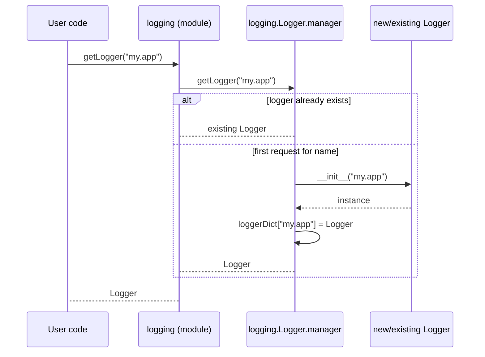
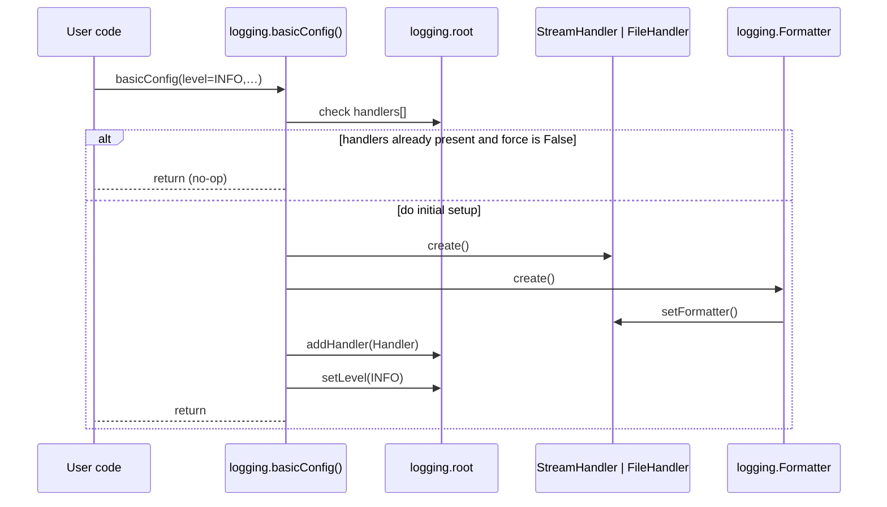
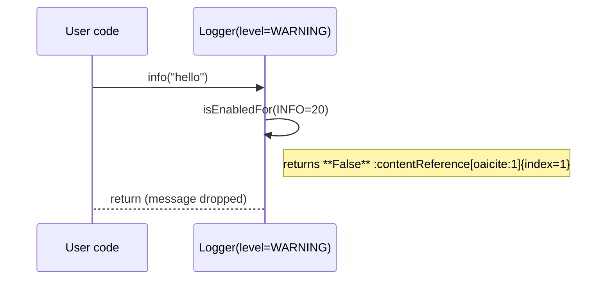
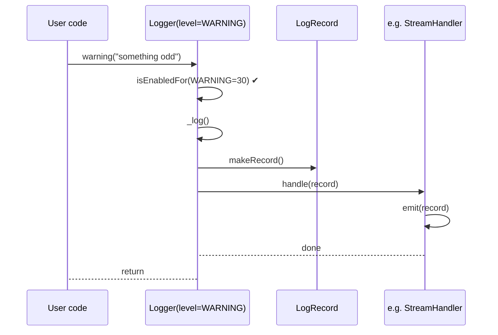
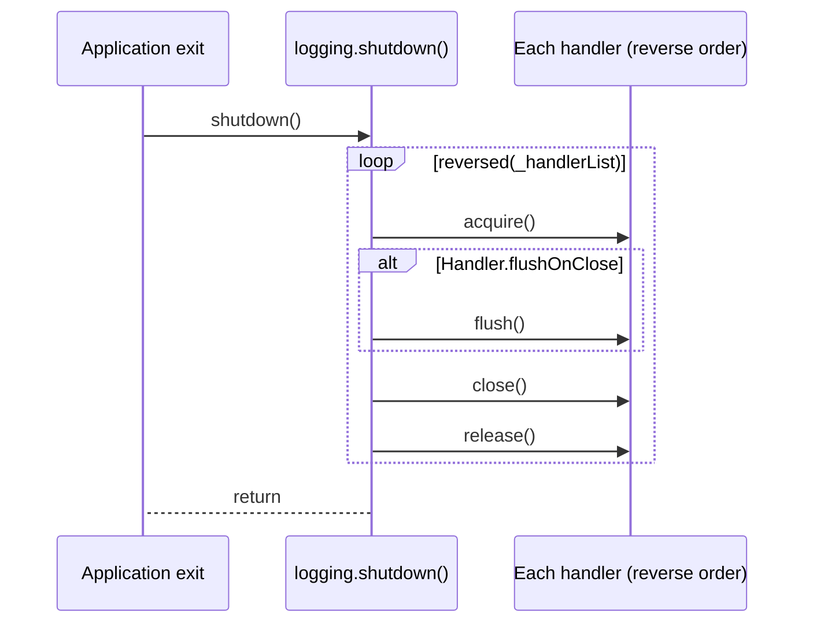

Below are five **Mermaid sequence diagrams** that trace the *happy-path* control-flow inside CPython’s `logging` package (main branch, June 2025).\
I have interpreted your “`letLogger()`” as the canonical `logging.getLogger()`—there is no function named *letLogger* in the standard library.\
All call-stacks have been pared down to the routines and objects that perform real work, using the current source code for reference ([github.com](https://github.com/python/cpython/raw/main/Lib/logging/__init__.py), [github.com](https://github.com/python/cpython/raw/main/Lib/logging/__init__.py), [github.com](https://github.com/python/cpython/raw/main/Lib/logging/__init__.py), [github.com](https://github.com/python/cpython/raw/main/Lib/logging/__init__.py), [github.com](https://github.com/python/cpython/raw/main/Lib/logging/__init__.py)).

---

### 1 `getLogger(name)` – retrieve or create a logger

---

### 2 `basicConfig(...)` – one-shot root logger configuration

---

### 3 `logger.info()` when *effective level = WARNING*

The `INFO` record never reaches `_log()` because the short-circuit guard fails.

---

### 4 `logger.warning()` when *effective level = WARNING*

The message propagates to every handler whose own level permits it; only one generic handler is shown for brevity.

---

### 5 `shutdown()` – orderly shutdown at process exit

`shutdown()` is automatically registered with `atexit`, so normal interpreter termination flushes and closes all live handlers ([github.com](https://github.com/python/cpython/raw/main/Lib/logging/__init__.py)).

---

#### Reading the diagrams

- *Participants* are real objects or modules as they appear in the current source.

- `alt`/`else` blocks show mutually exclusive paths; `loop` indicates iteration.

- Only logically significant calls are shown—locks, internal helpers and error handling are omitted unless essential to the behaviour being described.

Drop any of these diagrams straight into a Mermaid-enabled Markdown viewer (e.g. GitHub) and they will render inline.