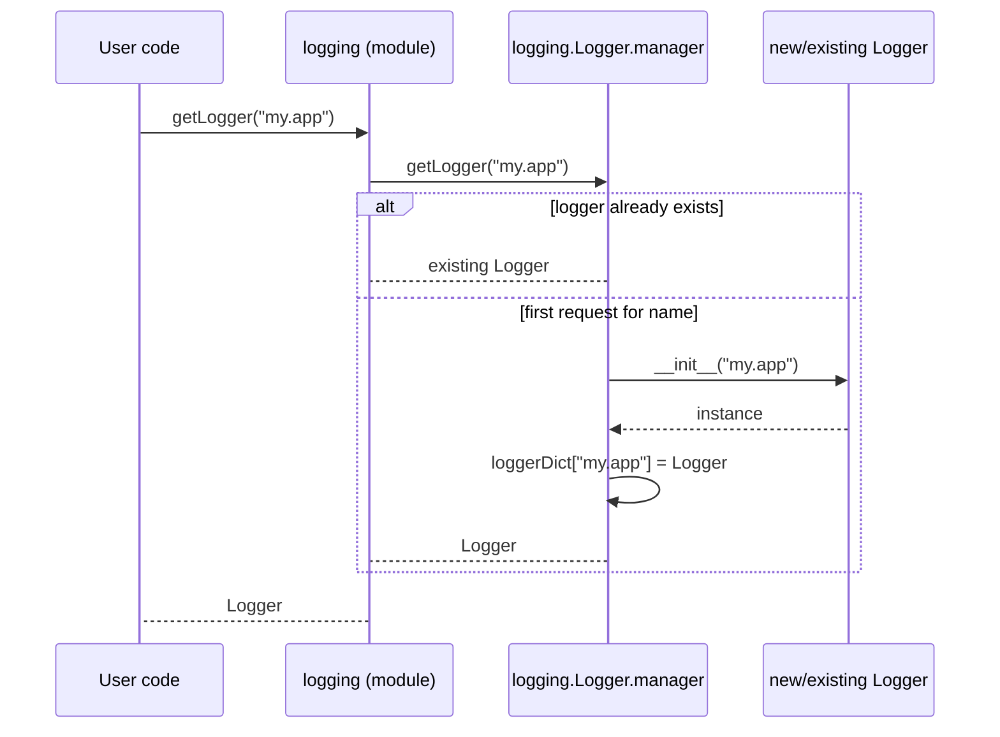
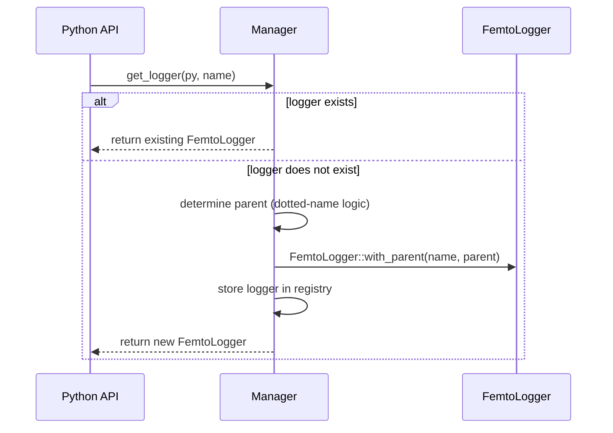
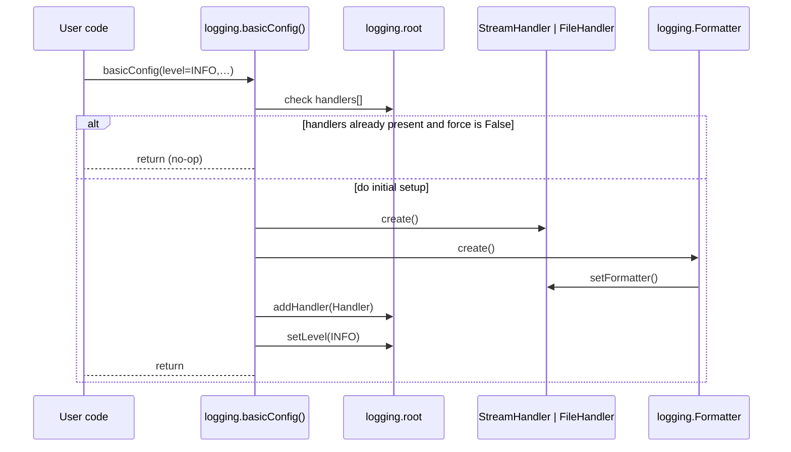
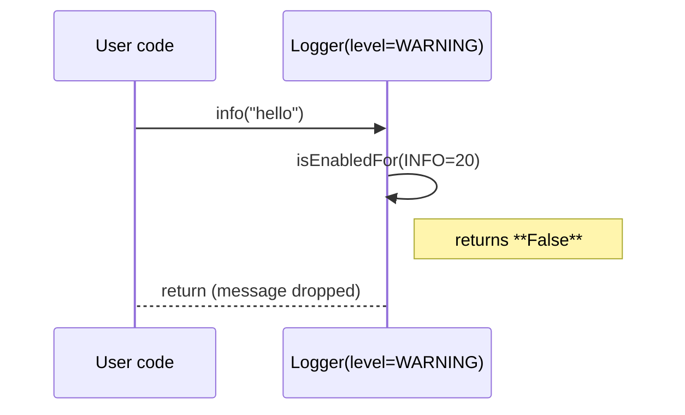
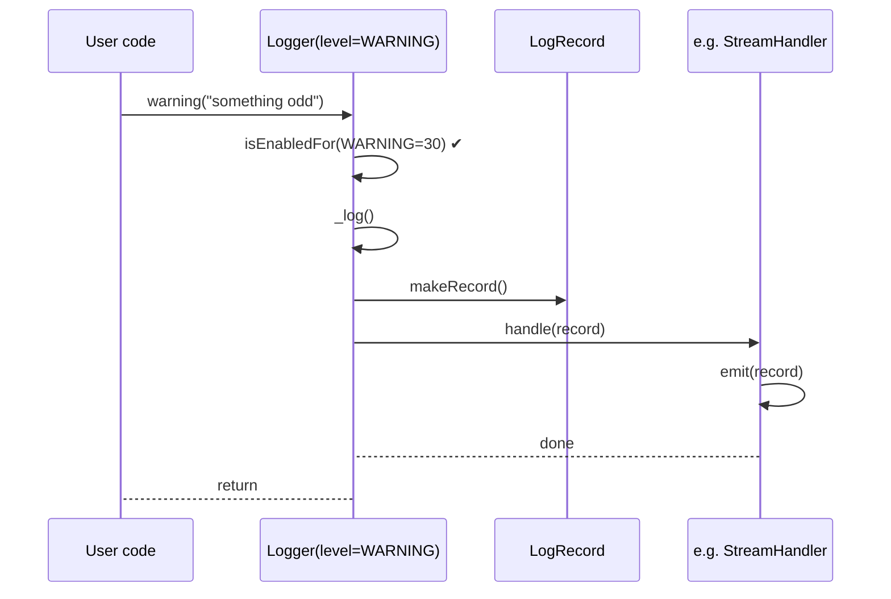
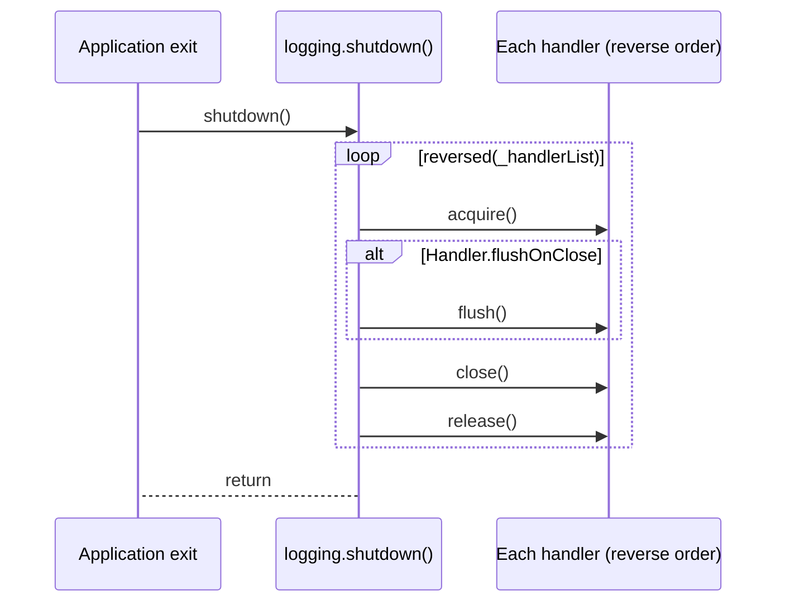
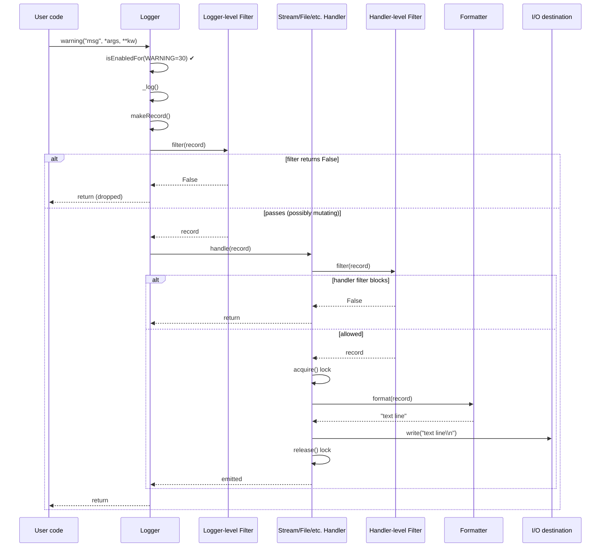
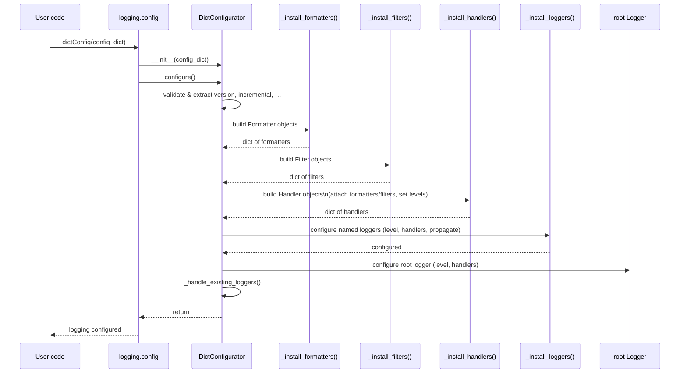

# Logging Sequence Diagrams

Below are five **Mermaid sequence diagrams** that trace the *happy-path*
control-flow inside CPython’s `logging` package (main branch, June 2025).\\

All call-stacks have been pared down to the routines and objects that perform
real work, using the current source code for reference
([`Lib/logging/__init__.py`](https://github.com/python/cpython/raw/main/Lib/logging/__init__.py)).

______________________________________________________________________

## 1 `getLogger(name)` – retrieve or create a logger

## `Manager.get_logger()` – femtologging

______________________________________________________________________

## 2 `basicConfig(...)` – one-shot root logger configuration

______________________________________________________________________

## 3 `logger.info()` when *effective level = WARNING*

The `INFO` record never reaches `_log()` because the short-circuit guard fails.

______________________________________________________________________

## 4 `logger.warning()` when *effective level = WARNING*

The message propagates to every handler whose own level permits it; only one
generic handler is shown for brevity.

______________________________________________________________________

## 5 `shutdown()` – orderly shutdown at process exit

`shutdown()` is automatically registered with `atexit`, so normal interpreter
termination flushes and closes all live handlers
([Lib/logging/\_\_init\_\_.py](https://github.com/python/cpython/raw/main/Lib/logging/__init__.py)).

______________________________________________________________________

## 6 `Logger.warning()` with Filter + Formatter

### Key code points for `Logger.warning()`

- `Logger.warning()` short-circuits on level then calls `_log()`.
- `Handler.handle()` applies its own filters, formats the record and calls
  `emit()` under a lock.

______________________________________________________________________

## 7 `logging.config.dictConfig()` – dictionary-driven configuration

### Key code points for `dictConfig()`

- `dictConfig(config)` simply instantiates `DictConfigurator` and calls its
  `configure()` method.
- Inside `DictConfigurator.configure()` the helper routines
  `_install_formatters`, `_install_filters`, `_install_handlers`,
  `_install_loggers`, and `configure_root` are invoked in that order (see start
  of file for these helpers), before the clean-up call
  `_handle_existing_loggers`.

______________________________________________________________________

#### Reading the diagrams

- *Participants* are real objects or modules as they appear in the current
  source.

- `alt`/`else` blocks show mutually exclusive paths; `loop` indicates iteration.

- Only logically significant calls are shown—locks, internal helpers and error
  handling are omitted unless essential to the behaviour being described.
