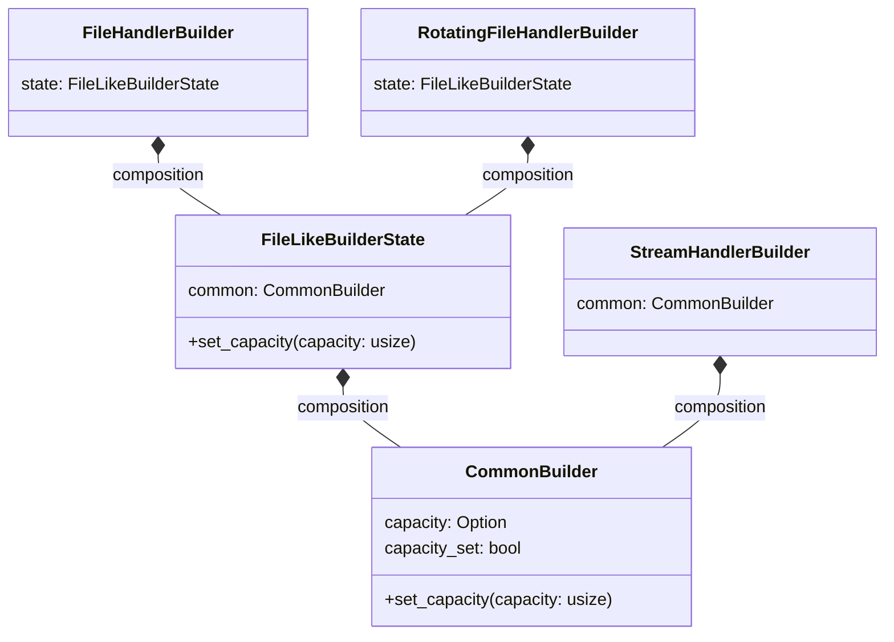
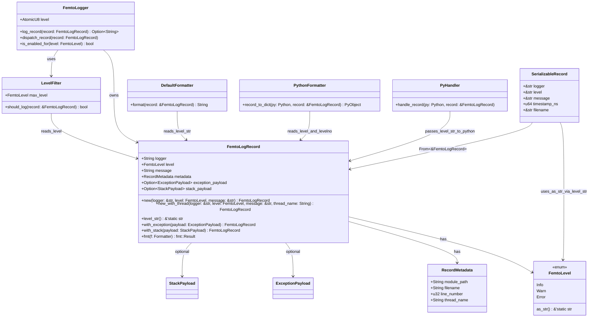

# Rust Extension

This project includes a small Rust extension built with
[PyO3](https://pyo3.rs/) (currently `^0.25.1`). Initially, it exposed only a
trivial `hello()` function and the `FemtoLogger` class. It has since grown to
provide the core handler implementations as well:

- `FemtoStreamHandler` writes log records to `stdout` or `stderr` on a
  background thread.
- `FemtoFileHandler` persists records to a file, also using a dedicated worker
  thread. It now provides `flush()` and `close()` to deterministically manage
  that thread.

The file handler lives under `rust_extension/src/handlers/file`. This directory
splits responsibilities into three modules:

1. `config.rs` – configuration types shared with the Python bindings.
2. `worker.rs` — the asynchronous consumer thread that writes log records.
3. `mod.rs` — the public API exposing `FemtoFileHandler` and re‑exporting the
    configuration items.

## Builder composition

The handler builders reuse a small shared state machine so both the Rust and
Python APIs surface identical fluent setters. The diagram below illustrates how
`CommonBuilder` embeds into each handler-specific builder, and how
`FileLikeBuilderState` composes the shared configuration required by file-based
handlers.



```rust
use femtologging_rs::handlers::file::{FemtoFileHandler, HandlerConfig};
```

The module initialiser `_femtologging_rs` delegates registration of
Python-specific builders and errors to
[`add_python_bindings`](./add-python-bindings.md). This helper keeps
conditional compilation concise by grouping Python-only items in one place. The
crate re-exports these builder types, and `FilterBuildErrorPy` when the
`python` feature is enabled, so they remain available from the public API.

## Public API Re-exports

The crate exposes selected types from its internal modules so consumers can
configure loggers without digging into submodules. These items are always
available, though they are added to the Python module only when the `python`
feature is enabled via [`add_python_bindings`](./add-python-bindings.md).

| Symbol                 | Source module                                  |
| ---------------------- | ---------------------------------------------- |
| `ConfigBuilder`        | `config::ConfigBuilder`                        |
| `FormatterBuilder`     | `config::FormatterBuilder`                     |
| `LoggerConfigBuilder`  | `config::LoggerConfigBuilder`                  |
| `FemtoFilter`          | `filters::FemtoFilter`                         |
| `FilterBuildError`     | `filters::FilterBuildError`                    |
| `FilterBuildErrorPy`   | `filters::FilterBuildErrorPy` (python feature) |
| `FilterBuilderTrait`   | `filters::FilterBuilderTrait`                  |
| `LevelFilterBuilder`   | `filters::LevelFilterBuilder`                  |
| `NameFilterBuilder`    | `filters::NameFilterBuilder`                   |
| `DefaultFormatter`     | `formatter::DefaultFormatter`                  |
| `FemtoFormatter`       | `formatter::FemtoFormatter`                    |
| `FemtoHandler`         | `handler::FemtoHandler`                        |
| `FemtoHandlerTrait`    | `handler::FemtoHandlerTrait`                   |
| `FileHandlerBuilder`   | `handlers::FileHandlerBuilder`                 |
| `HandlerBuilderTrait`  | `handlers::HandlerBuilderTrait`                |
| `HandlerConfigError`   | `handlers::HandlerConfigError`                 |
| `HandlerIOError`       | `handlers::HandlerIOError`                     |
| `StreamHandlerBuilder` | `handlers::StreamHandlerBuilder`               |
| `FemtoLevel`           | `level::FemtoLevel`                            |
| `FemtoLogRecord`       | `log_record::FemtoLogRecord`                   |
| `RecordMetadata`       | `log_record::RecordMetadata`                   |
| `FemtoLogger`          | `logger::FemtoLogger`                          |
| `QueuedRecord`         | `logger::QueuedRecord`                         |
| `FemtoStreamHandler`   | `stream_handler::FemtoStreamHandler`           |
| `StreamHandlerConfig`  | `stream_handler::HandlerConfig`                |

Packaging is handled by [maturin](https://maturin.rs/). Use version
`>=1.9.1,<2.0.0` as declared in `pyproject.toml`. The `[tool.maturin]` section
declares the extension module as `femtologging._femtologging_rs`, so running
`pip install .` automatically builds the Rust code. Windows users may need the
MSVC build tools installed, or may need to run maturin with
`--compatibility windows` to build.

PyO3 0.25 introduced `Bound` return types for constructors such as
`PyDict::new(py)`. When dictionaries must be returned to Python, use
`pyo3::IntoPyObjectExt::into_py_any(d, py)` rather than the pre‑0.25 pattern of
`unbind().into()`. This keeps the object bound to the Global Interpreter Lock
(GIL) during conversion.

```rust
let d = pyo3::types::PyDict::new(py);
let obj = pyo3::IntoPyObjectExt::into_py_any(d, py)?;
```

`FemtoLogRecord` now groups its contextual fields into a `RecordMetadata`
struct. Each record stores a timestamp, source file and line, module path and
thread ID. The thread name is included when available, along with any
structured key‑value pairs. Use `FemtoLogRecord::new` for default metadata or
`FemtoLogRecord::with_metadata` to supply explicit values.

`FemtoLevel` defines the standard logging levels (`TRACE`, `DEBUG`, `INFO`,
`WARN`, `ERROR`, `CRITICAL`). Each `FemtoLogger` holds a current level and
drops messages below that threshold. The `set_level()` method updates the
logger's minimum level using a `FemtoLevel` value. Likewise, `log()` accepts a
`FemtoLevel` and message, returning the formatted string or `None` when a
record is filtered out.

### Log record structure

`FemtoLogRecord` stores a single `FemtoLevel` value as its source of truth for
the log level. The `level_str()` method provides zero-allocation access to the
canonical string representation via `FemtoLevel::as_str()`. This design
eliminates split-brain scenarios where string and enum representations could
diverge.



*Figure 1: Class diagram showing `FemtoLogRecord` with its single `FemtoLevel`
source of truth. Consumers access the level string via `level_str()`, which
delegates to `FemtoLevel::as_str()` for zero-allocation string access.*

## Runtime level updates

`FemtoLogger` supports dynamic log level changes at runtime via `set_level()`
and a `level` property getter. These operations are thread-safe:

- **Storage:** The level is stored in an `AtomicU8`, enabling lock-free reads
  and writes across producer and consumer threads.
- **Memory ordering:** Both getter and setter use `Ordering::Relaxed`. This
  provides atomicity without synchronization overhead, appropriate because
  level changes do not need to synchronize with other memory operations.
- **Behaviour:** Level changes take effect immediately for subsequent `log()`
  calls. Records already in the handler queue are not affected.

### Python API

```python
from femtologging import FemtoLogger

logger = FemtoLogger("app")
logger.set_level("ERROR")    # Only ERROR and above will be logged
print(logger.level)          # "ERROR"
logger.set_level("DEBUG")    # Now DEBUG and above
```

### Rust API

```rust
use femtologging_rs::{FemtoLogger, FemtoLevel};

let logger = FemtoLogger::new("app".into());
logger.set_level(FemtoLevel::Error);
assert_eq!(logger.get_level(), FemtoLevel::Error);
```

## Rust log crate bridge

When built with the default `log-compat` feature, femtologging can act as the
backend for Rust's `log` facade. Call `femtologging.setup_rust_logging()` early
during application start-up to install a global Rust logger that forwards
`log::info!()` and similar calls into femtologging handlers.

This installs a global logger for the entire Rust process. If another global
logger is already installed, `setup_rust_logging()` raises `RuntimeError` and
does not replace it. The call is idempotent after a successful install.

Users building the extension from source may disable the bridge with
`cargo build --no-default-features`, or re-enable it explicitly with
`--features log-compat`.

`FemtoLogger` can now dispatch a record to multiple handlers. Handlers
implement `FemtoHandlerTrait` and run their I/O on worker threads. The logger
keeps its handler list inside an `RwLock<Vec<Arc<dyn FemtoHandlerTrait>>>`,
allowing handlers to be added through `&self`. Calling `add_handler()` pushes
another reference into that list. When `log()` creates a `FemtoLogRecord`, it
sends a clone to each configured handler, ensuring thread‑safe routing via the
handlers' MPSC queues.

Handlers observe log records in the order they are attached. Adding a handler
while other threads are logging is safe—new handlers only receive records
logged after the addition completes. The `remove_handler()` method works
through `&self` as well and detaches a handler so it no longer receives
subsequent records.

Handlers manage worker threads; the logger simply forwards each record to every
handler. Callers may invoke a handler's `flush()` method to ensure queued
messages are written before dropping it.

The `add_handler()` method is exposed through the Python bindings and can be
called on a shared logger instance. It verifies the provided object defines a
callable `handle(logger, level, message)` method and raises `TypeError` if the
check fails. Built-in handlers like `FemtoStreamHandler` and `FemtoFileHandler`
pass automatically; custom classes must implement a compatible `handle` method.
