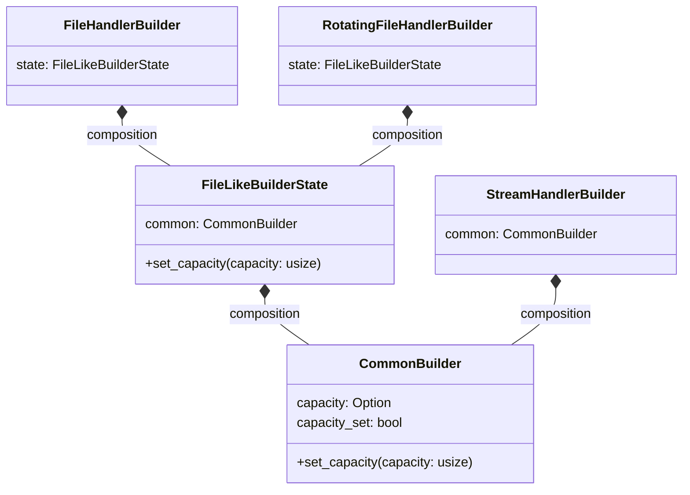
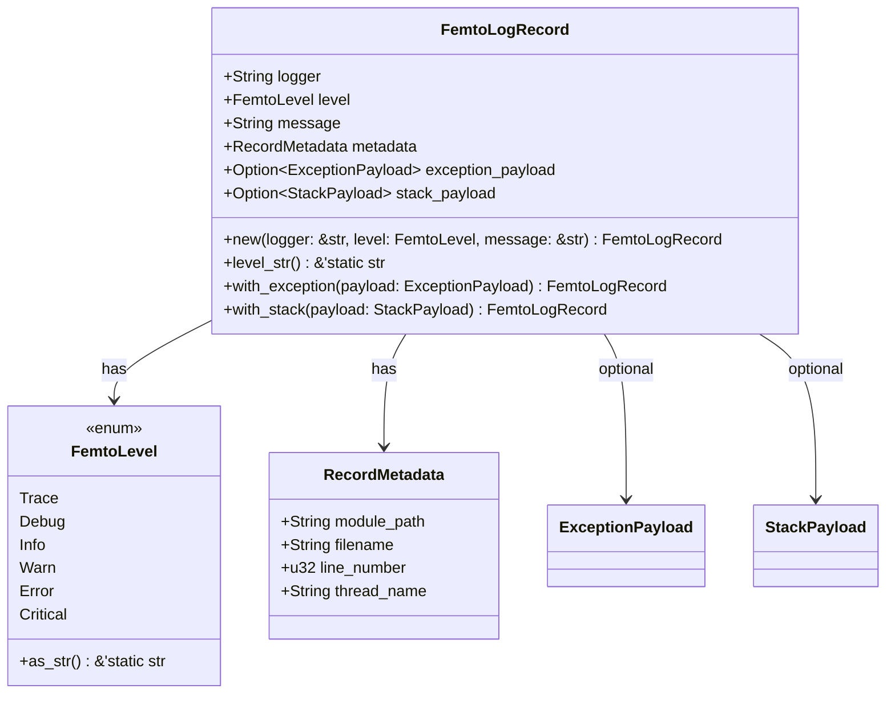
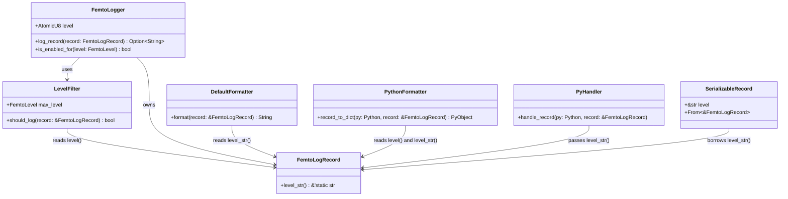

# Rust Extension

This project includes a small Rust extension built with
[PyO3](https://pyo3.rs/) (currently `^0.28.0`). Initially, it exposed only a
trivial `hello()` function and the `FemtoLogger` class. It has since grown to
provide the core handler implementations as well:

- `FemtoStreamHandler` writes log records to `stdout` or `stderr` on a
  background thread.
- `FemtoFileHandler` persists records to a file, also using a dedicated worker
  thread. It now provides `flush()` and `close()` to deterministically manage
  that thread.

The file handler lives under `rust_extension/src/handlers/file`. ADR 004's
batching work prompted a split into focused submodules, so the public handler
API could stay stable while the implementation remained readable. The list
below covers the primary runtime and test-support modules declared from
`rust_extension/src/handlers/file/mod.rs`; it is a guide to the current module
shape rather than a promise that every future internal helper will appear here:

1. `mod.rs` — the public `FemtoFileHandler` entry point that wires the module
   tree together and re-exports the file-handler surface.
2. `config.rs` — configuration types shared with the Python bindings and the
   higher-level builders.
3. `builder_options.rs` — worker construction options such as rotation
   strategy injection and test-only start barriers.
4. `handler_impl.rs` — the `FemtoHandlerTrait` and `Drop` implementations that
   define the handler's runtime semantics.
5. `io_utils.rs` — writer-side helpers for opening files and emitting
   formatted records.
6. `validations.rs` — constructor and Python-binding guards for capacity and
   flush-interval validation.
7. `worker.rs` — the asynchronous consumer thread, including ADR 004's batch
   draining, flush tracking, and worker lifecycle management.
8. `policy.rs` — parsing for file-handler overflow policy strings such as
   `"drop"`, `"block"`, and `"timeout:N"`.
9. `test_support.rs` — shared Rust-test logging capture helpers used by the
   file-handler test modules behind `#[cfg(test)]`.

This split keeps the ADR 004 batching changes local to `worker.rs` and its
helpers instead of forcing `mod.rs` to carry validation, I/O, builder, and
runtime concerns in one file.

ADR 004's file-handler work also changed the worker contract in two ways that
matter for contributors working below the Python API surface:

- `BatchConfig` now owns the worker's drain-loop capacity. Construction is
  fallible, so `BatchConfig::new(...)` rejects zero and
  `HandlerConfig -> WorkerConfig` conversion wires a validated batch size into
  `worker.rs` before the thread starts.
- Flushes now use per-call acknowledgement channels instead of a handler-wide
  receiver. `FileCommand::Flush` carries a fresh `Sender<io::Result<()>>`, and
  `FemtoFileHandler::flush()` only reports success when that specific worker
  flush sends `Ok(())` back before the deadline.

Inside `worker.rs`, batching follows ADR 004's "block once, then drain"
strategy. `recv_batch()` blocks for the first command, then uses `try_recv()`
to pull additional pending commands up to `BatchConfig.capacity()` with no
extra delay under light traffic. `WorkerState::process_batch()` applies each
drained `FileCommand` in order, so queued records and explicit flush requests
still preserve deterministic shutdown and acknowledgement semantics.

The logger follows the same file-size discipline. `rust_extension/src/logger`
now splits responsibilities between:

1. `mod.rs` — the public `FemtoLogger` surface, shared state, and PyO3 methods.
2. `producer.rs` — producer-path level checks, filter evaluation, and
   dispatch.
3. `worker.rs` — queue draining, shutdown coordination, and worker-thread
   helpers.

This refactor keeps the public API unchanged while making producer/worker
contracts testable in isolation.

## Builder composition

The handler builders reuse a small shared state machine so both the Rust and
Python APIs surface identical fluent setters. The diagram below illustrates how
`CommonBuilder` embeds into each handler-specific builder, and how
`FileLikeBuilderState` composes the shared configuration required by file-based
handlers.


```mermaid
classDiagram
    class CommonBuilder {
        +set_capacity(capacity: usize)
        capacity: Option<NonZeroUsize>
        capacity_set: bool
    }
    class FileLikeBuilderState {
        +set_capacity(capacity: usize)
        common: CommonBuilder
    }
    class FileHandlerBuilder {
        state: FileLikeBuilderState
    }
    class StreamHandlerBuilder {
        common: CommonBuilder
    }
    class RotatingFileHandlerBuilder {
        state: FileLikeBuilderState
    }
    FileLikeBuilderState *-- CommonBuilder : composition
    FileHandlerBuilder *-- FileLikeBuilderState : composition
    RotatingFileHandlerBuilder *-- FileLikeBuilderState : composition
    StreamHandlerBuilder *-- CommonBuilder : composition
```

```rust
use femtologging_rs::handlers::file::{FemtoFileHandler, HandlerConfig};
```

The module initializer `_femtologging_rs` delegates registration of
Python-specific builders and errors to
[`add_python_bindings`](./add-python-bindings.md). This helper keeps
conditional compilation concise by grouping Python-only items in one place. The
crate re-exports these builder types, and `FilterBuildErrorPy` when the
`python` feature is enabled, so they remain available from the public API.

## Public API Re-exports

The crate exposes selected types from its internal modules so consumers can
configure loggers without digging into submodules. These items are always
available, though they are added to the Python module only when the `python`
feature is enabled via [`add_python_bindings`](./add-python-bindings.md).

Public API re-exports.

| Symbol                        | Source module                                           |
| ----------------------------- | ------------------------------------------------------- |
| `ConfigBuilder`               | `config::ConfigBuilder`                                 |
| `FormatterBuilder`            | `config::FormatterBuilder`                              |
| `LoggerConfigBuilder`         | `config::LoggerConfigBuilder`                           |
| `FemtoFilter`                 | `filters::FemtoFilter`                                  |
| `FilterBuildError`            | `filters::FilterBuildError`                             |
| `FilterBuildErrorPy`          | `filters::FilterBuildErrorPy` (python feature)          |
| `FilterBuilderTrait`          | `filters::FilterBuilderTrait`                           |
| `LevelFilterBuilder`          | `filters::LevelFilterBuilder`                           |
| `NameFilterBuilder`           | `filters::NameFilterBuilder`                            |
| `PythonCallbackFilterBuilder` | `filters::PythonCallbackFilterBuilder` (python feature) |
| `DefaultFormatter`            | `formatter::DefaultFormatter`                           |
| `FemtoFormatter`              | `formatter::FemtoFormatter`                             |
| `FemtoHandler`                | `handler::FemtoHandler`                                 |
| `FemtoHandlerTrait`           | `handler::FemtoHandlerTrait`                            |
| `FileHandlerBuilder`          | `handlers::FileHandlerBuilder`                          |
| `HandlerBuilderTrait`         | `handlers::HandlerBuilderTrait`                         |
| `HandlerConfigError`          | `handlers::HandlerConfigError`                          |
| `HandlerIOError`              | `handlers::HandlerIOError`                              |
| `StreamHandlerBuilder`        | `handlers::StreamHandlerBuilder`                        |
| `FemtoLevel`                  | `level::FemtoLevel`                                     |
| `FemtoLogRecord`              | `log_record::FemtoLogRecord`                            |
| `RecordMetadata`              | `log_record::RecordMetadata`                            |
| `FemtoLogger`                 | `logger::FemtoLogger`                                   |
| `QueuedRecord`                | `logger::QueuedRecord`                                  |
| `FemtoStreamHandler`          | `stream_handler::FemtoStreamHandler`                    |
| `StreamHandlerConfig`         | `stream_handler::HandlerConfig`                         |

Packaging is handled by [maturin](https://maturin.rs/). Use version
`>=1.9.1,<2.0.0` as declared in `pyproject.toml`. The `[tool.maturin]` section
declares the extension module as `femtologging._femtologging_rs`, so running
`pip install .` automatically builds the Rust code. Windows users may need the
MSVC build tools installed, or may need to run maturin with
`--compatibility windows` to build.

PyO3 0.25 introduced `Bound` return types for constructors such as
`PyDict::new(py)`. When dictionaries must be returned to Python, use
`pyo3::IntoPyObjectExt::into_py_any(d, py)` rather than the pre‑0.25 pattern of
`unbind().into()`. This keeps the object bound to the Global Interpreter Lock
(GIL) during conversion.

```rust
let d = pyo3::types::PyDict::new(py);
let obj = pyo3::IntoPyObjectExt::into_py_any(d, py)?;
```

`FemtoLogRecord` now groups its contextual fields into a `RecordMetadata`
struct. Each record stores a timestamp, source file and line, module path and
thread ID. The thread name is included when available, along with any
structured key‑value pairs. Use `FemtoLogRecord::new` for default metadata or
`FemtoLogRecord::with_metadata` to supply explicit values.

`FemtoLevel` defines the standard logging levels (`TRACE`, `DEBUG`, `INFO`,
`WARN`, `ERROR`, `CRITICAL`). Each `FemtoLogger` holds a current level and
drops messages below that threshold. The `set_level()` method updates the
logger's minimum level using a `FemtoLevel` value. Likewise, `log()` accepts a
`FemtoLevel` and message, returning the formatted string or `None` when a
record is filtered out.

### Log record structure

`FemtoLogRecord` stores a single `FemtoLevel` value as its source of truth for
the log level. The `level_str()` method provides zero-allocation access to the
canonical string representation via `FemtoLevel::as_str()`. This design
eliminates split-brain scenarios where string and enum representations could
diverge.


```mermaid
classDiagram
    class FemtoLevel {
        <<enum>>
        Trace
        Debug
        Info
        Warn
        Error
        Critical
        +as_str() &'static str
    }

    class RecordMetadata {
        +String module_path
        +String filename
        +u32 line_number
        +String thread_name
    }

    class ExceptionPayload
    class StackPayload

    class FemtoLogRecord {
        +String logger
        +FemtoLevel level
        +String message
        +RecordMetadata metadata
        +Option~ExceptionPayload~ exception_payload
        +Option~StackPayload~ stack_payload
        +new(logger: &str, level: FemtoLevel, message: &str) FemtoLogRecord
        +level_str() &'static str
        +with_exception(payload: ExceptionPayload) FemtoLogRecord
        +with_stack(payload: StackPayload) FemtoLogRecord
    }

    FemtoLogRecord --> FemtoLevel : has
    FemtoLogRecord --> RecordMetadata : has
    FemtoLogRecord --> ExceptionPayload : optional
    FemtoLogRecord --> StackPayload : optional
```

*Figure 1: Core record structure. `FemtoLogRecord` stores a single `FemtoLevel`
value as its source of truth. The `level_str()` method provides zero-allocation
access to the canonical string representation via `FemtoLevel::as_str()`.*


```mermaid
classDiagram
    class FemtoLogRecord {
        +level_str() &'static str
    }

    class LevelFilter {
        +FemtoLevel max_level
        +should_log(record: &FemtoLogRecord) bool
    }

    class FemtoLogger {
        +AtomicU8 level
        +log_record(record: FemtoLogRecord) Option~String~
        +is_enabled_for(level: FemtoLevel) bool
    }

    class DefaultFormatter {
        +format(record: &FemtoLogRecord) String
    }

    class PythonFormatter {
        +record_to_dict(py: Python, record: &FemtoLogRecord) PyObject
    }

    class PyHandler {
        +handle_record(py: Python, record: &FemtoLogRecord)
    }

    class SerializableRecord {
        +&str level
        +From<&FemtoLogRecord>
    }

    LevelFilter --> FemtoLogRecord : reads level()
    FemtoLogger --> FemtoLogRecord : owns
    FemtoLogger --> LevelFilter : uses

    DefaultFormatter --> FemtoLogRecord : reads level_str()
    PythonFormatter --> FemtoLogRecord : reads level() and level_str()
    PyHandler --> FemtoLogRecord : passes level_str()

    SerializableRecord --> FemtoLogRecord : borrows level_str()
```

*Figure 2: Consumer relationships. Components read the log level through
`level()` for comparisons or `level_str()` for string output. All string access
is zero-allocation via `FemtoLevel::as_str()`.*

## Producer-thread filter flow

The filter trait now returns structured decisions instead of a bare `bool`.
This keeps Rust-native filters cheap while giving Python callback filters a
place to return enrichment captured from a mutable `logging.LogRecord` view.

```text
FemtoLogger::log_record(record)
    -> apply_filters(&mut record)
        -> filter.decision(record, &mut FilterContext)
            -> FilterDecision { accepted, enrichment }
        -> record.metadata_mut().key_values.extend(enrichment)
    -> dispatch_to_handlers(record)
```

`FilterDecision` lives in `filters/mod.rs` and carries:

- `accepted`: whether the record continues through the pipeline.
- `enrichment`: Rust-owned key/value pairs copied onto the record before it
  crosses the queue boundary.

`FilterContext` is per-record scratch state shared across filters during one
producer-path evaluation. The Python implementation uses it to cache a single
mutable `LogRecord` view so multiple callback filters can inspect and enrich
the same record without recreating Python objects for each filter.

In practice the contract looks like this:

```rust
use std::collections::BTreeMap;

use femtologging_rs::filters::{FemtoFilter, FilterContext, FilterDecision};
use femtologging_rs::log_record::FemtoLogRecord;

struct AllowAllFilter;

impl FemtoFilter for AllowAllFilter {
    fn decision(
        &self,
        _record: &mut FemtoLogRecord,
        _context: &mut FilterContext,
    ) -> FilterDecision {
        FilterDecision {
            accepted: true,
            enrichment: BTreeMap::from([("request_id".to_string(), "req-123".to_string())]),
        }
    }
}
```

### Enrichment validation

Python callback enrichment is validated in
`rust_extension/src/filters/python_callback_validation.rs` before it is copied
into `RecordMetadata.key_values`.

- Keys must be non-empty strings and must not collide with stdlib
  `logging.LogRecord` fields or femtologging-reserved metadata names.
- Values are limited to `str`, `int`, `float`, `bool`, and `None`; scalar
  values are stringified into Rust-owned metadata.
- Bounds are enforced at 64 keys per record, 64 UTF-8 bytes per key,
  1,024 UTF-8 bytes per value, and 16 kibibytes (KiB) total serialized
  enrichment per record.

Rejected enrichment raises a Python exception inside the callback path; the
logger catches that failure, emits a warning, and drops the record rather than
letting Python objects cross into worker threads.

## Python configuration bridge

The Python `dictConfig` parity layer is split into two focused helpers:

- `femtologging/_config_filters.py` validates top-level filter entries and
  builds `LevelFilterBuilder`, `NameFilterBuilder`, or
  `PythonCallbackFilterBuilder` instances from declarative and factory forms.
- `femtologging/_filter_factory.py` resolves stdlib-style dotted paths used by
  `{"()": ...}` filter entries, following the same module/attribute traversal
  rules as `logging.config.dictConfig`.

This keeps the Rust extension focused on runtime behaviour, while Python
retains responsibility for importing arbitrary user-defined factories.

## HTTP handler builder bindings

`HTTPHandlerBuilder` exposes a compatibility-preserving Python surface from
`rust_extension/src/handlers/http_builder/python_bindings.rs`.

- `with_endpoint(url, method=None)` is the preferred combined setter for the
  request URL and HTTP method.
- `with_auth(config)` accepts either `{"token": "..."}` or
  `{"username": "...", "password": "..."}` and validates mixed or incomplete
  payloads eagerly.
- Legacy `with_url`, `with_method`, `with_basic_auth`, and
  `with_bearer_token` methods remain available so existing code keeps working,
  but the typed stub surface points users at the combined methods first.

## Runtime level updates

`FemtoLogger` supports dynamic log level changes at runtime via `set_level()`
and a `level` property getter. These operations are thread-safe:

- **Storage:** The level is stored in an `AtomicU8`, enabling lock-free reads
  and writes across producer and consumer threads.
- **Memory ordering:** Both getter and setter use `Ordering::Relaxed`. This
  provides atomicity without synchronization overhead, appropriate because
  level changes do not need to synchronize with other memory operations.
- **Behaviour:** Level changes take effect immediately for subsequent `log()`
  calls. Records already in the handler queue are not affected.

### Python API

```python
from femtologging import FemtoLogger

logger = FemtoLogger("app")
logger.set_level("ERROR")  # Only ERROR and above will be logged
print(logger.level)  # "ERROR"
logger.set_level("DEBUG")  # Now DEBUG and above
```

### Rust API

```rust
use femtologging_rs::{FemtoLogger, FemtoLevel};

let logger = FemtoLogger::new("app".into());
logger.set_level(FemtoLevel::Error);
assert_eq!(logger.get_level(), FemtoLevel::Error);
```

## Rust log crate bridge

When built with the default `log-compat` feature, femtologging can act as the
backend for Rust's `log` facade. Call `femtologging.setup_rust_logging()` early
during application start-up to install a global Rust logger that forwards
`log::info!()` and similar calls into femtologging handlers.

This installs a global logger for the entire Rust process. If another global
logger is already installed, `setup_rust_logging()` raises `RuntimeError` and
does not replace it. The call is idempotent after a successful install.

Users building the extension from source may disable the bridge with
`cargo build --no-default-features`, or re-enable it explicitly with
`--features log-compat`.

`FemtoLogger` can now dispatch a record to multiple handlers. Handlers
implement `FemtoHandlerTrait` and run their I/O on worker threads. The logger
keeps its handler list inside an `RwLock<Vec<Arc<dyn FemtoHandlerTrait>>>`,
allowing handlers to be added through `&self`. Calling `add_handler()` pushes
another reference into that list. When `log()` creates a `FemtoLogRecord`, it
sends a clone to each configured handler, ensuring thread‑safe routing via the
handlers' MPSC queues.

Handlers observe log records in the order they are attached. Adding a handler
while other threads are logging is safe—new handlers only receive records
logged after the addition completes. The `remove_handler()` method works
through `&self` as well and detaches a handler so it no longer receives
subsequent records.

Handlers manage worker threads; the logger simply forwards each record to every
handler. Callers may invoke a handler's `flush()` method to ensure queued
messages are written before dropping it.

The `add_handler()` method is exposed through the Python bindings and can be
called on a shared logger instance. It verifies the provided object defines a
callable `handle(logger, level, message)` method and raises `TypeError` if the
check fails. Built-in handlers like `FemtoStreamHandler` and `FemtoFileHandler`
pass automatically; custom classes must implement a compatible `handle` method.
