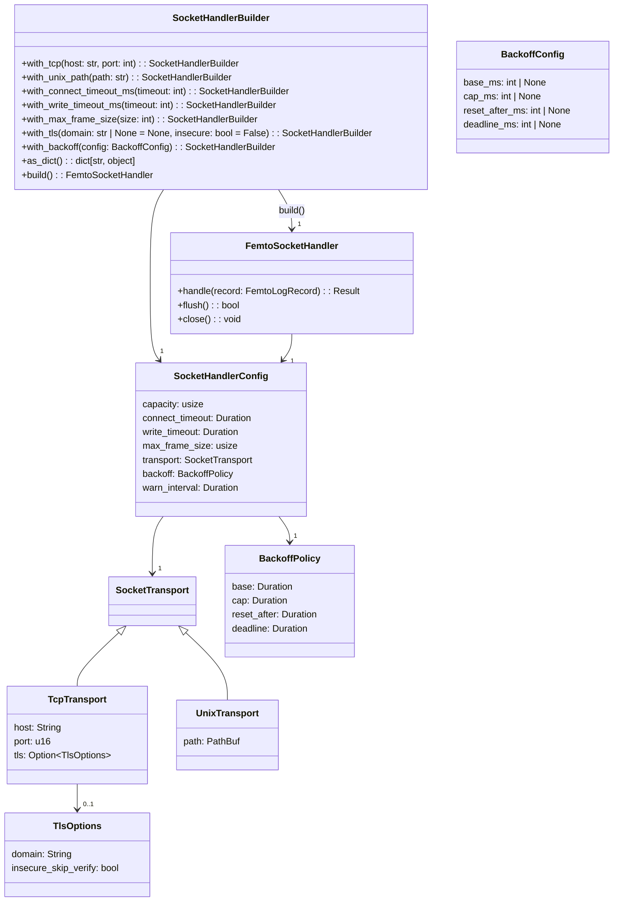
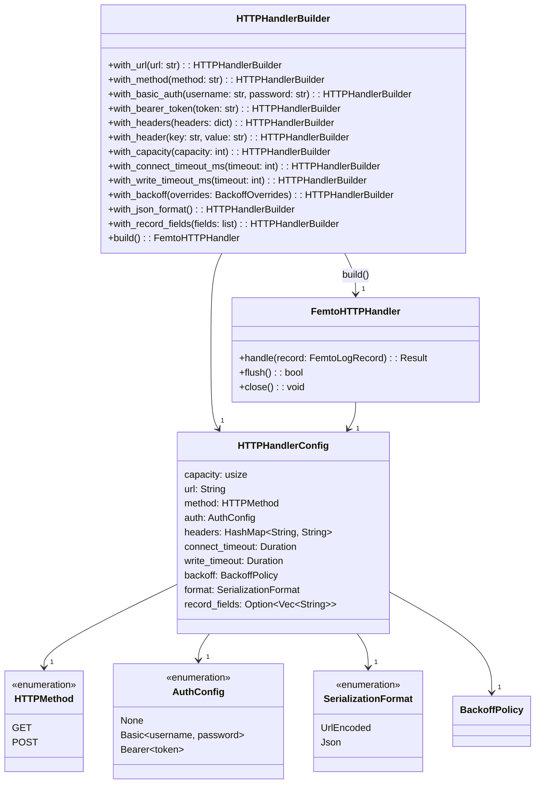
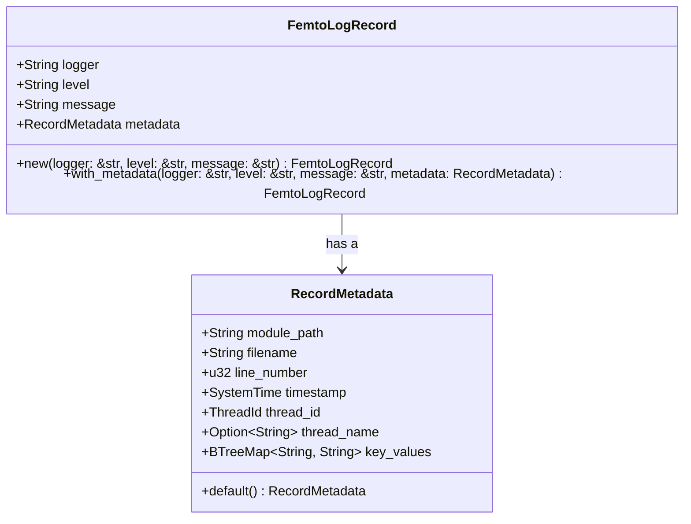
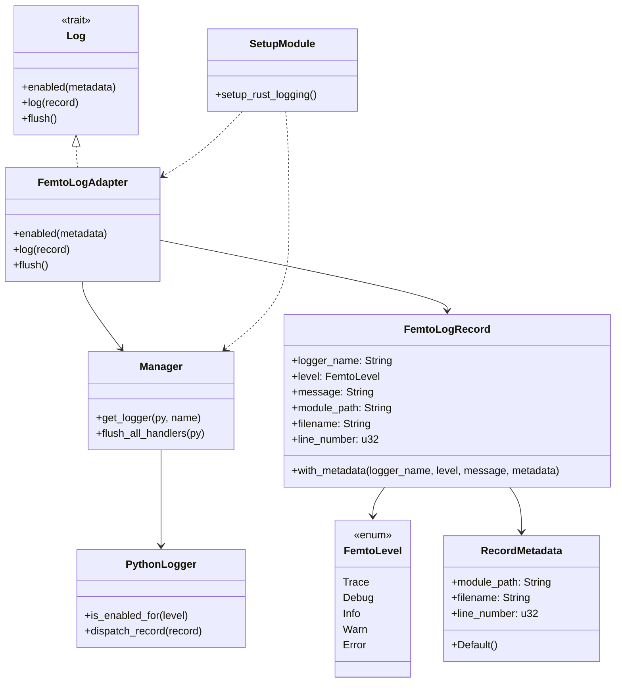
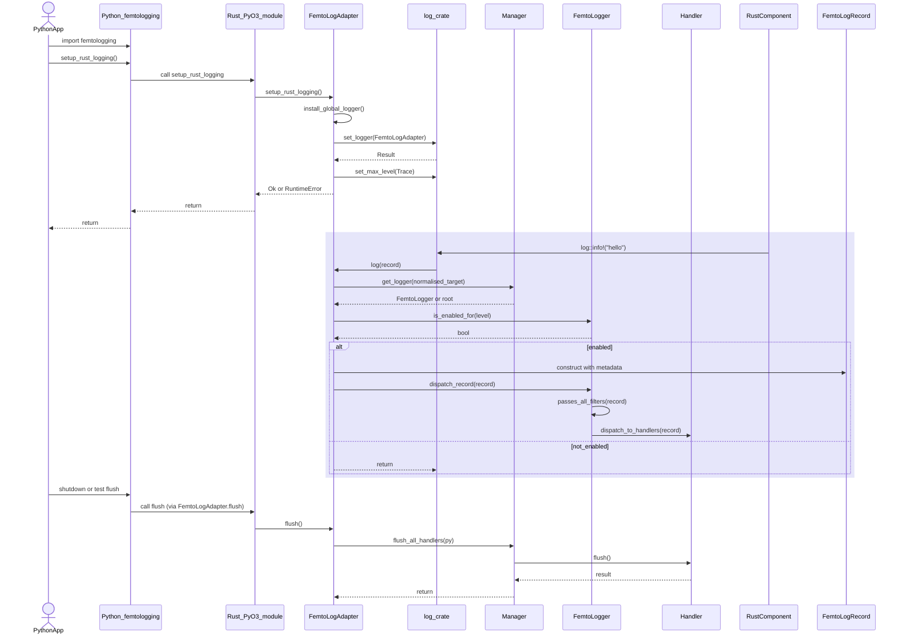

<!-- markdownlint-disable MD013 -->

# Femtologging: A High-Performance, Compile-Time Safe Logging Framework for Rust

## 1. Introduction

The Python standard library's `logging` module, while versatile, often presents
a performance bottleneck in high-throughput applications. `picologging` emerged
as a high-performance alternative, demonstrating significant speed improvements
(4-10x faster) by optimizing critical paths while maintaining API compatibility
with the standard `logging` module.This success highlights the demand for
logging solutions that prioritize speed without sacrificing familiar interfaces.

This report proposes the design and implementation philosophy for
"femtologging," a new logging library for Rust. Femtologging aims to draw
inspiration from `picologging`'s performance focus but will be architected from
the ground up to leverage Rust's unique strengths. The core emphasis will be on
compile-time safety, pervasive multithreading through the producer-consumer
pattern for all handler types, and an API that is both familiar to users of
CPython's `logging` module and idiomatic within the Rust ecosystem. The
objective is to create a logging framework that is not only exceptionally fast
and safe but also highly resilient and developer-friendly. This document
outlines the architectural principles, design choices, and a potential roadmap
for achieving these goals, focusing on replicating the functionality of common
CPython `logging` handlers within this new, robust paradigm.

## 2. Core Philosophy and Design Principles

The development of `femtologging` will be guided by a set of fundamental
principles designed to maximize its utility, performance, and safety within the
Rust ecosystem.

### 2.1 Compile-Time Safety as a Cornerstone

Rust's powerful type system and ownership model enable the detection of many
classes of bugs at compile time, including data races and use-after-free
errors. `femtologging` will embrace this by avoiding `unsafe` code wherever
possible. Any consideration of `unsafe` blocks, perhaps for highly specialized
FFI interactions or performance-critical custom data structures, would be
subject to rigorous justification and review, ensuring that safety guarantees
are not compromised. This commitment ensures that the logging framework itself
does not introduce instability into applications.

### 2.2 Pervasive Multithreading via Producer-Consumer

A central tenet of `femtologging` is the pervasive application of the
producer-consumer pattern for all log handling. Application threads (producers)
will do the minimal work necessary to create a log record and submit it to a
Multi-Producer, Single-Consumer (MPSC) channel. Dedicated consumer threads, one
per active handler, will then be responsible for formatting the log record and
performing the actual I/O (e.g., writing to a file, sending over a network).
This decoupling is critical:

- It minimizes the impact of logging I/O latency on application performance.
  Application threads can continue execution quickly after submitting a log
  message.

- It enhances resilience. If a logging destination becomes slow or temporarily
  unavailable, only the dedicated consumer thread for that handler is directly
  affected, not the application threads.

- It simplifies concurrency management for handler logic, as each consumer
  operates on its own queue and resources.

This architectural choice represents a significant departure from some CPython
handlers that might perform I/O operations directly in the calling thread,
especially if not wrapped by a `QueueHandler` and `QueueListener`. By making
this pattern universal,

`femtologging` aims for consistent high performance and robustness across all
handler types.

### 2.3 Uncompromising Performance

Inspired by `picologging`'s significant performance gains over standard Python
logging,

`femtologging` will strive for similar or even greater efficiency. This will be
achieved through several Rust-specific avenues:

- **Zero-cost abstractions:** Rust's trait system and generics allow for
  high-level abstractions that can compile down to highly efficient machine
  code.

- **Compile-time optimizations:** Features like compile-time log level filtering
  (discussed later) can eliminate entire log statements from release builds if
  they are below a configured threshold.

- **Efficient data structures and algorithms:** Careful selection of MPSC
  channel implementations and optimized formatting routines will be key.

- **Minimal overhead on the "hot path":** The code executed by application
  threads to log a message will be kept as lean as possible.

### 2.4 API Familiarity and Rust Idioms

While drawing conceptual parallels with CPython's `logging` module for ease of
adoption by developers familiar with it,

`femtologging` will be designed as an idiomatic Rust library. This involves:

- Leveraging Rust traits for extensibility (e.g., custom formatters, filters).

- Employing Rust's robust error handling mechanisms (e.g., `Result<T, E>`).

- Utilizing macros for ergonomic and efficient logging calls.

- Adhering to Rust API design guidelines, such as the builder pattern for
  constructing complex objects.

The goal is to create an API that feels natural to Rust developers while
retaining the conceptual clarity of Python's logging components.

## 3. Architecture Overview

`femtologging` will be structured around several key components, facilitating a
clear and efficient flow of log data from application code to its final
destination.

### 3.1 Key Components

The primary components of the `femtologging` system include:

- `FemtoLogger`**:** The main interface for application code to emit log
  messages. It will manage log levels and dispatch `FemtoLogRecord`s to the
  appropriate MPSC channels for configured handlers. Log calls will likely be
  mediated through macros.

- `FemtoLogRecord`**:** An immutable data structure representing a single
  logging event. It will encapsulate all necessary information, such as the log
  level, message, arguments, source code location (file, line number),
  timestamp, and thread ID. Critically, `FemtoLogRecord` instances must be
  `Send` and `Sync` to be safely transmitted across threads. This ensures that
  once a record is created, its data is fixed and can be processed by a
  consumer thread without race conditions. The data within the record,
  particularly user-provided arguments, will also need to adhere to these trait
  bounds if they are to be processed in their original form by the consumer;
  otherwise, they may need to be pre-formatted into strings by the producer.

- `FemtoHandler` **Trait and Implementations:** A trait defining the contract
  for log handlers. Concrete implementations (e.g., `FemtoFileHandler`,
  `FemtoSocketHandler`) will each run their logic in a dedicated consumer
  thread, receiving `FemtoLogRecord`s from an MPSC channel.

- `FemtoFormatter` **Trait and Implementations:** A trait for converting a
  `FemtoLogRecord` into a string representation. A default formatter will be
  provided, but users can implement custom formatters.

- `FemtoFilter` **Trait and Implementations:** A trait for providing
  fine-grained control over which log records are processed by a logger or
  handler.

### 3.2 The Producer-Consumer Data Flow

The logging process will follow these steps:

1. **Log Invocation:** Application code calls a logging macro (e.g.,
   `femtologging::info!("message", key = value)`).

2. **Level Check:** The macro or `FemtoLogger` performs an efficient check
   against the configured log level. If the message's level is insufficient,
   processing stops, incurring minimal overhead.

3. `FemtoLogRecord` **Creation:** If the level check passes, a `FemtoLogRecord`
   is created on the producer thread, capturing the message, arguments, and
   contextual information.

4. **Channel Send:** The `FemtoLogRecord` is sent through one or more MPSC
   channels to the consumer threads associated with the active handlers for
   that logger. The choice of MPSC channel implementation is critical for
   performance and will be discussed further. Implementations like `flume` or
   `thingbuf::mpsc` offer different trade-offs in terms of speed, blocking
   behaviour, and features.

   The logger tracks how many records are dropped when the queue is full. The
   running count is available via `FemtoLogger.get_dropped()` for tests and
   dashboards, and a rate-limited warning surfaces the total periodically.

5. **Consumer Receive:** Each handler's dedicated consumer thread blocks on its
   MPSC channel waiting for `FemtoLogRecord`s.

6. **Filtering (Handler-Level):** The consumer thread may apply handler-specific
   filters to the received record.

7. **Formatting:** If the record passes filters, it is formatted into a string
   using the handler's configured `FemtoFormatter`.

8. **Output:** The formatted string is written to the target destination (e.g.,
   file, socket, console) by the consumer thread.

### 3.3 `FemtoLogRecord` Structure

A `FemtoLogRecord` will contain at least the following fields:

- `level`: The severity level of the log message (e.g., `DEBUG`, `INFO`,
  `WARNING`, `ERROR`, `CRITICAL`).

- `message_template`: The raw format string or message.

- `args`: Captured arguments for the message template, potentially as a
  collection of `Box<dyn Any + Send>` or pre-formatted strings/values.

- `module_path`: The module path where the log call originated.

- `filename`: The source file name.

- `line_number`: The line number in the source file.

- `timestamp`: The time the log record was created.

- `thread_id`: The ID of the thread that created the log record.

- `thread_name`: The name of the thread that created the log record (if
  available).

- `key_values`: A collection of structured key-value pairs provided at the log
  call site.

These contextual fields are grouped within a `RecordMetadata` struct. Each
`FemtoLogRecord` owns its metadata, keeping the main record lightweight. Future
fields can be added without altering the core API.

This structure ensures all relevant information is captured once and passed
efficiently to consumer threads.

#### FemtoSocketHandler Implementation Update

The production handler now serializes `FemtoLogRecord` values to MessagePack
and frames them with a four-byte big-endian prefix before writing to the
socket. The consumer thread manages connection establishment and reconnection
with configurable exponential backoff (base, cap, reset-after, and deadline),
and the builder exposes TCP, IPv4/IPv6, and Unix domain transports. TLS is
optional via `native-tls`, with the builder controlling SNI and an opt-in
insecure mode for tests. The TCP stream now applies the connect timeout as a
temporary read/write deadline during TLS handshakes so stalled peers cannot
block shutdown, and clears the deadline once the handshake completes. Python
bindings mirror these options, splitting connect and write timeouts and
allowing frame size overrides so `dictConfig` and fluent APIs use the same
knobs. Runtime failures surface as handler errors while rate-limited warnings
document dropped frames without spamming stderr. Additional parity-focused
tests (e.g. TLS handshake failure scenarios) remain on the roadmap but the core
transport, framing, and reconnection behaviour is now implemented end to end.

Rust callers configure jitter timings through a `BackoffOverrides` helper
passed to `SocketHandlerBuilder::with_backoff`. Python callers supply the same
configuration via the `BackoffConfig` PyO3 class, keeping the builder method
signature compact while still allowing per-field overrides.



#### FemtoHTTPHandler Design

`FemtoHTTPHandler` sends log records to an HTTP server, following the
producer-consumer architecture established by `FemtoSocketHandler`. The design
must balance three drivers:

1. **FemtoSocketHandler implementation pattern** – reuse the worker-thread
   model, `BackoffPolicy`, rate-limited warnings, and builder conventions.
2. **CPython `logging.HTTPHandler` behaviour** – maintain parity where sensible
   to ease migration from the standard library.
3. **Standard HTTP client best practices** – connection pooling, proper status
   code handling, and idiomatic request construction.

##### CPython Parity Reference

CPython's `logging.handlers.HTTPHandler` provides the following interface:

| Constructor Parameter | Description                                              |
| --------------------- | -------------------------------------------------------- |
| `host`                | Server address, optionally including port (`host:port`)  |
| `url`                 | Target endpoint path for log messages                    |
| `method`              | HTTP verb; defaults to `'GET'`                           |
| `secure`              | Boolean enabling HTTPS                                   |
| `credentials`         | Tuple `(userid, password)` for HTTP Basic authentication |
| `context`             | `ssl.SSLContext` for custom TLS configuration            |

Key methods:

- **`mapLogRecord(record)`** – Converts a `LogRecord` to a dictionary. The
  default returns `record.__dict__`; subclasses override to customise payload.
- **`emit(record)`** – Calls `mapLogRecord`, URL-encodes the result via
  `urllib.parse.urlencode`, and transmits via GET or POST.

Notable behaviour: the handler ignores any `Formatter` set via
`setFormatter()`; formatting is controlled entirely through `mapLogRecord`.

##### Resolved Design Decisions

The following questions were resolved during implementation. Each decision
balances the three drivers listed above.

<!-- markdownlint-disable MD056 -->

| Question                           | Decision                                                        | Rationale                                                                                                                                                                                                         |
| ---------------------------------- | --------------------------------------------------------------- | ----------------------------------------------------------------------------------------------------------------------------------------------------------------------------------------------------------------- |
| **Serialisation format**           | URL-encoded (default), JSON via `.with_json_format()`           | URL-encoded matches CPython `logging.HTTPHandler` for migration parity. JSON is opt-in for modern HTTP APIs via the builder.                                                                                      |
| **HTTP client library**            | `ureq` 2.x with `native-tls` feature                            | Blocking model matches `FemtoSocketHandler` worker-thread pattern. Lightweight, no async runtime dependency.                                                                                                      |
| **Connection management**          | `ureq::Agent` with keep-alive pooling                           | Agent maintains connection pool across requests. Created once per worker thread and reused for the handler's lifetime.                                                                                            |
| **Retry semantics by status code** | 2xx success, 429/5xx retryable, 4xx permanent failure           | Follows HTTP semantics. 429 (rate limit) and 5xx (server error) trigger backoff retry. 4xx (client error) drops record without retry. Network errors are retryable.                                               |
| **`mapLogRecord` equivalent**      | Field filtering via `.with_record_fields(["name", "msg", ...])` | Configuration-driven approach is simplest and covers the common use case. The full record is serialised by default; specifying fields limits output. Future work may add a Python callable for custom transforms. |
| **Authentication methods**         | Basic, Bearer, and custom headers                               | `.with_basic_auth(user, password)`, `.with_bearer_token(token)`, and `.with_headers(dict)` cover CPython parity (Basic) and modern APIs (Bearer). Custom headers allow arbitrary `Authorization` schemes.         |
| **Timeout granularity**            | Split connect/write (mirrors `FemtoSocketHandler`)              | `.with_connect_timeout_ms()` and `.with_write_timeout_ms()` provide per-phase control. Defaults match `ureq` library defaults when not specified.                                                                 |

<!-- markdownlint-enable MD056 -->

##### Implemented Architecture

The handler follows this structure:

- **Producer-consumer model**: Application threads enqueue `HttpCommand` values
  (variants: `Record`, `Flush`, `Shutdown`) via a bounded MPSC channel; a
  dedicated worker thread processes commands and performs HTTP I/O.
- **Backoff and retry**: Reuse `BackoffPolicy` from `FemtoSocketHandler` for
  transient failures (network errors, 5xx responses). Permanent failures (4xx)
  do not trigger retry.
- **TLS/HTTPS**: Support secure connections with optional certificate
  verification bypass for testing, mirroring `FemtoSocketHandler`'s TLS options.
- **Builder pattern**: `HTTPHandlerBuilder` implementing `HandlerBuilderTrait`,
  exposing URL, method, authentication (Basic, Bearer, or custom headers),
  timeouts (`connect_timeout`, `write_timeout`), and backoff configuration.
- **Python bindings**: Mirror builder methods in Python; integrate with
  `dictConfig` and `basicConfig`.





### 3.4 Handler Implementation Strategy

`femtologging` will provide Rust equivalents for common CPython `logging`
handlers, each operating with its own producer-consumer MPSC queue and
dedicated consumer thread. This ensures that the performance and resilience
benefits of the producer-consumer model are consistently applied.

<!-- markdownlint-disable MD056 -->

**Table 1: Core CPython Handlers and** `femtologging` **Equivalents**

| CPython `logging` Handler  | `femtologging` Equivalent       | Brief Description                                                                                                                                     | Key CPython Features to Replicate                                                                          |
| -------------------------- | ------------------------------- | ----------------------------------------------------------------------------------------------------------------------------------------------------- | ---------------------------------------------------------------------------------------------------------- |
| `StreamHandler`            | `FemtoStreamHandler`            | Logs to an I/O stream (e.g., `stdout`, `stderr`). The consumer thread writes formatted records to the stream.                                         | Stream selection (default `stderr`), terminator customization.                                             |
| `FileHandler`              | `FemtoFileHandler`              | Logs to a disk file. The consumer thread manages file I/O.                                                                                            | Filename, mode (append/overwrite), encoding, delayed open.                                                 |
| `RotatingFileHandler`      | `FemtoRotatingFileHandler`      | Logs to a file, with rotation based on size. The consumer thread handles the rotation logic.                                                          | `maxBytes`, `backupCount`, file renaming scheme.                                                           |
| `TimedRotatingFileHandler` | `FemtoTimedRotatingFileHandler` | Logs to a file, with rotation based on time intervals. The consumer thread handles timed rotation.                                                    | `when`, `interval`, `backupCount`, `utc`, `atTime`.                                                        |
| `SocketHandler`            | `FemtoSocketHandler`            | Sends log records over a TCP or Unix domain socket. The consumer thread manages socket connection and data transmission (pickled/serialized records). | Host, port, TCP/Unix socket, reconnection logic, pickling/serialization of `FemtoLogRecord`.               |
| `HTTPHandler`              | `FemtoHTTPHandler`              | Sends log records to an HTTP server (GET or POST). The consumer thread makes HTTP requests.                                                           | Host, URL, method (GET/POST), secure (HTTPS), credentials, `mapLogRecord` equivalent for data preparation. |

<!-- markdownlint-enable MD056 -->

Each `FemtoHandler` implementation will encapsulate the logic for its specific
output mechanism within its consumer thread, ensuring that I/O operations do
not block application threads. The choice of MPSC channel (e.g., bounded,
unbounded, lock-free) will be a configurable aspect, potentially per handler,
to allow fine-tuning based on expected log volume and performance
characteristics. For instance, `crossbeam-channel` is a popular choice, but
alternatives like `flume` claim higher performance in some scenarios and offer
asynchronous capabilities, while `thingbuf` focuses on lock-free MPSC channels
built on a lock-free queue. The selection directly impacts throughput and
latency. For the early experimental release, `femtologging` defaults to a
bounded `crossbeam-channel` with a capacity of 1024 records. This guards
against unbounded memory growth when producers outpace the consumer thread.
Later versions may expose the channel type and capacity as configuration
options.

## 4. Leveraging Rust's Strengths

Rust offers a unique combination of features that are particularly well-suited
for building a high-performance, safe logging library. `femtologging` will
capitalize on these capabilities.

### 4.1 Ownership, Borrowing, and Lifetimes for Inherent Safety

Rust's core principles of ownership, borrowing, and lifetimes will be
fundamental to `femtologging`'s design. These mechanisms provide compile-time
guarantees against common concurrency pitfalls like data races and dangling
pointers, without needing a garbage collector.

- **Ownership** ensures that each piece of data (like a `FemtoLogRecord` or a
  buffer within a handler) has a clear owner, preventing ambiguous state or
  concurrent modification issues.

- **Borrowing rules** (one mutable reference or multiple immutable references)
  will be enforced by the compiler, ensuring that shared data (e.g.,
  configuration, shared state within a handler if any) is accessed safely.

- **Lifetimes** ensure that references do not outlive the data they point to,
  which is crucial when passing data between threads or managing resources
  within handlers.

These features allow for the construction of complex concurrent systems with a
high degree of confidence in their memory safety.

### 4.2 `Send` and `Sync` Traits for Thread Safety

The `Send` and `Sync` marker traits are Rust's way of indicating whether a type
can be safely transferred across thread boundaries or accessed concurrently
from multiple threads, respectively.

- `Send`: A type `T` is `Send` if it is safe to move a value of type `T` to
  another thread. `FemtoLogRecord` instances must be `Send` to be passed from
  producer threads to consumer threads via MPSC channels.

- `Sync`: A type `T` is `Sync` if it is safe to share a reference `&T` across
  multiple threads. Configuration objects or shared resources within
  `femtologging` (e.g., an `Arc` holding the current global log level) would
  need to be `Sync`.

The compiler automatically derives these traits if all constituent parts of a
type are also `Send` or `Sync`. By ensuring that all data structures involved
in inter-thread communication or shared access satisfy these traits,
`femtologging` guarantees thread safety at a fundamental level. For instance,
if a `FemtoLogRecord` contains user-supplied data, that data itself must be
`Send` if it's to be passed raw to the consumer. If not, it must be converted
to a `Send`-able representation (e.g., a `String`) on the producer side.

### 4.3 Macros for Ergonomic and Safe Logging

Rust's macro system provides powerful tools for metaprogramming, allowing for
the creation of expressive and efficient logging APIs. `femtologging` will use
macros (likely `macro_rules!`) as the primary interface for logging calls,
similar to the `log` crate or `tracing`.

Key features of `femtologging` macros will include:

- **Automatic Capture of Source Location:** Macros can automatically insert
  `file!()`, `line!()`, and `module_path!()` information into the
  `FemtoLogRecord`, reducing boilerplate for the user.

- **Log Level Support:** Macros like `info!(...)`, `warn!(...)`, `debug!(...)`
  will correspond to different log levels.

- **Ergonomic Structured Data Logging:** A key goal is to make structured
  logging intuitive. The macros should support syntax like:
  `info!(target: "network", "Request received from {}", client_ip; request_id = "123", user_agent = agent_string);`
   This allows for both a formatted message and arbitrary key-value pairs.

- **Compile-Time Format String Checks:** Rust macros can parse format strings
  and arguments at compile time, ensuring that the number and types of
  arguments match the format specifiers, preventing runtime formatting errors.

- **Minimal Performance Overhead:** Log level checks can be performed
  efficiently within the macro or by inlined logger code. If a log level is
  disabled (especially via compile-time filtering), the macro can expand to
  nothing or a minimal check, ensuring near-zero cost for disabled log
  statements.

The design of these macros must carefully consider how structured data is
captured. If arbitrary values are logged (e.g., `user_id = current_user.id()`),
and these values are to be processed by the consumer thread, they must be
`Send`. A pragmatic approach, often better for developer experience, is to
allow non-`Send` values if they are formatted into strings (using their
`Display` or `Debug` implementations) directly within the macro on the producer
thread. The `FemtoLogRecord` would then store these pre-formatted key-value
strings or potentially `Box<dyn Display + Send + Sync>` objects if more
flexibility is needed for the formatter. This affects the design of
`FemtoLogRecord`'s argument storage and the capabilities of the
`FemtoFormatter`.

Procedural macros, such as those demonstrated by the `logcall` crate for
logging function entry/exit and arguments/return values, could also be
considered as an extension for more specialized, attribute-based logging tasks,
although the core logging calls will likely rely on declarative macros for
simplicity and widespread applicability.

### 4.4 Commitment to Avoiding `unsafe` Code

Reiterating the principle from section 2.1, the library will strive to be
implemented entirely in safe Rust. The benefits of Rust's safety guarantees are
too significant to compromise lightly. If a situation arises where `unsafe`
code seems necessary for an extreme optimization (e.g., interacting with a
platform-specific API via FFI for a specialized handler, or implementing a
highly custom lock-free data structure not available in existing crates), it
would require substantial justification, thorough review for soundness, and
clear documentation of the invariants that must be upheld.

A powerful aspect of Rust that aligns with the performance goals is the ability
to perform compile-time log filtering. Similar to how `slog` allows for setting
maximum log levels via Cargo features (e.g., `max_level_info`,
`release_max_level_warn`),

`femtologging` should adopt this. This means that log statements below the
compiled-in maximum level can be entirely stripped from the binary by the
compiler. This goes beyond a simple runtime check, resulting in truly zero
performance overhead for those disabled log statements. This is a distinct
advantage Rust can offer over typical Python logging, which primarily relies on
runtime level checks.

## 5. Optimizing for Performance

Achieving performance comparable to or exceeding `picologging` requires
meticulous attention to detail in several key areas of

`femtologging`'s design.

### 5.1. Minimizing Overhead at the Log Call Site (The "Hot Path")

The code executed on an application thread (producer) when a logging macro is
called must be extremely efficient. This "hot path" involves several steps:

- **Efficient Level Checking:** This is the first gate. The check to determine
  if a log message should be processed must be very fast, typically involving
  an atomic load of the current effective log level for the logger.

- **Lazy Argument Evaluation/Formatting:** Arguments to logging calls,
  especially those involving complex computations or string formatting, should
  only be evaluated if the log level is enabled. Macros are crucial here, as
  they can wrap argument expressions in closures or conditional blocks that are
  only executed if the level check passes.

- `FemtoLogRecord` **Creation:** If a record is to be generated, its
  construction must be swift. This means avoiding complex logic or allocations
  on the hot path if they can be deferred to the consumer thread. The
  `FemtoLogRecord` should ideally be designed for quick population. Pooling
  `FemtoLogRecord` objects could be an advanced optimization for extreme
  scenarios to reduce allocation overhead, but it introduces significant
  complexity (e.g., managing pool lifecycles, thread-local pools) and should be
  considered carefully.

- **Channel Send:** The send operation on the MPSC channel, which transfers the
  `FemtoLogRecord` to the consumer thread, must be highly optimized. Lock-free
  or low-contention concurrent queues are essential. The performance of
  `picologging`'s `QueueHandler` underscores the importance of this step.

The richness of context captured automatically (like module, line number,
thread ID) also contributes to hot path overhead. While compile-time constants
like `module_path!`, `file!`, and `line!` have minimal runtime cost once
compiled in, runtime acquisitions like thread IDs or high-resolution timestamps
do have a cost. `slog`, for example, emphasizes contextual key-value pairs.

`femtologging` must balance the richness of automatically captured context with
performance. Essential, cheap-to-acquire context fields should be part of the
core `FemtoLogRecord`. More expensive or optional dynamic context should be
handled by macros in such a way that their evaluation occurs only if the log
level is active.

### 5.2. Strategies for Efficient Log Record Formatting and Serialization

Once a `FemtoLogRecord` reaches a consumer thread, efficient processing remains
important:

- **Deferred Formatting:** The default strategy is that actual string formatting
  of the log message and its arguments occurs in the consumer thread. This
  offloads significant work from the application threads.

- **Optimized** `FemtoFormatter`**:** The default string formatter (and any
  custom implementations) should use efficient string building techniques.
  Rust's `write!` macro into a pre-allocated buffer (e.g.,
  `String::with_capacity` or a pooled buffer) or specialized string formatting
  libraries can be significantly faster than naive string concatenation. The
  substantial speedup of `picologging`'s `Formatter().format()` (18-19x faster
  than the standard library's) indicates that this is a prime area for
  optimization.

- **Efficient Serialization for Network Handlers:** For handlers like
  `FemtoSocketHandler` and `FemtoHTTPHandler` that transmit log records over a
  network, the choice of serialization format and library is critical. While
  `serde` is the de facto standard for serialization in Rust, the specific
  format (e.g., JSON, MessagePack, Protocol Buffers) will impact both
  serialization speed and payload size. Benchmarking different
  `serde`-compatible formats will be necessary to choose the best default or
  offer configurable options.

### 5.3. Impact of MPSC Channel Choice on Throughput and Latency

The MPSC channel is the backbone of `femtologging`'s producer-consumer
architecture. The choice of implementation directly affects how quickly
producers can offload log records and how efficiently consumers can receive
them.

Table 2: Comparison of Potential Rust MPSC Channel Implementations

| Crate               | Key Features                                                                                                                                           | Performance Profile (General)                                                                                           | Async Support                                                     | Send/Sync Handled | Notes                                                                                                                   |
| ------------------- | ------------------------------------------------------------------------------------------------------------------------------------------------------ | ----------------------------------------------------------------------------------------------------------------------- | ----------------------------------------------------------------- | ----------------- | ----------------------------------------------------------------------------------------------------------------------- |
| `std::sync::mpsc`   | Part of standard library, basic blocking MPSC.                                                                                                         | Generally slower than specialized crates, can be a bottleneck under high load.                                          | No (blocking only).                                               | Yes.              | Baseline, likely not performant enough for `femtologging`'s goals.                                                      |
| `crossbeam-channel` | Highly optimized, bounded & unbounded, `select!` macro. Offers both blocking and `try_` operations.                                                    | Very fast for many workloads, widely used. Uses spinlocks which can be an issue in low-traffic, many-channel scenarios. | Limited native async; often wrapped or used in blocking contexts. | Yes.              | A strong contender for synchronous handlers.                                                                            |
| `flume`             | Claims to be faster than `std::sync::mpsc` and sometimes `crossbeam-channel`. Bounded, unbounded, rendezvous. `Send + Sync + Clone` Senders/Receivers. | High performance, designed for speed and flexibility.                                                                   | Yes, `async` send/recv methods available. Can mix sync and async. | Yes.              | Excellent choice, especially if async handlers are a future goal. Good for batching via `try_iter`.                     |
| `tokio::sync::mpsc` | Designed for asynchronous programming within the Tokio runtime. Bounded channel.                                                                       | Optimized for async contexts, performance tied to Tokio's scheduler.                                                    | Yes (primary design).                                             | Yes.              | Ideal if `femtologging` aims for deep integration with Tokio-based applications.                                        |
| `async-channel`     | Similar to `crossbeam-channel` but with a focus on async. Bounded & unbounded.                                                                         | Good performance in async scenarios.                                                                                    | Yes (primary design).                                             | Yes.              | Another strong option for async handlers.                                                                               |
| `thingbuf::mpsc`    | Lock-free MPSC channel built on `ThingBuf` (a lock-free queue). Supports static allocation.                                                            | Potentially very low latency due to lock-free nature.                                                                   | Asynchronous and blocking versions available.                     | Yes.              | Interesting for minimizing contention, especially with many producers. Static allocation is a niche but useful feature. |

The selection should be based on benchmarking various channel types under
realistic load patterns (e.g., bursty traffic, sustained high volume, many
producers to one consumer). The ability to configure different channel types or
parameters (like boundedness) per handler might also be a valuable advanced
feature.

### 5.4. Potential for Batching Log Messages in Consumer Threads

To further optimize I/O operations, consumer threads can process log records in
batches rather than one by one.

- **Concept:** Instead of a consumer thread calling `recv()` and processing a
  single `FemtoLogRecord`, it could attempt to retrieve multiple records from
  its MPSC channel (e.g., using `try_iter()` offered by `flume` or by looping
  `try_recv()` until a certain number of messages are collected or a small
  timeout occurs).

- **Benefits:**

  - **Amortized I/O Costs:** For file or network handlers, batching allows
    multiple log messages to be written with a single system call (e.g., one
    `write()` for several lines to a file, or one network packet for multiple
    log events). This significantly reduces per-message I/O overhead.

  - **Reduced Lock Contention:** If the underlying I/O resource (e.g., a shared
    file handle, though less common with dedicated consumer threads) requires
    locking, batching reduces the frequency of lock acquisitions.

  - **Improved Network Throughput:** Sending larger, batched payloads can be
    more efficient for network handlers than many small, individual
    transmissions.

- **Implementation:** The consumer loop in each handler would be modified to
  accumulate records into a temporary buffer before processing the entire
  batch. Channels like `flume` provide convenient iterators (`recv_iter()`,
  `try_iter()`) that can simplify batch collection.

- **Trade-off:** Batching introduces a small amount of latency for individual
  messages, as they might wait in the consumer's local buffer for the batch to
  fill or for a timeout to expire before being written to the final
  destination. This trade-off (throughput vs. individual message latency)
  should be configurable (e.g., batch size, batch timeout).

Dynamic filtering, while a desirable feature for operational flexibility, also
has performance implications. If filters are complex or numerous, evaluating
them on the hot path for every log call can add overhead. CPython's

`logging` allows filters on both loggers and handlers. If

`femtologging` supports dynamically changing filters, the mechanism for
accessing and evaluating the current filter set must be highly efficient (e.g.,
using an `Arc<Vec<Box<dyn FemtoFilter + Send + Sync>>>` accessed via an atomic
read or a `RwLock` for updates). The primary level check should always precede
any filter evaluation to short-circuit as early as possible. For very common
filter criteria, more advanced techniques like pre-calculated bitmasks or bloom
filters might be considered, though this adds complexity.

## 6. API Design and Developer Experience

A successful logging library must not only be performant and safe but also
intuitive and pleasant to use. `femtologging` aims to strike a balance between
API familiarity for those coming from Python's `logging` and the idiomatic
practices of Rust development.

### 6.1. Balancing API Familiarity with Rust Idioms

To ease adoption, especially for developers with a Python background,
`femtologging` will use recognizable names for core concepts:

- **Core Components:** `Logger`, `Handler`, `Formatter`, `Filter`, `LogRecord`.

- **Logging Methods:** While actual logging will likely occur via macros (e.g.,
  `info!(...)`, `warn!(...)`), the conceptual methods they invoke on a `Logger`
  instance are similar to Python's `logger.info(...)`.

- **Handler Naming:** Handler types will echo CPython's naming convention, such
  as `FileHandler`, `SocketHandler`, `RotatingFileHandler`.

Simultaneously, the API will be thoroughly Rust-idiomatic:

- **Traits for Extensibility:** Core functionalities like formatting
  (`FemtoFormatter`), filtering (`FemtoFilter`), and handling (`FemtoHandler`)
  will be defined by traits, allowing users to implement custom behaviours.

- **Rust Error Handling:** Operations that can fail (e.g., handler construction
  due to I/O errors, configuration parsing) will return `Result<T, E>`,
  enabling robust error management.

- **Macros for Conciseness:** As discussed, macros will be the primary interface
  for emitting log messages, providing a concise and powerful syntax.

- **Strong Typing:** Rust's type system will be leveraged throughout the API to
  ensure correctness and provide excellent compiler feedback.

- **Builder Pattern:** For constructing complex objects like handlers or the
  main `femtologging` configuration, the builder pattern will be used to
  provide a clear, fluent, and discoverable API.

A common consideration in Rust logging libraries is the "global vs. instance"
logger pattern. CPython's `logging.getLogger()` provides access to a global
(or, more accurately, hierarchical) logger registry. In Rust, global mutable
state is often discouraged for reasons of explicitness and testability.
Libraries like

`slog` encourage passing `Logger` instances explicitly, which can be verbose.
Conversely,

`log` and `tracing` typically use global macros that dispatch to a globally
configured subscriber or logger. `femtologging` will likely adopt a hybrid
approach:

- It will provide convenient static logging macros (e.g.,
  `femtologging::info!(...)`) that dispatch to a globally initialized and
  configured `femtologging` system. This offers ease of use similar to the
  `log` crate.

- The underlying `FemtoLogger` objects and the central dispatcher could still be
  accessible for more advanced use cases, such as fine-grained control in
  specific modules or easier mocking during testing.

### 6.2. Logging Macros: The Primary User Interface

The logging macros are central to the developer experience. As outlined in
section 4.3, they will support:

- Log levels (e.g., `trace!`, `debug!`, `info!`, `warn!`, `error!`,
  `critical!`).

- Automatic capture of source code location (`file!`, `line!`, `module_path!`).

- Ergonomic structured logging with key-value pairs (e.g.,
  `info!("User {} logged in", user.name; user_id = user.id, ip_address = "127.0.0.1");` ).

- Compile-time validation of format strings and arguments.

Inspired by `tracing::span!`,

femtologging could also offer span-like macros for logging the entry and exit
of a block of code, automatically including duration:

let result = info_span!("Processing request", request_id = id; { /\*… code… \*/
result_value });

This would create two log events, one at the beginning and one at the end of
the block, potentially with the duration of the block included in the exit
event.

### 6.3. Configuration API

Configuration is a critical aspect of any logging library. `femtologging` will
prioritize a robust programmatic API, with file-based configuration as a
potential future enhancement.

- Programmatic Configuration:

  A builder pattern will be the primary method for setting up femtologging.
  This provides type safety and discoverability. A hypothetical example:

  Rust

  ```rust
  use femtologging::{Config, FemtoLevel, FemtoFileHandler, MyCustomFormatter}; // Hypothetical types

  fn setup_logging() -> Result<(), Box<dyn std::error::Error>> {
      Config::builder()
         .default_level(FemtoLevel::Info)
         .add_handler(
              "file_handler_1", // Unique name for the handler
              FemtoFileHandler::builder()
                 .path("application.log")
                 .formatter(Box::new(MyCustomFormatter::new())) // Formatters are boxed trait objects
                 .level(FemtoLevel::Debug) // Handler-specific level
                 .build()?
          )
         .add_logger_config("my_app::network", FemtoLevel::Trace, vec!["file_handler_1"]) // Logger-specific config
         .build_and_init()?; // Initializes the global logging system
      Ok(())
  }

  ```

- Python

  Because Python is the primary target language for femtologging, a
  builder-style configuration API will also be exposed in the Python package.
  This mirrors the Rust builder semantics so developers can switch between
  languages without relearning the configuration model. The Python builder sits
  alongside helpers that replicate `basicConfig`, `dictConfig`, and
  `fileConfig`, but it remains the recommended approach for new applications.

  ```python
  from femtologging import Config, FileHandler, Formatter

  def setup_logging() -> None:
      (
          Config.builder()
          .default_level("INFO")
          .add_handler(
              "file_handler_1",
              FileHandler.builder()
              .path("application.log")
              .formatter(Formatter("%(message)s"))
              .level("DEBUG")
              .build(),
          )
          .add_logger_config("my_app.network", "TRACE", ["file_handler_1"])
          .build_and_init()
      )
  ```

  - File-Based Configuration (Considerations):

  CPython's logging module supports fileConfig (using an INI-like format) and
  dictConfig (often from JSON or YAML). In the Rust ecosystem, YAML (used by
  `log4rs`) and TOML are common choices for configuration files.

#### 6.3.1. Rotating file handler configuration decisions

- The rotating handler remains a thin wrapper around the file handler builder.
  Rotation thresholds live on `FemtoRotatingFileHandler`, while the worker
  thread owns the logic that evaluates when a rollover must occur.
- The worker evaluates the predicate `current_file_len + buffered_bytes +
  next_record_bytes >
  max_bytes` before each write. `next_record_bytes` counts the UTF-8 payload plus the newline that `
  writeln!` appends so the check mirrors the eventual I/O.
- Measuring never flushes buffered data. When the predicate fires, the worker
  flushes once, swaps the live `BufWriter` onto an append handle so the
  original file descriptor can be closed, cascades existing backups (dropping
  the oldest if necessary), renames the just-closed log to `.1`, and finally
  opens a fresh base file before writing the new record. If opening the fresh
  file fails the append handle remains active so producers keep logging against
  a durable descriptor. Tests can trigger this path via the
  `_force_rotating_fresh_failure_for_test` hook exposed to Python, which flips
  a thread-safe toggle. The design keeps rotation non-blocking for producers
  whilst ensuring backup files remain consistent and compatible with Windows'
  rename semantics.
- `max_bytes == 0` and `backup_count == 0` disable rotation. Builder validation
  in Rust and the Python `HandlerOptions` mirror this rule, ensuring both
  values are set together and exposing the builder API as the canonical
  configuration surface in both languages.

  `tracing-logger-config` also demonstrates configuration via structs, implying
  `serde` for deserialization from files.

  Implementing file-based configuration involves:

  - Choosing a format (e.g., YAML, TOML).

  - Using `serde` for deserialization of the configuration structure.

  - A mechanism to map string identifiers in the config file (for handler types,
    formatter types, etc.) to actual Rust types. This often involves a
    registration pattern or extensive enum dispatch.

  The initial implementation opts for a pragmatic bridge: Python's
  `femtologging.fileConfig` now parses INI files via the Rust extension,
  rewrites them into a `dictConfig` dictionary, and feeds the builder API. This
  keeps the builder layer authoritative while enabling interoperable,
  file-based configuration for existing picologging-style deployments. Richer
  schemas (TOML, YAML, or serde-backed structures) remain future work once the
  builder ergonomics stabilize further.

### 6.4. Interoperability with the Rust Logging Ecosystem

To maximize adoption and utility, `femtologging` should integrate with existing
popular logging facades and frameworks in Rust.

- log Crate Facade:

  The log crate is the most widely used logging facade in the Rust ecosystem.
  Many libraries use log::info!, log::warn!, etc., to emit log messages.
  femtologging should implement the log::Log trait. This would allow
  applications and libraries already using the log crate to seamlessly use
  femtologging as their logging backend simply by initializing femtologging.

#### 6.4.1 Implementation Strategy for log::Log

Femtologging already uses the `log` crate internally for diagnostics (e.g.,
`log::warn!` in `logger.rs`, `socket_handler/worker.rs`, and
`handlers/file/mod.rs`). A working test implementation exists at
`handlers/file/test_support.rs:22-39`, demonstrating the pattern. This pattern
will be generalised to create a reusable adapter that routes all `log` crate
records through femtologging's handler pipeline.

**Value Proposition:**

For hybrid Python/Rust applications, implementing `log::Log` provides unified
logging:

| Component                                       | Without `log::Log`   | With `log::Log`      |
| ----------------------------------------------- | -------------------- | -------------------- |
| Python code using `femtologging.get_logger()`   | ✓ Logs to handlers   | ✓ Logs to handlers   |
| Rust code using `log::info!()`                  | ✗ Logs go nowhere    | ✓ Same handlers      |
| Rust dependencies (e.g., `native-tls`, `hyper`) | ✗ Silent             | ✓ Captured           |

**Level Mapping:**

The `log` crate defines five levels; femtologging adds a `Critical` level for
parity with Python's `logging.CRITICAL`. Since the `log` crate has no
equivalent, `log::Level::Error` maps to `FemtoLevel::Error`. Direct mapping
follows for all other levels:

| `log::Level` | `FemtoLevel` | Notes                                   |
| ------------ | ------------ | --------------------------------------- |
| Trace        | Trace        | Direct mapping                          |
| Debug        | Debug        | Direct mapping                          |
| Info         | Info         | Direct mapping                          |
| Warn         | Warn         | Direct mapping                          |
| Error        | Error        | `log` has no `Critical`; map to `Error` |

**Logger Resolution:**

The `log::Record::target()` field typically contains the Rust module path
(e.g., `my_app::network::client`). This maps naturally to femtologging's
hierarchical logger system via `Manager::get_logger()`, which creates parent
loggers automatically based on dotted names.

The implemented bridge normalises Rust-style `::` separators to `.` before
resolving the logger, preserving femtologging's dotted hierarchy semantics. If
a target is invalid after normalisation, the record is routed to the root
logger rather than panicking.

**Conceptual Implementation:**

```rust
pub struct FemtoLogAdapter;

impl log::Log for FemtoLogAdapter {
    fn enabled(&self, metadata: &Metadata) -> bool {
        let level = FemtoLevel::from(metadata.level());
        Python::with_gil(|py| {
            let logger = Manager::get_logger(py, metadata.target());
            logger.borrow(py).is_enabled_for(level)
        })
    }

    fn log(&self, record: &log::Record) {
        Python::with_gil(|py| {
            let logger = Manager::get_logger(py, record.target());
            let femto_record = FemtoLogRecord::with_metadata(
                record.target(),
                &record.level().to_string(),
                &record.args().to_string(),
                RecordMetadata {
                    module_path: record.module_path().unwrap_or_default().to_string(),
                    filename: record.file().unwrap_or_default().to_string(),
                    line_number: record.line().unwrap_or(0),
                    ..Default::default()
                },
            );
            logger.borrow(py).dispatch_record(femto_record);
        })
    }

    fn flush(&self) {
        Python::with_gil(|py| {
            Manager::flush_all_handlers(py);
        })
    }
}
```

**GIL Acquisition and Error Handling:**

The `log::Log` trait methods (`enabled`, `log`, `flush`) require GIL
acquisition to interact with femtologging's Python-integrated components. The
expected failure behaviour is:

| Scenario                          | Behaviour                                     |
| --------------------------------- | --------------------------------------------- |
| GIL acquisition succeeds          | Normal operation                              |
| GIL acquisition blocked           | Blocks until GIL is available (standard PyO3) |
| Python exception during `log()`   | Swallowed; log message silently dropped       |
| Python exception during `flush()` | Swallowed; flush is best-effort               |
| Rust panic in Python callback     | Caught by PyO3; converted to Python exception |

**Rationale for swallowing errors:** The `log::Log` trait methods return `()`
and cannot propagate errors. Logging infrastructure must not panic or disrupt
application flow. If a Python-side error occurs (e.g., handler I/O failure),
femtologging's internal error tracking (via handler metrics) records the
failure while the Rust caller continues uninterrupted.

**Thread Safety:** The GIL ensures serialised access to Python objects.
Consumer threads (which perform actual I/O) release the GIL during blocking
operations per the patterns in `docs/multithreading-in-pyo3.md`, so
`log::log()` calls from Rust do not contend with handler I/O.

**flush() Behaviour:**

The `flush()` method iterates over all handlers registered with the Manager and
invokes each handler's flush mechanism. The semantics are:

- **Best-effort guarantee:** `flush()` attempts to flush all handlers but does
  not block indefinitely. Each handler has a configurable flush timeout
  (defaulting to the handler's write timeout).
- **Buffered handlers:** Handlers using `BufWriter` (e.g., `FemtoFileHandler`,
  `FemtoRotatingFileHandler`) flush their internal buffers to the underlying
  file descriptor.
- **Network handlers:** `FemtoSocketHandler` flushes its write buffer to the
  socket. If the socket is disconnected, flush returns without error (the
  disconnection is already tracked via handler metrics).
- **Stream handlers:** `FemtoStreamHandler` flushes stdout/stderr via the
  standard library's `Write::flush()`.
- **Error handling:** Individual handler flush failures are logged internally
  and do not prevent other handlers from being flushed. The method returns `()`
  per the `log::Log` trait contract.
- **Interaction with producer-consumer:** Flush does not drain the MPSC queue;
  it only flushes data already received by the consumer thread. Records in
  transit may not be written until the next consumer loop iteration.





**Initialisation Options:**

The logger must be set after femtologging's `Manager` is initialised. Options
include:

1. **Automatic** – Set during Python module initialisation (`#[pymodule]`)
2. **Explicit** – Expose `setup_rust_logging()` callable from Python
3. **Feature-gated** – Control via an optional Cargo feature

The recommended approach is explicit initialisation via a Python-callable
function, giving applications control over when the bridge is activated.

`setup_rust_logging()` is idempotent: once femtologging installs the global
Rust logger, repeated calls are no-ops. If a different global logger is already
installed, the call raises `RuntimeError` and femtologging does not override
the existing configuration.

**Cargo Feature Scope (`log-compat`):**

The `log-compat` feature is a **Rust-side Cargo feature only**. It controls
whether the `FemtoLogAdapter` and `setup_rust_logging()` function are compiled
into the extension module. The feature is not surfaced through Python packaging
or `pip install` extras because:

- The integration is transparent to Python consumers; they simply call
  `femtologging.setup_rust_logging()` if the feature was enabled at build time.
- Python wheels are pre-built with features baked in. The default distribution
  will include `log-compat` enabled. Users building from source can disable it
  via `--no-default-features` if they want a smaller binary.
- There is no runtime Python feature flag; attempting to call
  `setup_rust_logging()` when `log-compat` is disabled raises `AttributeError`.

To enable/disable during development:

```bash
# Enable (default):
cargo build --features log-compat

# Disable:
cargo build --no-default-features
```

The feature name `log-compat` was chosen over alternatives like `log-bridge` or
`rust-log` for consistency with similar ecosystem conventions (e.g.,
`tracing-log`).

**Mutual Exclusivity:**

The `log` crate permits only one global logger. Setting femtologging as the
logger prevents simultaneous use of other Rust logging backends (e.g.,
`env_logger`). This is acceptable since:

- The Python application controls initialisation
- Femtologging is the intentional backend for unified logging

**Comparison with tracing::Layer (Phase 3):**

| Aspect                | `log::Log` (Phase 2)       | `tracing::Layer` (Phase 3)        |
| --------------------- | -------------------------- | --------------------------------- |
| Adoption              | Older, near-universal      | Growing, especially in async code |
| Features              | Simple message logging     | Spans, structured data, context   |
| Implementation effort | Low                        | Medium-high                       |
| Immediate value       | High (broad compatibility) | Medium (fewer libraries)          |

Implement `log::Log` first for immediate ecosystem compatibility; a
`tracing::Layer` can follow, and `tracing-log` demonstrates they can coexist.

- tracing Layer/Subscriber:

  tracing is a powerful framework for instrumenting applications and libraries
  to collect structured, event-based diagnostic data, including spans with
  temporal context.

  femtologging can provide a tracing_subscriber::Layer implementation.

  A FemtoTracingLayer could receive tracing events and spans and convert them
  into FemtoLogRecords. These records would then be dispatched through
  femtologging's MPSC channels to its configured handlers. This allows users of
  the tracing API to leverage femtologging's specific handler implementations
  (e.g., FemtoRotatingFileHandler) and its producer-consumer architecture. The
  tracing-slog crate, which bridges

  `slog` and `tracing`, serves as an example of such interoperability.

This focus on interoperability is strategically important. Rather than forcing
the entire ecosystem to adopt a new set of logging macros, `femtologging` can
gain traction by serving as a high-performance, robust backend for these
established interfaces.

## 7. Configuration and Runtime Control

Effective logging requires not only initial setup but also the ability to
control and modify logging behaviour at runtime.

### 7.1. Initial Setup: Levels, Handlers, Formatters

The initial configuration of `femtologging` will primarily be done
programmatically using the builder pattern described in section 6.3. This
involves:

- **Setting Global Log Levels:**

  - A compile-time maximum log level (e.g., via Cargo features like
    `max_level_info` or `release_max_level_warn`), which strips out log
    statements below this level at compilation.

  - A runtime global minimum log level, which acts as a default for all loggers
    unless overridden.

- **Instantiating and Configuring Handlers:** Defining instances of
  `FemtoFileHandler`, `FemtoSocketHandler`, etc., with their specific
  parameters (file paths, rotation settings, network addresses, ports). Each
  handler will spawn its own MPSC channel and consumer thread.

- **Assigning Formatters to Handlers:** Each handler will be associated with a
  `FemtoFormatter` instance (either a default or a custom one).

- **Adding Filters:** `FemtoFilter` instances can be associated with specific
  loggers or handlers to provide more granular control over log message
  processing.

### 7.2. Dynamic Reconfiguration

A common operational requirement is the ability to change logging
configurations, especially log levels, without restarting the application.

- **The Challenge:** Modifying logging behaviour in a live, concurrent
  application requires careful synchronization to avoid inconsistencies or
  crashes.

- **Approaches in Rust for Dynamic Control:**

  - **Log Level Changes:** The effective log level for each logger can be stored
    in an `AtomicUsize` (or a similar atomic type representing the level).
    `FemtoLogger` instances (or the global dispatcher) would read this atomic
    value for each log call. Updates to the level can then be made atomically
    and safely from a control interface (e.g., a signal handler, a dedicated
    configuration thread, or an admin HTTP endpoint).

  - **Handler, Formatter, and Filter Changes:** These are more complex to manage
    dynamically. Modifying the set of active handlers, their formatters, or
    their filters typically involves:

    - Protecting the collection of active handler configurations with a
      concurrency primitive like `std::sync::RwLock`.

    - A mechanism to gracefully shut down consumer threads for removed or
      reconfigured handlers, ensuring any buffered messages are flushed.

    - A way to start new consumer threads for newly added handlers.

      The tracing-subscriber::reload::Handle offers a sophisticated model for
      this, allowing parts of a

      `tracing` subscriber (which could include filters or dispatch logic) to
      be swapped out at runtime. The `log4rs_dynamic_filters` crate also
      demonstrates dynamic control over filter parameters.

- `femtologging` **Strategy for Dynamic Reconfiguration:**

  - **V1 Priority:** Dynamic log level changes for loggers will be a core
    feature in the initial version, leveraging atomic operations for
    thread-safe updates.

  - **Future Enhancements:** The architecture should be designed to accommodate
    dynamic changes to handlers, formatters, and filters, but the full
    implementation of this dynamic reconfiguration might be a V1.1 or V2
    feature due to its complexity. This would involve designing the central
    logger dispatcher to safely manage and swap out handler configurations and
    their associated consumer threads and MPSC channels.

Graceful handler reconfiguration requires careful resource management. If a
`FemtoFileHandler`'s configured output path changes, the consumer thread
associated with the old file must close it cleanly, and then open and use the
new file. If an entire handler is removed from the configuration, its consumer
thread must be signaled to shut down. This shutdown process should be graceful,
meaning the consumer attempts to process all remaining `FemtoLogRecord`s in its
MPSC queue before exiting. The `FemtoHandler` trait might need to include
methods like
`reconfigure(&self, new_config: Box<dyn Any + Send + Sync>) -> Result<()>`
(where `new_config` is a type-erased configuration specific to the handler
type) and `shutdown(&self) -> Result<()>` that can be invoked by a central
configuration manager. The MPSC channel itself is crucial here; the sender side
(from the logger) would be dropped, and the consumer would drain the channel
before terminating.

### 7.3. Integration with Application Configuration

If file-based configuration (e.g., YAML or TOML) is implemented in
`femtologging`, it should integrate smoothly with common application
configuration practices. This might involve:

- Reading a dedicated configuration file (e.g., `femtologging.yaml`).

- Allowing `femtologging` configuration to be a section within a larger
  application configuration file, which is then extracted and passed to
  `femtologging`'s initialization function.

- Potentially supporting environment variable overrides for certain
  configuration parameters.

Furthermore, if `femtologging` provides APIs for dynamic reconfiguration that
could be exposed via network endpoints (e.g., an HTTP endpoint to change log
levels, similar to ideas in or CPython's `logging.config.listen`), the
documentation must strongly emphasize the security implications. Such
endpoints, if not properly secured (e.g., via authentication, authorization,
network restrictions), could become a vector for attackers to disrupt logging
(e.g., by disabling critical security logs) or to cause denial-of-service
(e.g., by enabling excessively verbose logging to exhaust disk space or CPU).
While `femtologging` itself might not provide the HTTP server, its
reconfiguration API design should be mindful of these potential misuse
scenarios.

## 8. Key Recommendations and Future Directions

To guide the development of `femtologging`, a phased implementation roadmap, a
robust benchmarking strategy, and considerations for future enhancements are
proposed.

### 8.1. Suggested Implementation Roadmap

A phased approach will allow for iterative development and feedback:

- **Phase 1 (Core Functionality & Minimum Viable Product):**

  - Define `FemtoLogRecord` structure and core `FemtoLogger` logic (including
    logging macros and efficient level checking).

  - Implement the `FemtoFormatter` trait and a default string formatter.

  - Select and integrate an MPSC channel implementation (from Table 2).

  - Develop `FemtoStreamHandler` (for console output) and `FemtoFileHandler`,
    both utilizing the producer-consumer pattern with dedicated consumer
    threads.

  - Create the initial programmatic configuration API using the builder pattern.

  - Implement compile-time log level filtering via Cargo features.

  - Ensure fundamental `Send`/`Sync` safety throughout all components.

  - Establish basic unit and integration tests.

- **Phase 2 (Expanded Handlers & Core Features):**

  - Implement `FemtoRotatingFileHandler` and `FemtoTimedRotatingFileHandler`
    with their respective rotation logic managed by consumer threads.

  - Develop `FemtoSocketHandler`, including secure serialization (e.g., using
    `serde` with a format like MessagePack or CBOR) and reconnection logic.

  - Define the `FemtoFilter` trait and implement basic filter types (e.g.,
    level-based, string matching).

  - Implement dynamic log level updates at runtime (using atomic variables).

  - Provide compatibility with the `log` crate by implementing the `log::Log`
    trait.

  - Expand test coverage, including benchmarks.

- **Phase 3 (Advanced Features & Ecosystem Integration):**

  - Implement `FemtoHTTPHandler` for sending logs to web servers.

  - Develop a `tracing_subscriber::Layer` for integration with the `tracing`
    ecosystem, allowing `femtologging` handlers to process `tracing` events and
    spans.

  - Introduce file-based configuration (e.g., using YAML or TOML and `serde`).

  - Enhance structured logging capabilities in macros (e.g., more sophisticated
    value capture, easier context propagation).

  - Investigate and implement more sophisticated dynamic reconfiguration
    capabilities, allowing for the addition, removal, or modification of
    handlers and filters at runtime.

  - Explore performance optimizations like batching in consumer threads.

A strategic consideration for adoption is the "ecosystem play." While
`femtologging` will have its own powerful API, prioritizing integration with
the `log` crate (Phase 2) and `tracing` (Phase 3) could significantly
accelerate its uptake. This allows existing libraries and applications to
benefit from `femtologging`'s performance and handler architecture without
needing to rewrite their instrumentation calls. This path might be more
impactful than perfecting a unique file-based configuration format in the early
stages.

It is also important to manage scope regarding feature parity with CPython's
`logging` module. CPython `logging` has a vast array of features, helper
classes, and niche handlers accumulated over many years (e.g.,
`BufferingFormatter`, `MemoryHandler`, `NTEventLogHandler`, specific filter
types, adapter classes, `namer`/`rotator` callables for `BaseRotatingHandler`).

`picologging` itself acknowledges limitations and may not implement every
obscure feature.

`femtologging` should focus on the 80/20 rule: implement the most commonly used
and impactful handlers and features that align well with Rust's idioms.
Decisions to include more niche CPython features should be driven by clear
demand and suitability for the Rust ecosystem, rather than a goal of absolute,
one-to-one parity.

### 8.2. Benchmarking Approach

A rigorous benchmarking strategy is essential to validate `femtologging`'s
performance goals and compare it against alternatives.

- **Targets for Comparison:**

  - CPython `logging` (standard library, as a baseline).

  - `picologging` (the primary inspiration, for direct performance comparison
    where feasible).

  - Popular Rust logging libraries:

    - `log` crate with `env_logger` or `simple_logger`.

    - `slog`.

    - `tracing` with a basic `tracing_subscriber::fmt` layer.

- **Key Benchmarking Scenarios:**

  - **Throughput:** Maximum number of log messages processed per second. This
    should be tested with varying numbers of producer threads, different log
    message complexities (e.g., simple strings vs. messages with multiple
    arguments and structured data), and different active handlers.

  - **Latency:**

    - Hot path latency: Time taken from the logging macro call until the
      `FemtoLogRecord` is successfully enqueued into the MPSC channel.

    - End-to-end latency: Time from the logging macro call until the message is
      written to its final destination by the consumer thread (harder to
      measure accurately but indicative of overall performance).

  - **Overhead of Disabled Logs:** Measure the performance impact (ideally
    near-zero) of log statements that are filtered out by compile-time level
    settings and runtime level settings.

  - **Handler-Specific Performance:** Benchmark individual handlers (e.g.,
    `FemtoFileHandler`, `FemtoSocketHandler`) under load to identify
    bottlenecks in formatting or I/O.

  - **Memory Usage:** Track memory consumption under various logging loads.

  - Utilize benchmark scenarios similar to those published for `picologging` to
    allow for more direct comparisons where the underlying operations are
    analogous. Tools like `criterion.rs` should be used for robust benchmarking
    in Rust.

The first concrete step towards this plan now lives in
`rust_extension/benches/config.rs`. The suite constructs an `Arc`-sharing
configuration via `ConfigBuilder` and records three metrics: direct
`build_and_init` calls, Python's `basicConfig`, and the `dictConfig` pipeline
fed with a builder-generated schema. This keeps the builder as the canonical
surface while providing measurable data points for both the Rust and Python
entry points.

Complementary compatibility tests ensure those code paths remain in lock-step.
`rust_extension/src/config/config_tests.rs` gained `rstest` coverage proving
that `with_default_level` applies identically to the root logger and its
descendants, and `tests/features/config_compat.feature` (plus
`tests/test_config_compat.py`) now drives snapshot-tested `pytest-bdd`
scenarios covering both the builder↔`dictConfig` round-trip and parity between
builder output and `basicConfig`. Together, these additions close the loop on
the roadmap item to expand tests and introduce benchmarking for the
configuration system.

### 8.3. Exploring Advanced Asynchronous Capabilities

While the initial handler implementations will use dedicated OS threads for
their consumer logic (which is a robust and simple model), future versions of
`femtologging` could explore deeper integration with Rust's `async`/`await`
ecosystem. This is particularly relevant for applications already built around
an async runtime like Tokio or `async-std`.

- **Async MPSC Channels:** Utilize MPSC channel implementations that are
  designed for async contexts, such as `tokio::sync::mpsc`, `flume`'s async
  variants, or `async-channel`.

- Async Consumer Tasks: Implement handler consumer logic as async tasks that can
  be spawned onto a shared async runtime. This could potentially lead to more
  efficient resource utilization in heavily async applications compared to
  dedicating an OS thread per handler.

  Crates like async-log and

  `async_logger_log` are already exploring this space, providing patterns for
  asynchronous logging. Adopting such capabilities would make

  `femtologging` a more natural fit for the growing number of async-first Rust
  projects.

### 8.4. Enhancing Structured Logging Features

While the initial macros will support basic key-value pair logging, there's
scope for more advanced structured logging features:

- **Deeper Key-Value Integration:** More sophisticated ways to capture and
  represent structured data, perhaps with type information preserved more
  explicitly if not pre-formatted to strings.

- **Direct** `serde::Serialize`**:** For values that are
  `Send + serde::Serialize`, allow them to be captured directly and serialized
  by the `FemtoFormatter` or a specialized network handler. This would enable
  richer, typed structured logs.

- **Schema Compatibility:** Design formatters or provide adapters to produce log
  output compatible with common structured logging schemas and platforms, such
  as the OpenTelemetry Log Data Model, ELK (Elasticsearch, Logstash, Kibana)
  stack ingestion formats, or JSON structures suitable for Datadog, Splunk,
  etc. The `tracing-opentelemetry` crate provides a good example of integrating
  with such ecosystems.

## 9. Conclusion

The proposed design for `femtologging` outlines a path towards a
high-performance, robust, and safe logging framework for Rust. By drawing
inspiration from `picologging`'s performance achievements and systematically
leveraging Rust's unique strengths, `femtologging` aims to offer a compelling
alternative for demanding applications.

### 9.1. Summary of `femtologging`'s Strengths

The core strengths of the proposed `femtologging` design are:

- **Compile-Time Safety:** Rust's ownership and type system will be used to
  prevent common bugs and ensure memory safety without runtime overhead.

- **Pervasive Multithreading:** The universal application of the
  producer-consumer pattern for all handlers decouples logging I/O from
  application threads, enhancing performance and resilience.

- **High Performance:** Achieved through efficient hot paths, lazy evaluation,
  optimized formatting, careful MPSC channel selection, and compile-time
  optimizations.

- **Familiar yet Idiomatic API:** Combining conceptual familiarity from
  CPython's `logging` with Rust's idiomatic practices (traits, macros, error
  handling) aims for a good developer experience.

- **Extensibility:** Trait-based design for handlers, formatters, and filters
  will allow users to customize and extend the library.

The success of `femtologging` will ultimately be measured by its ability to
deliver on these strengths. Key metrics will include raw performance benchmarks
against both Python logging solutions and other Rust logging libraries, the
ease with which developers (especially those familiar with Python's `logging`)
can adopt and use the library, its stability and reliability in highly
concurrent applications, and its reception within the Rust community,
particularly if developed as an open-source project. The proposed design
positions `femtologging` favorably against these potential metrics by
prioritizing performance, safety, and a considered approach to API design and
ecosystem integration.

### 9.2. Alignment with User Requirements

The design directly addresses the primary requirements set forth:

- **Rebuild of** `picologging` **in Rust:** `femtologging` takes `picologging`'s
  performance-oriented philosophy as a starting point and re-architects it for
  the Rust environment.

- **Emphasis on Compile-Time Safety:** This is a foundational principle, guiding
  the entire design to leverage Rust's safety guarantees and avoid `unsafe`
  code.

- **Pervasive Multithreading:** The producer-consumer model is mandated for all
  handler types, ensuring consistent multithreaded operation.

- **Pervasive Use of Producer-Consumer for CPython Stdlib Handler Types:** The
  design explicitly maps common CPython `logging.handlers` to `femtologging`
  equivalents, each operating within the producer-consumer paradigm.

### 9.3. Call to Action/Next Steps

This design proposal provides a strong and detailed foundation for the
development of `femtologging`. The next logical step is to commence with Phase
1 of the suggested implementation roadmap. This initial phase will focus on
establishing the core components, implementing essential handlers, and creating
the foundational programmatic API, thereby delivering a minimum viable product
that can be tested, benchmarked, and iterated upon. Subsequent phases will
build upon this core to expand handler variety, enhance features, and deepen
integration with the broader Rust ecosystem.
