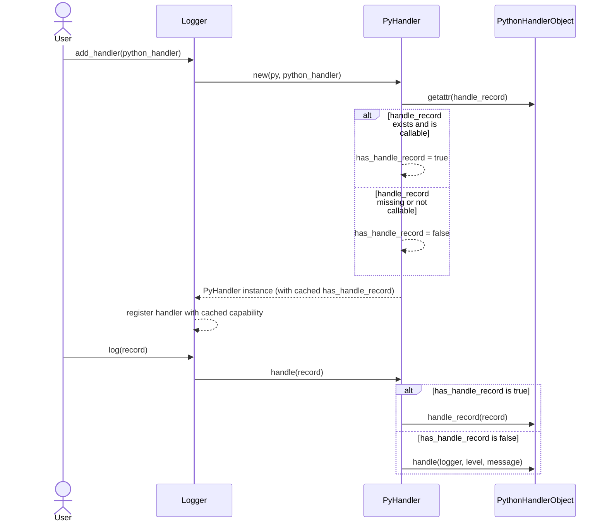
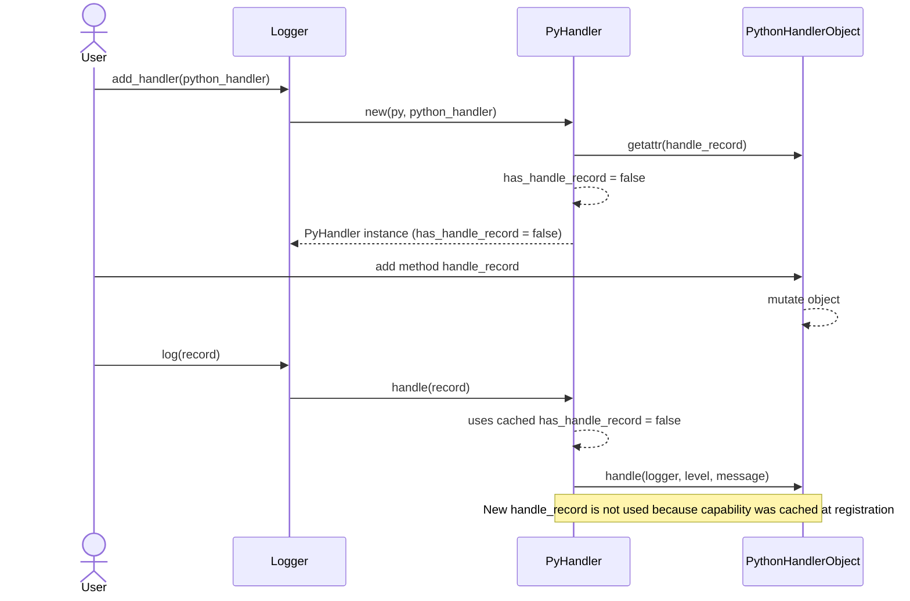

# Femtologging user guide

Femtologging is an asynchronous logging runtime for Python applications that
delegates IO and record fan-out to Rust worker threads. This guide covers the
features that are currently implemented, how they differ from the CPython
`logging` module, and the practical caveats you need to keep in mind when
building production systems on top of femtologging.

## Quick start

Install the package (a local editable installation is shown here) and emit your
first record:

```bash
pip install .
```

```python
from femtologging import FemtoStreamHandler, get_logger

logger = get_logger("demo.app")
logger.add_handler(FemtoStreamHandler.stderr())

logger.log("INFO", "hello from femtologging")
```

Handlers run in background threads, so remember to flush or close them before
your process exits.

## Architectural overview

- Each `FemtoLogger` owns a bounded queue (capacity 1 024) and a worker thread
  that drains records and invokes handlers. Calls to `logger.log()` simply
  enqueue a record and return immediately.
- Handlers (`FemtoStreamHandler`, `FemtoFileHandler`,
  `FemtoRotatingFileHandler`, and `FemtoSocketHandler`) also own dedicated
  queues and worker threads so file IO, stdout/stderr writes, and socket
  operations never block the calling code.
- When any queue is full, the record is dropped. Each component emits
  rate-limited warnings and maintains drop counters
  (`FemtoLogger.get_dropped()` and handler-specific warnings) so you can
  monitor pressure.
- Record metadata tracks the logger name, level, message text, timestamps,
  thread identity, and optional structured exception (`exc_info`) and call
  stack (`stack_info`) payloads. The Python API does not yet expose other rich
  `LogRecord` attributes such as `extra` or the calling module.

## Working with loggers

### Creating and naming loggers

- Use `get_logger(name)` to obtain a singleton `FemtoLogger`. Names must not be
  empty, start or end with `.`, or contain consecutive dots.
- Logger parents are derived from dotted names. `get_logger("api.v1")` creates
  a parent `api` logger that ultimately propagates to `root`.
- Call `logger.set_propagate(False)` to stop parent propagation. The default is
  to bubble records to ancestors, just like the stdlib.
- `reset_manager()` clears all registered loggers. It is intended for tests and
  is not thread-safe.

### Emitting records

- `logger.log(level, message)` accepts the case-insensitive names `"TRACE"`,
  `"DEBUG"`, `"INFO"`, `"WARN"`, `"WARNING"`, `"ERROR"`, and `"CRITICAL"`.
- The method returns the formatted string when the record passes level checks
  (default format is `"{logger} [LEVEL] message"`), or `None` when the record
  is filtered out. This differs from `logging.Logger.log()`, which always
  returns `None`.
- Convenience methods `logger.debug(message)`, `logger.info(message)`,
  `logger.warning(message)`, `logger.error(message)`,
  `logger.critical(message)`, and `logger.exception(message)` are available.
  Each accepts a pre-formatted `message` string plus optional `exc_info` and
  `stack_info` keyword arguments, identical to `log()`. Unlike the stdlib,
  `*args` / `**kwargs` lazy formatting is not supported — build the final
  message string before calling these methods. `exception()` behaves like
  `error()` but defaults `exc_info` to `True`.
- `log()` accepts the keyword-only arguments `exc_info` and `stack_info`
  for capturing exception tracebacks and call stacks alongside the log message.
  `exc_info` accepts any of the following forms:
  - `True` — capture the current exception via `sys.exc_info()`.
  - An exception instance — capture that exception's traceback.
  - A `(type, value, traceback)` 3-tuple — use directly.
  - `False` or `None` (default) — no capture.

  `stack_info` is a boolean (`False` by default). When `True`, the current call
  stack is appended to the record. Both payloads are rendered by the default
  formatter and are available as structured data to `handle_record` handlers.

  ```python
  try:
      db.execute(query)
  except DatabaseError:
      logger.log("ERROR", "query failed", exc_info=True)

  # Capture just the call stack (no exception needed):
  logger.log("DEBUG", "checkpoint reached", stack_info=True)
  ```

- `logger.isEnabledFor(level)` returns `True` when the logger would process a
  record at the given level. Use it for expensive message construction that
  should be skipped when the level is filtered out.
- `getLogger(name)` is an alias for `get_logger(name)`, provided for drop-in
  compatibility with code written against `logging.getLogger`.
- There is no equivalent to `extra` or lazy formatting. Build the final
  message string before calling `log()`.

### Exception schema versioning

Structured `exc_info` and `stack_info` payloads carry a `schema_version` field.
This allows the payload schema to evolve without silent breakage.

- `EXCEPTION_SCHEMA_VERSION` is the current version exposed by the Python API.
- Rust consumers accept versions in the inclusive range
  `MIN_EXCEPTION_SCHEMA_VERSION..=EXCEPTION_SCHEMA_VERSION`.
- Backward compatibility is guaranteed within that range. Missing optional
  fields default safely during deserialization.
- Forward compatibility is not guaranteed. A payload from a newer producer may
  deserialize, but explicit validation is required before processing.

Rust-side validation returns stable variants from `SchemaVersionError`:

- `VersionTooNew { found, max_supported }`
- `VersionTooOld { found, min_supported }`

Use these variants to choose explicit behaviour when versions mismatch:

```rust
use femtologging_rs::{
    ExceptionPayload, SchemaVersionError, SchemaVersioned,
};

fn process_payload(json: &str) -> Result<(), SchemaVersionError> {
    let payload: ExceptionPayload =
        serde_json::from_str(json).expect("valid JSON");
    match payload.validate_version() {
        Ok(()) => {
            // Normal processing path.
            Ok(())
        }
        Err(SchemaVersionError::VersionTooNew {
            found,
            max_supported,
        }) => {
            // Degrade safely: keep raw payload and skip schema-dependent logic.
            eprintln!(
                "payload schema {} is newer than supported {}",
                found, max_supported
            );
            Err(SchemaVersionError::VersionTooNew {
                found,
                max_supported,
            })
        }
        Err(SchemaVersionError::VersionTooOld {
            found,
            min_supported,
        }) => {
            // Reject unsupported historical payloads explicitly.
            eprintln!(
                "payload schema {} is older than minimum {}",
                found, min_supported
            );
            Err(SchemaVersionError::VersionTooOld {
                found,
                min_supported,
            })
        }
    }
}
```

When consuming payloads in Python from external sources, compare
`payload["schema_version"]` with `femtologging.EXCEPTION_SCHEMA_VERSION` and
apply the same policy: reject too-old payloads, and explicitly degrade or
reject too-new payloads.

Increment the schema version only for breaking changes (required field
additions, removals, renamed fields, or semantic/type changes). Adding optional
fields with safe defaults does not require a version bump.

### Managing handlers and custom sinks

- The built-in handlers implement the Rust-side `FemtoHandlerTrait`. Python
  handlers can be attached by supplying any object that exposes a callable
  `handle(logger_name: str, level: str, message: str)` method.
- Python handlers run inside the logger’s worker thread. Ensure they are
  thread-safe and fast; slow handlers block the logger worker and can cause
  additional record drops.
- `logger.add_handler(handler)` accepts either a Rust-backed handler or a Python
  handler as described above. Use `logger.remove_handler(handler)` or
  `logger.clear_handlers()` to detach them. Removals only affect records that
  are enqueued after the call because previously queued items already captured
  their handler list.
- Use `logger.get_dropped()` to inspect how many records have been discarded
  because the logger queue was full or shutting down.

## Built-in handlers

### FemtoStreamHandler

- `FemtoStreamHandler.stderr()` (default) and `.stdout()` log to the respective
  standard streams. Calls return immediately; the handler thread flushes the
  underlying `io::Write`.
- `handler.flush()` waits (up to one second by default) for the worker to flush
  buffered writes and returns `True` on success. `handler.close()` shuts down
  the worker thread and should be called before process exit.
- To tune capacity, flush timeout, or formatters use `StreamHandlerBuilder`. It
  provides `.with_capacity(n)`, `.with_flush_after_ms(ms)`, and
  `.with_formatter(callable_or_id)` fluent methods before calling `.build()`.

### FemtoFileHandler

- Constructor signature:
  `FemtoFileHandler(path, capacity=1024, flush_interval=1, policy="drop")`. The
  flush interval counts _records_, not seconds.
- `policy` controls queue overflow handling:
  - `"drop"` (default) discards records and raises `RuntimeError`.
  - `"block"` blocks the caller until the worker makes room.
  - `"timeout:N"` blocks for `N` milliseconds before giving up.
- Use `handler.flush()` and `handler.close()` to ensure on-disk consistency.
  Always close the handler when the application shuts down. `close()` is
  idempotent and safe to call multiple times; only the first call performs
  shutdown work.
- In Rust, `close()` requires exclusive mutable access (`&mut self`). If the
  handler is shared across threads, synchronize close calls externally (for
  example with a mutex) instead of invoking `close()` concurrently.
- `FileHandlerBuilder` mirrors these options and also exposes
  `.with_overflow_policy(OverflowPolicy.drop()/block()/timeout(ms))` and
  `.with_formatter(…)`. Formatter identifiers other than `"default"` are not
  wired up yet; pass a callable (taking a mapping and returning a string) to
  attach custom formatting logic.

### FemtoRotatingFileHandler

- Wraps `FemtoFileHandler` with size-based rotation. Instantiate via
  `FemtoRotatingFileHandler(path, options=HandlerOptions(…))`.
- `HandlerOptions` fields:
  - `capacity`, `flush_interval`, and `policy` mirror `FemtoFileHandler`.
  - `rotation=(max_bytes, backup_count)` enables rollover when _both_ values
    are greater than zero. Set `(0, 0)` to disable rotation entirely.
- Rotation renames the active log file to `.1`, shifts older backups up to
  `backup_count`, and truncates the live file. If opening a fresh file fails
  the implementation falls back to appending to the existing file and logs the
  reason.
- `handler.close()` follows the same contract as `FemtoFileHandler`: it is
  idempotent, only the first call performs shutdown work, and concurrent close
  calls must be synchronized by the caller.
- `RotatingFileHandlerBuilder` provides the same fluent API as the file builder
  plus `.with_max_bytes()` and `.with_backup_count()`.

### FemtoTimedRotatingFileHandler

- Wraps `FemtoFileHandler` with time-based rotation. Instantiate via
  `FemtoTimedRotatingFileHandler(path, options=TimedHandlerOptions(…))`.
- `TimedHandlerOptions` keeps the queue fields (`capacity`, `flush_interval`,
  `policy`) and adds `when`, `interval`, `backup_count`, `utc`, and optional
  `at_time`.
- Supported `when` values are `S`, `M`, `H`, `D`, `MIDNIGHT`, and `W0`-`W6`.
  `at_time` is only valid for daily, midnight, and weekday schedules.
- Rotation runs on the worker thread. `backup_count == 0` keeps all timestamped
  backups instead of disabling rotation.
- `TimedRotatingFileHandlerBuilder` mirrors the direct handler surface with
  `.with_when()`, `.with_interval()`, `.with_backup_count()`, `.with_utc()`,
  and `.with_at_time()`.

### FemtoSocketHandler

- Socket handlers must be built via `SocketHandlerBuilder`. Typical usage:

```python
from femtologging import BackoffConfig, SocketHandlerBuilder

socket_handler = (
    SocketHandlerBuilder()
    .with_tcp("127.0.0.1", 9020)
    .with_capacity(2048)
    .with_connect_timeout_ms(5000)
    .with_write_timeout_ms(1000)
    .with_tls("logs.example.com", insecure=False)
    .with_backoff(
        BackoffConfig({
            "base_ms": 100,
            "cap_ms": 5000,
            "reset_after_ms": 30000,
            "deadline_ms": 120000,
        })
    )
    .build()
)
```

- Default transport is TCP to `localhost:9020`. Call `.with_unix_path()` to use
  Unix sockets on POSIX systems. TLS only works with TCP transports; attempting
  to combine TLS and Unix sockets raises `HandlerConfigError`.
- Records are serialized to MessagePack maps:
  `{logger, level, message, timestamp_ns, filename, line_number, module_path,
    thread_id, thread_name, key_values}` and framed with a 4-byte big-endian
  length prefix.
- The worker reconnects automatically using exponential backoff. Payloads that
  exceed the configured `max_frame_size` are dropped.
- `handler.flush()` forces the worker to flush the active socket. Always call
  `handler.close()` to terminate the worker thread cleanly.

### FemtoHTTPHandler

- HTTP handlers are built via `HTTPHandlerBuilder` and send one serialized
  record per request from a dedicated worker thread.
- Use `.with_endpoint(url, method="POST")` to configure the destination in a
  single call. Legacy `.with_url()` and `.with_method()` setters remain
  available for compatibility.
- Use `.with_auth({"token": "..."})` for bearer tokens or
  `.with_auth({"username": "...", "password": "..."})` for basic auth. Legacy
  `.with_basic_auth()` and `.with_bearer_token()` setters remain available for
  compatibility.
- `with_headers(...)`, `with_capacity(...)`, timeout setters, and
  `.with_json_format()` mirror the socket/file builder style. Validation
  failures raise `ValueError` before the handler is built.

### Custom Python handlers

```python
class Collector:
    def __init__(self) -> None:
        self.records: list[tuple[str, str, str]] = []

    def handle(self, logger: str, level: str, message: str) -> None:
        # Runs inside the FemtoLogger worker thread
        self.records.append((logger, level, message))


collector = Collector()
logger.add_handler(collector)
```

The handler's `handle` method must be callable and thread-safe. Exceptions are
printed to stderr and counted as handler errors, so prefer defensive code and
avoid raising from `handle`.

#### Handler stability contract

Handler capabilities are inspected **once** when `add_handler()` is called:

- The presence of a callable `handle_record` method is cached at registration
  time and determines which dispatch path is used for all subsequent records.
- **Do not mutate the handler after calling `add_handler()`.** Adding or
  removing `handle_record` after registration has no effect and results in
  undefined behaviour.
- Ensure the handler is fully configured before passing it to `add_handler()`.

This design keeps per-record overhead low by avoiding repeated attribute
lookups on the hot path and aligns with the standard library expectation that
handlers are configured before use.

The following diagram shows how capability detection works at registration time
and how the cached result determines dispatch for all subsequent records:



_Figure 1: Capability detection at registration and dispatch based on cached
result._

This next diagram illustrates why mutating the handler after registration has
no effect—the capability was already cached:



_Figure 2: Mutating the handler after registration does not change dispatch
behaviour._

### Using standard library (stdlib) `logging.Handler` subclasses

Python's standard library ships with a rich set of handler classes
(`FileHandler`, `RotatingFileHandler`, `SMTPHandler`, `SysLogHandler`, etc.).
These handlers implement the stdlib `emit(LogRecord)` interface, which is
incompatible with femtologging's `handle_record(dict)` protocol.

`StdlibHandlerAdapter` bridges the gap.  It wraps any `logging.Handler`
subclass, translates femtologging record dicts into `logging.LogRecord`
instances, and delegates to the wrapped handler's `handle()` method so that
attached filters and I/O locking apply.

```python
import logging
from femtologging import FemtoLogger, StdlibHandlerAdapter

# Wrap a stdlib FileHandler for use with femtologging
file_handler = logging.FileHandler("app.log")
file_handler.setFormatter(
    logging.Formatter("%(asctime)s %(name)s [%(levelname)s] %(message)s")
)

adapter = StdlibHandlerAdapter(file_handler)

logger = FemtoLogger("myapp")
logger.add_handler(adapter)
logger.log("INFO", "Application started")
```

The adapter maps femtologging levels to their stdlib equivalents (TRACE maps to
level 5, DEBUG to 10, INFO to 20, WARN to 30, ERROR to 40, CRITICAL to 50). A
custom `TRACE` level name is registered with stdlib's `logging` module so that
formatters render it as `TRACE` rather than `Level 5`.

Metadata fields such as `filename`, `line_number`, `thread_name`, `thread_id`,
and `timestamp` are forwarded to the `LogRecord` where matching attributes
exist.  Custom key-value pairs from `metadata.key_values` are propagated into
the `LogRecord.__dict__`, making them available to stdlib formatters (e.g.
`%(request_id)s`) and filters.

**Limitations:**

- `exc_info` is provided as pre-formatted text (`exc_text`), not as
  the original `(type, value, traceback)` tuple.  Stdlib formatters that
  inspect `record.exc_info` directly will not find a live traceback object.
- `pathname` and `funcName` are set to defaults because femtologging does not
  capture these values.  `relativeCreated` is recomputed from
  `metadata.timestamp` when present, so elapsed-time values can be accurate.

## Configuration options

### basicConfig

- Accepts `level`, `filename`, `stream` (`sys.stdout` or `sys.stderr`), `force`,
  and `handlers` (an iterable of handler objects) either via keyword arguments
  or the `BasicConfig` dataclass.
- `filename` and `stream` are mutually exclusive and cannot be combined with
  the `handlers` argument.
- Passing `force=True` clears existing handlers on the root logger before
  installing the new one.
- Formatting parameters (`format`, `datefmt`, and friends) are intentionally
  unsupported until formatter customization lands.

### ConfigBuilder (imperative API)

```python
from femtologging import (
    ConfigBuilder,
    LoggerConfigBuilder,
    StreamHandlerBuilder,
    FileHandlerBuilder,
    OverflowPolicy,
    LevelFilterBuilder,
    PythonCallbackFilterBuilder,
)


def add_request_id(record):
    record.request_id = "req-123"
    return True


builder = (
    ConfigBuilder()
    .with_handler("console", StreamHandlerBuilder.stderr())
    .with_handler(
        "audit",
        FileHandlerBuilder("/var/log/app.log").with_overflow_policy(
            OverflowPolicy.block()
        ),
    )
    .with_filter(
        "request_context",
        PythonCallbackFilterBuilder(add_request_id),
    )
    .with_filter("info_only", LevelFilterBuilder().with_max_level("INFO"))
    .with_logger(
        "app.audit",
        LoggerConfigBuilder()
        .with_level("INFO")
        .with_handlers(["audit"])
        .with_filters(["request_context", "info_only"])
        .with_propagate(False),
    )
    .with_root_logger(
        LoggerConfigBuilder().with_level("WARNING").with_handlers(["console"])
    )
)

builder.build_and_init()
```

- `with_default_level(level)` sets a fallback for loggers that omit explicit
  levels. `with_disable_existing_loggers(True)` clears handlers and filters on
  previously created loggers that are not part of the new configuration (their
  ancestors are preserved automatically).
- Available filter builders are `LevelFilterBuilder`,
  `NameFilterBuilder`, and `PythonCallbackFilterBuilder`. Callback filters run
  on the producer thread and may either return a truthy/falsy value directly or
  expose a stdlib-style `filter(record)` method. Filters are applied in the
  order they are declared in each `LoggerConfigBuilder`.
- Formatter registration (`with_formatter(id, FormatterBuilder)`) is currently
  a placeholder. Registered formatters are stored in the serialized config, but
  handlers still treat any string other than `"default"` as unknown and raise
  `HandlerConfigError`.

### dictConfig (restricted compatibility layer)

- Supported handler classes: `logging.StreamHandler`,
  `femtologging.StreamHandler`, `logging.FileHandler`,
  `femtologging.FileHandler`, `logging.handlers.RotatingFileHandler`,
  `logging.handlers.TimedRotatingFileHandler`, and
  `logging.handlers.SocketHandler` (plus their femtologging equivalents).
- Handler `args` are evaluated with `ast.literal_eval`, matching the stdlib
  behaviour for simple tuples. For socket handlers you can pass either
  `(host, port)` or a single Unix socket path; keyword arguments mirror the
  builder API (`host`, `port`, `unix_path`, `capacity`, `connect_timeout_ms`,
  `write_timeout_ms`, `max_frame_size`, `tls`, `tls_domain`, `tls_insecure`,
  `backoff_*` aliases).
- Top-level `filters` sections are supported. Declarative mappings still use
  exactly one of `level` or `name`, while factory mappings use stdlib-style
  `"()"` syntax such as `{"()": "pkg.module.FilterFactory", "prefix": "svc"}`.
  The factory target may be a dotted path or a direct callable, and is
  instantiated with the remaining keys as keyword arguments. Mixing `"()"` with
  `level` or `name` is rejected. Loggers and the root logger accept a `filters`
  list of filter IDs.
- Unsupported stdlib features raise `ValueError`: incremental updates,
  handler `level`, handler `filters`, and handler formatters. Although the
  schema accepts a `formatters` section, referencing a formatter from a handler
  currently results in `ValueError("unknown formatter id")`.
- A `root` section is mandatory. Named loggers support `level`,
  `handlers`, `filters`, and `propagate` (bool).

### fileConfig (INI compatibility)

- `fileConfig(path, defaults=None, disable_existing_loggers=True, encoding=None)`
  parses CPython-style INI files via the Rust extension and translates them to
  the restricted `dictConfig` schema.
- Default substitutions (`%(foo)s`) work across the INI file and any mapping
  you pass via `defaults`.
- Formatters and handler-level overrides are not supported. Including
  `[formatter_*]` sections or specifying `level`/`formatter` inside
  `[handler_*]` entries raises `ValueError`.

## Formatting and filtering

- Logger-level formatting is fixed (`"{logger} [LEVEL] message"`). To customize
  output wrap handlers with formatter callables using the builder API:

```python
def json_formatter(record: dict[str, object]) -> str:
    import json

    return json.dumps(
        {
            "logger": record["logger"],
            "level": record["level"],
            "message": record["message"],
        },
        separators=(",", ":"),
    )


stream = StreamHandlerBuilder.stdout().with_formatter(json_formatter).build()
```

- Formatter identifiers are limited to `"default"` for now. Future releases
  will connect `FormatterBuilder` and handler formatter IDs, but this is not
  yet implemented.
- Filters are available through both `ConfigBuilder` and `dictConfig`.
  `fileConfig` does not yet support filter declarations. Handler-level
  `filters` and `level` attributes remain unsupported, as these require Rust
  infrastructure changes outside the current scope.
- Python callback filters receive a mutable `logging.LogRecord` view on the
  producer thread. When they accept the record, any new supported attributes
  they add are copied into `metadata.key_values` before the record enters the
  async queue, making them visible to formatter callables and
  `StdlibHandlerAdapter`.

```python
import contextvars
import logging

from femtologging import PythonCallbackFilterBuilder

request_id = contextvars.ContextVar("request_id", default="")


def enrich_request(record: logging.LogRecord) -> bool:
    record.request_id = request_id.get()
    return record.levelname == "INFO"


callback_filter = PythonCallbackFilterBuilder(enrich_request)
```

## Deviations from stdlib logging

- No `LoggerAdapter`.
- `log()` and the convenience methods (`debug`, `info`, `warning`, `error`,
  `critical`, `exception`) return the formatted string instead of `None`.
- Records lack `extra`, lazy formatting, and calling-module introspection.
  `exc_info` and `stack_info` are supported as keyword-only arguments to
  `log()` and the convenience methods.
- Handlers expect `handle(logger, level, message)` rather than `emit(LogRecord)`
  and run on dedicated worker threads.  Existing stdlib `logging.Handler`
  subclasses can be reused via
  [`StdlibHandlerAdapter`](#using-standard-library-stdlib-logginghandler-subclasses),
   which adapts `emit(LogRecord)`-based handlers to the runtime's handle API.
- The `dictConfig` schema lacks incremental updates, handler filters,
  handler levels, and formatter attachment. `fileConfig` is likewise cut down.
- Queue capacity is capped (1 024 per logger/handler). The stdlib blocks the
  emitting thread; femtologging drops records and emits warnings instead.
- Formatting styles (`%`, `{}`, `$`) are not implemented. Provide the final
  string, or supply a callable formatter per handler.
- The logging manager is separate from `logging`’s global state. Mixing both
  systems in the same process is unsupported.

## Operational tips and caveats

- Always flush or close handlers before shutting down the process; otherwise
  buffered records may be lost.
- Monitor `logger.get_dropped()` and the warnings emitted by each handler to
  detect back pressure early. Increase handler capacities or switch to
  blocking/timeout policies when drops are unacceptable.
- File-based handlers count `flush_interval` in _records_. If you need
  time-based flushing, add a periodic `handler.flush()` in your application.
- Blocking overflow policies affect the thread that calls `logger.log()`. Use
  them only when you are comfortable with logging back pressure slowing the
  producer because that is what will happen.
- Socket handlers serialize to MessagePack with a one-megabyte default frame
  limit. Large payloads are silently dropped; consider truncating or chunking
  messages before logging.
- `reset_manager()` is a destructive operation intended for tests. Do not call
  it while other threads might still hold references to existing loggers.

## Journald and OpenTelemetry roadmap notes

- Journald support is planned as a Linux/systemd-specific integration and will
  be unavailable on Windows and macOS. For non-systemd Unix systems, use
  `FemtoStreamHandler`, `FemtoFileHandler`, or `FemtoSocketHandler` to ship
  records to syslog-compatible or other central collectors.
- Sending logs to Journald or OpenTelemetry is always an explicit action.
  Enabling the relevant feature/build option alone is not enough; you must
  configure the matching handler/layer in your application.
- Treat log forwarding as sensitive-data egress. Scrub message text and any
  contextual keys before sending records to external observability systems.
- Before the structured logging work in Phase 3 is complete, the planned
  Journald/OpenTelemetry path is limited to message text and basic metadata
  (logger name and level), not rich key-value fields or trace correlation.

Keep an eye on the roadmap in `docs/` for upcoming additions (formatter
resolution, richer dictConfig support, timed rotation) and update your
configuration once those features land. For now, the patterns above reflect the
current, tested surface area of femtologging.

## Scoped structured context

Use `log_context(...)` to add structured key-values to every record emitted on
the current thread while the context is active:

```python
import femtologging

logger = femtologging.get_logger("service")
with femtologging.log_context(request_id=42, user="alice"):
    logger.info("request accepted")
```

Behavioural guarantees:

- Context values are merged on the producer thread before queueing.
- Inline structured fields emitted by Rust macros override outer context keys.
- Context values must be `str`, `int`, `float`, `bool`, or `None`.
- Callback-filter enrichment uses the same scalar contract: keys must be
  non-empty strings, and values must be `str`, `int`, `float`, `bool`, or
  `None`.
- Keys must not collide with stdlib `logging.LogRecord` attributes or
  femtologging-reserved metadata names.
- Enrichment is bounded to 64 keys per record, 64 UTF-8 bytes per key,
  1,024 UTF-8 bytes per value, and 16 kibibytes (KiB) total serialized
  enrichment per record.

### Callback enrichment validation

Python callback filters may mutate the temporary `logging.LogRecord` object and
return a truthy result to accept the record. femtologging copies only the
validated scalar additions from that record into Rust-owned metadata before the
record is queued.

Accepted enrichment must satisfy all of the following:

- Keys are non-empty `str` instances.
- Values are limited to `str`, `int`, `float`, `bool`, or `None`.
- Keys do not overwrite built-in `logging.LogRecord` fields such as `name`,
  `msg`, `levelname`, `created`, or femtologging-reserved metadata fields.
- The serialized payload stays within 64 keys, 64 UTF-8 bytes per key,
  1,024 UTF-8 bytes per value, and 16 KiB total.

Example of accepted enrichment:

```python
import logging

import femtologging


def request_filter(record: logging.LogRecord) -> bool:
    record.request_id = "req-123"
    record.user_id = 42
    record.cache_hit = False
    return True


logger = femtologging.get_logger(
    "service",
    filters=[femtologging.PythonCallbackFilterBuilder(request_filter)],
)
```

Collisions and invalid values are rejected before the record enters the worker
thread. For example, this filter tries to overwrite a stdlib field and attach
an unsupported value:

```python
import logging


def invalid_filter(record: logging.LogRecord) -> bool:
    record.name = "rewritten"
    record.payload = {"not": "allowed"}
    return True
```

When validation fails, femtologging raises a Python exception inside the
callback path, catches it at the logger boundary, emits a warning, and drops
that record. The process keeps running, but the invalid record is not queued or
delivered to handlers.
